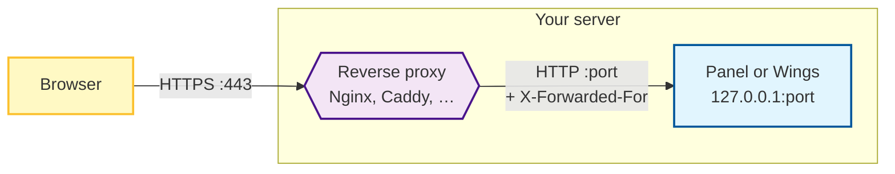

# Setting up a Reverse Proxy

A reverse proxy is a web server that sits between the internet and the Panel or a Wings node. Visitors talk to the proxy on the standard HTTPS port (443), and the proxy forwards each request to the service behind it, which keeps listening on its own port where nobody else can reach it.

You want one because it:

- Serves the Panel or a node at `https://panel.example.com` instead of `http://1.2.3.4:8000`.
- Terminates TLS in one place, so the Panel or Wings itself never has to handle certificates.
- Lets one machine host the Panel next to other websites on the same ports.
- Enables features that need a secure origin, such as [passkeys](../../panel/features/dashboard/security-keys.md).

## How It Fits Together

Three things happen at the proxy on every request:

1. It decrypts the HTTPS connection using your certificate.
2. It adds headers that tell the Panel or Wings who the real visitor is (`X-Forwarded-For`, `X-Real-IP`).
3. It forwards the request over plain HTTP to the service on the loopback address, and streams the response back.

Because every request now arrives *from the proxy*, the Panel or Wings has to be told which address the proxy uses. Otherwise every visitor looks like they come from the same IP, which breaks per-IP rate limiting and fills the activity log with the proxy's address. Telling it about the proxy is the only application-side change either guide makes.

::: info All-in-One image
If you run the [All-in-One image](../../panel/installation/docker.md#option-a-all-in-one-recommended-for-single-node-setups), the bundled Wings is reached through the Panel, so the Panel guide alone covers both. Only SFTP (port `2022`) stays direct, because it is not HTTP.
:::

## Pick a Guide

::::tabs
=== Panel

Set up once, for every visitor: log in page, dashboard, admin, and (on the All-in-One image) the bundled Wings.

See the [Panel reverse proxy guide](./panel.md).

=== Wings

Set up per standalone node, for browsers connecting to the console, file manager, and server uploads/downloads directly.

See the [Wings reverse proxy guide](./wings.md).
::::
