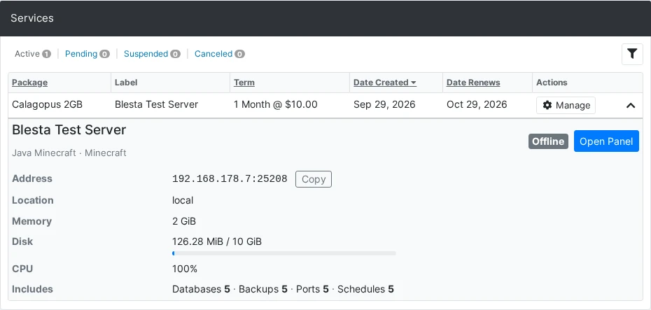
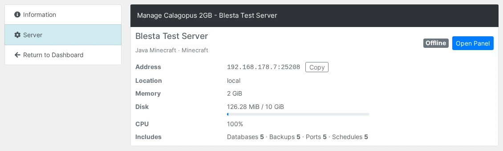
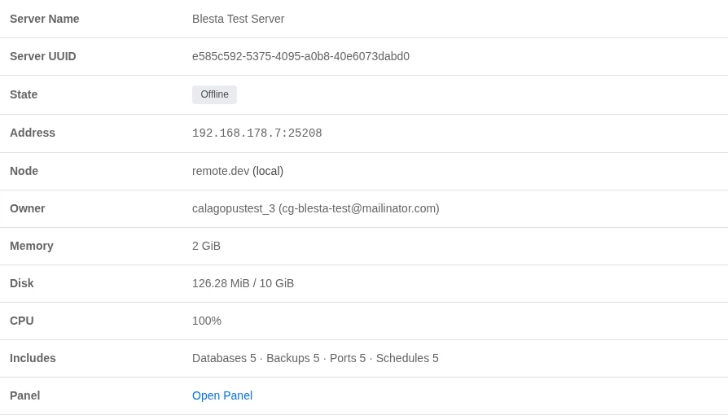
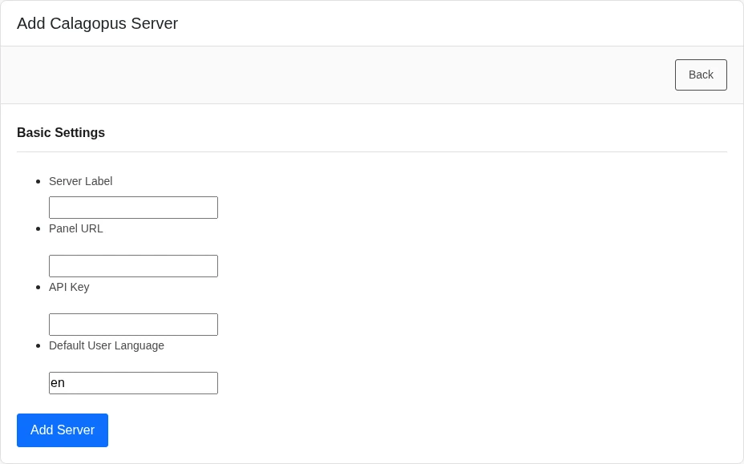
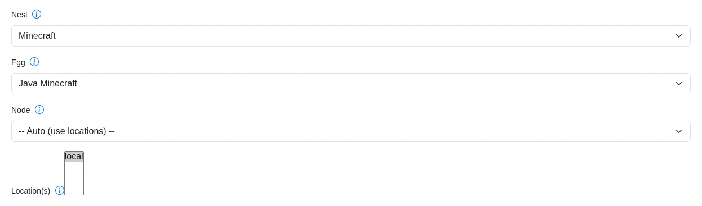
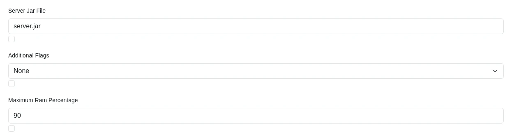

# Blesta

The **Calagopus Blesta module** is a server provisioning module for [Blesta](https://www.blesta.com). It provisions and manages Calagopus servers from Blesta as part of your billing workflow, with support for nests/eggs, node- or location-based deployment, egg variables, and custom (extension-added) feature limits.

::: info
This module is based on the official [Blesta Pterodactyl module](https://github.com/blesta/module-pterodactyl), adapted for the Calagopus panel API and its additional features.
:::

::: danger
This module authenticates with an **admin API key**, which grants full administrative access to your panel - creating users and servers, reading every resource, and more. Treat it like a root password: never share it, and rotate it immediately if it is ever exposed.
:::

## What it does

The module maps Blesta's service lifecycle onto the Calagopus admin API:

| Blesta action | Effect on the panel |
| --- | --- |
| Add | Finds or creates a panel user for the client, then provisions a server (on a specific node, or auto-deployed across locations). |
| Suspend / Unsuspend | Toggles the server's suspended state. |
| Edit / Change package | Updates the server's resource and feature limits, name, and egg variables to match the package configuration and the service's configurable options. |
| Cancel | Deletes the server from the panel, including its backups. |

Clients are matched to panel users by the `external_id` `bl-<client id>`, so each client reuses the same panel account across all of their services. When the module creates a user and the panel reports that the email or username is already taken, it looks for a panel user with exactly the client's email address and links that account by setting its `external_id`. A clash on the username alone is never linked automatically - provisioning stops with an error so you can check who owns that account first.

Clients see a summary of their server when they expand the service in their services list:



It shows the same information the panel does:

- The server's name as set on the panel, its egg and nest, and a status badge (**Running**, **Offline**, **Installing**, **Suspended** and so on).
- The address with a **Copy** button, the location, and the uptime while the server runs.
- Memory, disk and CPU as current use against the limit, with a usage bar. Live usage comes from the node, and memory and CPU use only show while the server is up. A limit of `0` shows as **Unlimited**.
- An **Includes** line with the database, backup, port and schedule limits, followed by any numeric custom feature limits.
- An **Open Panel** button that opens the server on the panel.

The same summary is also on its own **Server** tab when the client manages the service:



Staff see the same live state, address and usage when they expand the service on the client's admin page, along with the server UUID, node and panel owner and an **Open Panel** link:



## Requirements

- A running [Blesta](https://www.blesta.com) installation.
- A running Calagopus panel with at least one node, location, nest, and egg configured.
- An **admin API key** from your Calagopus panel.

## Installation

1. Upload the contents of the [module repository](https://github.com/calagopus/blesta-module) into your Blesta installation:

   ```sh
   /path/to/blesta/components/modules/calagopus/
   ```

2. In Blesta, go to **Settings → Company → Modules → Available**, find **Calagopus**, and click **Install**.

3. Click **Manage** on the Calagopus module, then **Add Server** and configure:

   | Field | Description |
   | --- | --- |
   | **Server Label** | A friendly name for this panel connection. |
   | **Panel URL** | Your panel URL, e.g. `https://panel.example.com`. |
   | **API Key** | An admin API key for your Calagopus panel. |
   | **Default User Language** | Two-letter language code for newly created users, e.g. `en`. |

   Saving validates the connection against the panel.



## Configuring a package

Create a **Package** and select the **Calagopus** module. The package configuration defines what every server provisioned from it looks like.

::: info
The **Nest**, **Egg**, **Node**, and **Location** fields are populated live from your panel through the API key on the server, so you can pick them from dropdowns. Changing the nest or egg refreshes the dependent options and the egg variable fields.
:::

### Deployment target

You can deploy in one of two ways:

- **Specific node** - pick a **Node**, and the module provisions onto the first available allocation on that node.
- **Auto deploy** - leave the node on **-- Auto (use locations) --** and select one or more **Location(s)**. Calagopus picks a node and allocation automatically.

At least one of a node or one or more locations must be set, or the package will not save.



### Resources and limits

| Field | Notes |
| --- | --- |
| **Memory / Swap / Disk** | In MiB. Set swap to `-1` for unlimited or `0` to disable. |
| **CPU Limit** | Percentage; `100` = one thread, `0` = unlimited. |
| **Memory Overhead** | Hidden memory added on top of the container's limit. |
| **IO Weight** | `10`–`1000`; leave blank for the default. |
| **Allocations / Databases / Backups / Schedules** | Standard feature limits. |
| **Custom Feature Limits** | Extension-added limits, as `key:value` pairs, e.g. `plugins:5,worlds:3`. |

### Egg and advanced options

| Field | Notes |
| --- | --- |
| **Docker Image** | Override the egg default. Blank uses the egg's default image. |
| **Startup Command** | Override the egg default startup command. |
| **Server Name Prefix** | Names the server `<prefix><client id>` when a service is created without a server name. The order form requires a **Server Name**, so this only applies to services added some other way. Blank defaults to `Server-`. |
| **Pinned CPUs** | Comma-separated core IDs, e.g. `0,1,2`. Blank disables pinning. |
| **Backup Configuration UUID** | Optional backup configuration to assign to the server. |
| **Skip Egg Install Script** | Skips the egg's installation script. |
| **Start on Completion** | Starts the server automatically once installation finishes. |
| **Hugepages / KVM Passthrough** | Mount `/dev/hugepages` / allow `/dev/kvm` inside the container. |

### Egg variables

The package form renders a field for each of the egg's environment variables, validated against the egg's own rules. Each variable has a checkbox under its field. Tick it to show that variable to the client during checkout so they can set its value themselves, or leave it unticked to keep the value fixed by the package.



## Overriding settings with configurable options

Blesta **configurable options** (Packages → Configurable Options) attached to the package override the matching package field whenever a service is added or edited. The option's name must equal the package field key exactly, in lowercase. Options with any other name are ignored.

| Option name | Overrides | Value |
| --- | --- | --- |
| `memory`, `swap`, `disk` | Memory / Swap / Disk | MiB |
| `cpu` | CPU Limit | Percentage, `100` = one thread |
| `memory_overhead` | Memory Overhead | MiB |
| `io_weight` | IO Weight | `10`–`1000` |
| `allocations_limit`, `database_limit`, `backup_limit`, `schedule_limit` | Feature limits | Count |
| `docker_image` | Docker Image | Image reference |
| `startup_command` | Startup Command | Command string |
| `nest_uuid`, `egg_uuid`, `node_uuid` | Nest, Egg, Node | UUIDs from your panel |

Locations, custom feature limits, the server name prefix, pinned CPUs, the backup configuration, and the checkbox settings always come from the package.

For example, a configurable option named `memory` with the choices `2048`, `4096`, and `8192` lets a client pick their RAM tier at checkout, with the package's Memory field acting as the default when the option is not on the service.

### Egg variable precedence

Each egg variable is resolved from the first of these that is set:

1. A configurable option named after the environment variable in lowercase, e.g. `minecraft_version` for `MINECRAFT_VERSION`.
2. The value entered on the order form. Staff can always set it, and clients only see the field when the variable's checkbox is ticked on the package.
3. The value already stored on the service.
4. The value stored on the package.
5. The egg's default value.

### Server name

The **Server Name** field on the order form is required and becomes the server's name on the panel. Clients and staff always see the name the panel currently has, so a server renamed on the panel shows its new name in Blesta too.

### What applies on edit

Editing a service or changing its package, with **Use module** enabled, re-reads the package fields and the service's options, then updates the server's resource limits, feature limits, pinned CPUs, hugepages and KVM passthrough, Docker image, and egg variables. A new Server Name value renames the server. The deployment target, startup command, and the install and start flags are only used when the server is first created.

## Migrating from Pterodactyl

If you sold servers through the official Blesta **Pterodactyl** module and have moved your panel to Calagopus, this module can take over your existing packages and services.

Before you start:

1. Migrate your servers, users, nests, eggs and locations to the Calagopus panel. Nests, eggs and locations are matched **by name**, so they have to exist on the Calagopus panel first.
2. Keep the Pterodactyl module installed and its panel reachable. The import uses it to translate Pterodactyl IDs into names and server UUIDs.
3. Add at least one Calagopus server under **Manage** on this module.

The **Import from Pterodactyl** section appears on the module's **Manage** page while the Pterodactyl module is installed. It lists each Pterodactyl server with an **Import Into** dropdown: pick the Calagopus server its packages and services should move to, or leave it on **-- Do not import --**, then click **Import**.

The import:

- Reassigns each package to this module and converts its settings: `io` becomes **IO Weight**, `image` **Docker Image**, `startup` **Startup Command**, and the database, allocation and backup limits and egg variables (with their checkbox for showing them to clients) carry over. The package's Pterodactyl location becomes its only deploy location.
- Rewrites each service's fields and links it to its server on the Calagopus panel, found by its external ID or, failing that, by translating the Pterodactyl server ID into a UUID through the Pterodactyl panel. The server's UUID, IP and port are refreshed from the panel.
- Copies the tracked panel username of each migrated client.

Anything that cannot be matched is skipped and listed in the results. Imported packages no longer belong to the Pterodactyl module, so after fixing the cause you can run the import again and it leaves the finished packages alone.

A few Pterodactyl settings have no Calagopus equivalent and are dropped: `port_range`, `dedicated_ip` and `pack_id`. Packages that deployed through a Pterodactyl server group are assigned directly to the Calagopus server you picked. Configurable options keep working when their names already match the Calagopus field names; recreate the ones named `nest_id`, `egg_id`, `location_id`, `io`, `image`, `startup`, `databases`, `allocations` or `backups` under the new names from [Overriding settings with configurable options](#overriding-settings-with-configurable-options).

## Troubleshooting

| Symptom | Fix |
| --- | --- |
| Saving the server fails with a connection error | The API key is missing, malformed, or lacks admin access, or the Panel URL is incorrect. Confirm the Panel URL points at your panel (HTTPS is assumed if you omit the protocol) and re-enter a valid **admin** API key. |
| "No available allocations on the selected node" | The chosen node has no free allocations. Add allocations to the node, or switch the package to auto-deploy across locations. |
| The package will not save | Either the Nest or Egg is unset, or neither a node nor any locations were selected. All selections must come from the same panel the server is configured against. |
| "A panel user with this username already exists and was not linked automatically" | The panel already has a user with the generated username but a different email. Check that the account belongs to this client, then link it by setting that panel user's `external_id` to `bl-<client id>` and provision again. |
| Clients get a duplicate panel account | The module only links existing users by exact email. If a client registered on the panel with a different email than the one in Blesta, link the accounts by setting that panel user's `external_id` to `bl-<client id>`. |
| The server summary shows "Server information is not available." | The service has no server UUID yet, or the server was deleted on the panel. Check the service's fields on its admin page. |
