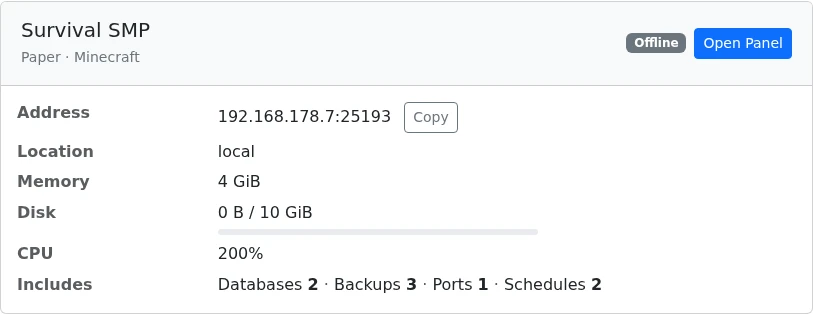
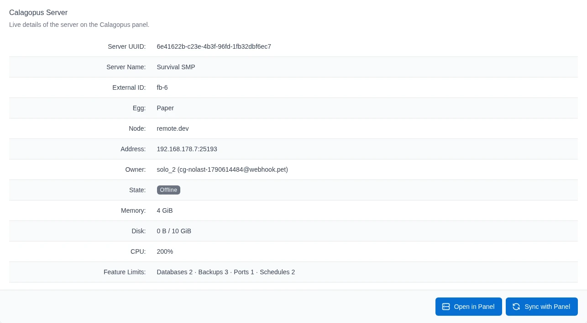
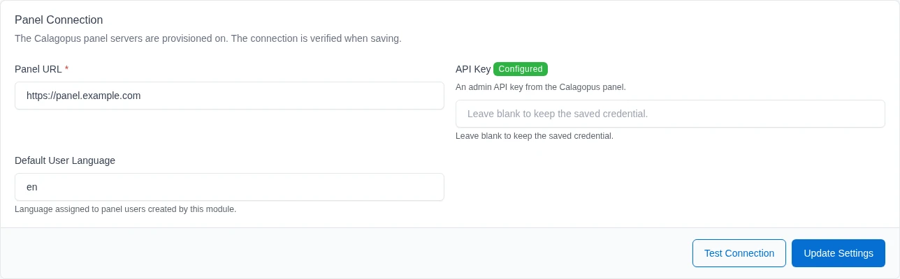
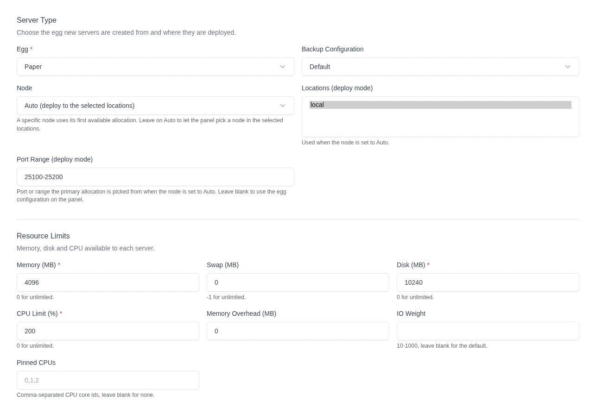
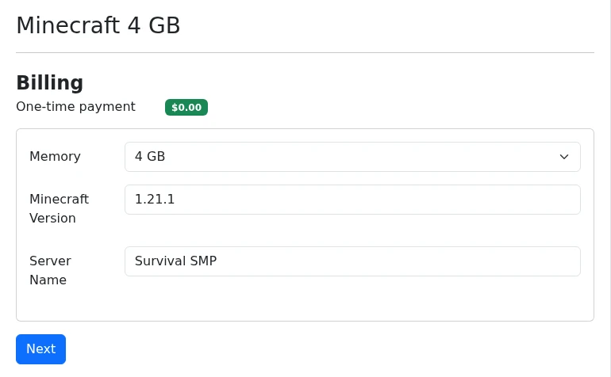
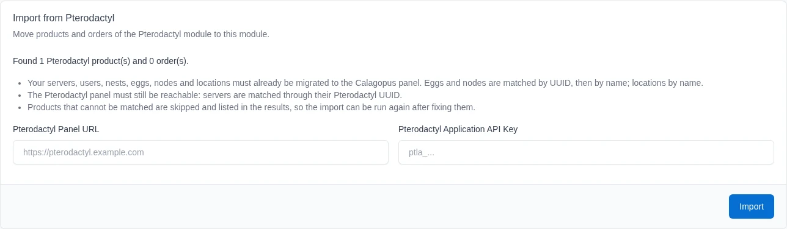

# FOSSBilling

The **Calagopus FOSSBilling module** adds a **Calagopus** product type to [FOSSBilling](https://fossbilling.org). Orders for a Calagopus product create, suspend, unsuspend and delete servers on your panel automatically, and clients see a live summary of their server on the order page.

::: danger
This module authenticates with an **admin API key**, which grants full administrative access to your panel - creating users and servers, reading every resource, and more. Treat it like a root password: never share it, and rotate it immediately if it is ever exposed.
:::

## What it does

The module maps FOSSBilling's order lifecycle onto the Calagopus admin API:

| FOSSBilling action | Effect on the panel |
| --- | --- |
| Activate | Finds or creates a panel user for the client, then provisions a server (on a specific node, or auto-deployed across locations). |
| Suspend / Cancel | Suspends the server. |
| Unsuspend / Uncancel | Unsuspends the server. |
| Renew | Unsuspends the server if the order was suspended. |
| Delete | Deletes the server, including its backups. |

Panel users are linked by the external ID `fb-<client id>` and servers by `fb-<order id>`, so a client reuses the same panel account across all of their orders, and activating an order again never creates a second server. The prefix keeps FOSSBilling's IDs apart from other billing systems connected to the same panel.

Clients see a server card on their order page. It shows the server's state, its address with a **Copy** button, the location and uptime, live memory, disk and CPU usage against the plan's limits, and the databases, backups, ports and schedules the plan includes. **Open Panel** takes the client straight to the server on your panel.



The admin order page gets a **Service Management** tab with the same live details plus the server UUID, external ID, node and owner, an **Open in Panel** button and **Sync with Panel**.



## Requirements

- A running [FOSSBilling](https://fossbilling.org) installation. The module is tested with FOSSBilling 0.8.7.
- A running Calagopus panel with at least one node, location, nest, and egg configured.
- An **admin API key** from your Calagopus panel.

## Installation

1. Upload the `modules/Servicecalagopus/` directory from the [module repository](https://github.com/calagopus/fossbilling-module) into your FOSSBilling installation:

   ```sh
   /path/to/fossbilling/modules/Servicecalagopus/
   ```

2. In the FOSSBilling admin area, go to **Extensions → Overview**, find **Calagopus**, and click the activate (▷) button.

3. Open the module settings with the ⚙ button next to **Calagopus**, or from **System → Settings**, and configure:

   | Field | Value |
   | --- | --- |
   | **Panel URL** | Your panel URL, e.g. `https://panel.example.com`. HTTPS is assumed if you leave out the protocol. |
   | **API Key** | Your Calagopus **admin API key**. It is stored encrypted and never shown again; leave the field blank to keep the saved key. |
   | **Default User Language** | The language assigned to panel users the module creates, e.g. `en`. |

4. Click **Update Settings**. The connection is verified before anything is saved, and **Test Connection** checks it again at any time.



::: info
The saved API key is only reused for the same panel. If you change the **Panel URL**, enter the API key again.
:::

## Configuring a product

Create a product with the type **Calagopus**, then open its **Configuration** tab. The tab loads eggs, nodes, locations and backup configurations from your panel, so you pick them from lists instead of entering UUIDs.



### Server type

| Field | What it does |
| --- | --- |
| **Egg** | The egg new servers are created from, grouped by nest. Required. |
| **Backup Configuration** | Optional backup configuration to assign to the server. **Default** uses the panel's default. |
| **Node** | Deploy onto a specific node, using its first available allocation. **Auto** lets the panel pick a node in the selected locations. |
| **Locations (deploy mode)** | The locations the panel can deploy into when the node is set to **Auto**. |
| **Port Range (deploy mode)** | A port or range such as `25565-25665` the primary allocation is picked from in deploy mode. Leave it blank to use the egg's configuration on the panel. |

Either a node or at least one location is required. Without a port range, deploy mode only assigns an allocation if the egg's configuration on the panel asks for one, so a server can end up without an address.

### Resources and limits

| Field | Notes |
| --- | --- |
| **Memory / Disk** | In MiB. `0` means unlimited. |
| **Swap** | In MiB. `-1` means unlimited. |
| **CPU Limit** | Percentage; `100` = one thread, `0` = unlimited. |
| **Memory Overhead** | Hidden memory added on top of the container's limit. |
| **IO Weight** | `10`–`1000`; leave blank for the default. |
| **Pinned CPUs** | Comma-separated core IDs, e.g. `0,1,2`. |
| **Allocation / Database / Backup / Schedule Limit** | Standard feature limits. |
| **Custom Feature Limits** | Extension-added limits, as `key:value` pairs, e.g. `plugins:5,worlds:3`. The built-in limits can't be set here. |

### Startup

| Field | Notes |
| --- | --- |
| **Docker Image** | Override the egg default. Blank uses the egg's default image. |
| **Server Name Prefix** | Servers are named `<prefix><order id>`, e.g. `MC-123`. Blank defaults to `Server-`. |
| **Startup Command** | Override the egg's default startup command. |
| **Start on Completion** | Starts the server once installation finishes (default: **Yes**). |
| **Skip Installer** | Skips the egg's installation script. |
| **Hugepages / KVM Passthrough** | Mount `/dev/hugepages` / allow `/dev/kvm` inside the container. |

### Egg variables

The tab shows a field for each of the selected egg's variables. Leave a variable blank to use the egg's default. After changing the egg, save the tab once to load the new egg's variables.

If the panel can't be reached, the tab shows an error and keeps the saved egg, node, locations and variables, so saving still works without losing them.

## Overriding settings with the order form

Create a form under **System → Settings → Form Builder**, then select it as the **Order Form** on the product's **General Settings** tab. Clients fill it in at checkout, and each field's name decides what it overwrites:

- **Dropdown or radio fields** named after a setting key, e.g. a `memory` dropdown with the options `2048` and `4096`. The submitted value has to be one of the field's options.
- **Custom feature limits:** a dropdown or radio field named after the limit's key, e.g. `plugins`.
- **Egg variables:** a field named after the variable in lowercase, e.g. `minecraft_version` for `MINECRAFT_VERSION`. Text fields only work for variables the egg marks as user editable; dropdown and radio fields work for any variable.
- **Server name:** any field named `server_name` (3 to 255 characters).



The module only reads the product's own form, and free-text fields never overwrite resource or placement settings. Form fields don't change the price, so sell priced tiers as separate products.

### Overridable settings

| Key | Setting |
| --- | --- |
| `nest_uuid`, `egg_uuid` | Nest, Egg |
| `node_uuid` | Node |
| `location_uuids` | Locations, comma-separated UUIDs |
| `port_range` | Port Range, e.g. `25565-25665` |
| `memory`, `swap`, `disk` | Memory, Swap, Disk in MiB |
| `cpu` | CPU Limit |
| `memory_overhead` | Memory Overhead |
| `io_weight` | IO Weight |
| `allocations_limit`, `database_limit`, `backup_limit`, `schedule_limit` | Feature limits |
| `docker_image` | Docker Image |
| `startup_command` | Startup Command |
| `pinned_cpus` | Pinned CPUs |
| `skip_installer`, `start_on_completion`, `hugepages_passthrough`, `kvm_passthrough` | `on`, `1`, `yes`, or `true` enables; anything else disables |
| `backup_configuration_uuid` | Backup Configuration |

FOSSBilling overwrites some order values at checkout, so fields named `id`, `product_id`, `form_id`, `title`, `type`, `quantity`, `unit`, `price`, `setup_price`, `discount`, `discount_price`, `discount_setup`, `total` or `period` are ignored.

## Syncing changes to a server

FOSSBilling doesn't notify modules when a product changes or an order moves to another product. After you change a product's configuration, open the order's **Service Management** tab and click **Sync with Panel**. It pushes the current limits, feature limits, pinned CPUs, passthrough settings, egg variables and, if set, the Docker image to the server. The deployment target, startup command, server name and install flags only apply when the server is first created.

## Linking existing panel users

When a client's first order activates, the module looks up the panel user with the external ID `fb-<client id>` and creates one if none exists. If a panel user with the same email address already exists, it is only linked when the client's email address is verified in FOSSBilling, the panel user isn't an admin and has no role, and it isn't linked to anything else yet. Otherwise activation fails, and you link the account yourself by setting that panel user's external ID to `fb-<client id>`.

## Migrating from the Pterodactyl module

If you sold servers through the community FOSSBilling Pterodactyl module (`Servicepterodactyl`) and have migrated your panel to Calagopus, the module can move those products and orders over. The **Import from Pterodactyl** section appears on the module settings page while Pterodactyl products or orders exist.



Before importing:

1. Migrate your servers, users, nests, eggs, nodes and locations to the Calagopus panel. Eggs and nodes are matched by UUID, which the panel migration keeps, then by name; locations are matched by name.
2. Keep the Pterodactyl panel reachable. Servers are matched by translating the stored Pterodactyl server ID to its UUID through the Pterodactyl application API.

The Pterodactyl panel URL and application API key default to the Pterodactyl module's settings. The saved key is only used with that module's saved panel URL.

The import:

- Converts each Pterodactyl product to a Calagopus product, mapping its egg and node (or location) and its limits. Both `<key>` and `default_<key>` settings are read.
- Converts each order of an imported product, links it to the matching server on the panel and sets the server's external ID to `fb-<order id>`.
- Links each server's owner to the client (`fb-<client id>`) when the owner's email matches the client's and the owner isn't linked to anything yet.

The import skips anything it can't match and lists it in the results, so you can fix it on the panel and run the import again. The next run also picks up orders an interrupted run left behind.

## Troubleshooting

| Symptom | Fix |
| --- | --- |
| Saving the settings fails | The panel rejected the key or couldn't be reached. Check the **Panel URL** and enter a valid **admin** API key. Changing the URL also requires entering the key again. |
| The Configuration tab shows "Could not load data from the Calagopus panel" | The panel is unreachable or the saved key stopped working. Fix the module settings; the tab keeps the saved values in the meantime. |
| The order goes to **Failed setup** with "only found 0 available allocations" | Deploy mode found no free allocation in the selected locations or port range. Add allocations on the panel or widen the **Port Range**, then activate the order again. |
| Activation fails because a panel user already exists | A panel user with the client's email exists but couldn't be linked automatically. Verify it belongs to the client, then set its external ID to `fb-<client id>`. |
| A server has no address | The product uses deploy mode without a **Port Range**, and the egg's configuration on the panel doesn't assign allocations. Set a **Port Range**, or configure allocations for the egg. |
| Clients see "Unable to load server information from the panel" | The panel was unreachable when the page loaded. The details come back on their own once the panel responds again. |
