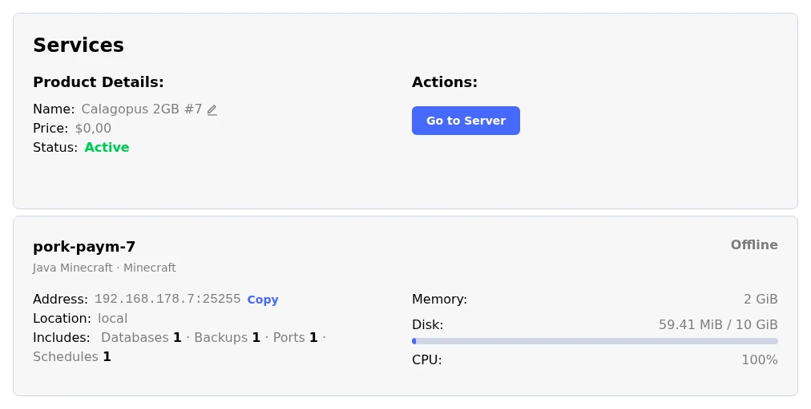
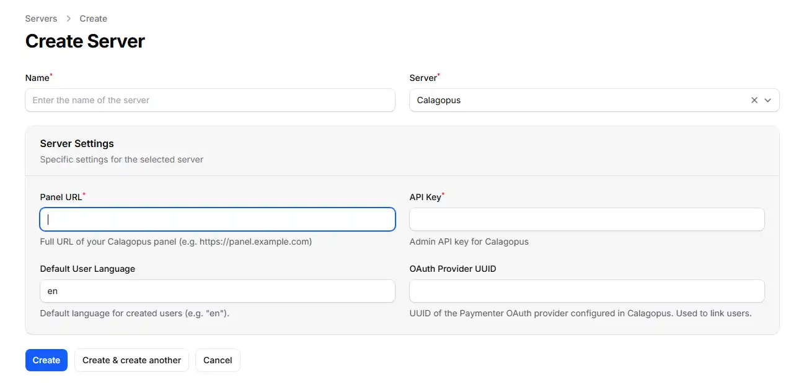
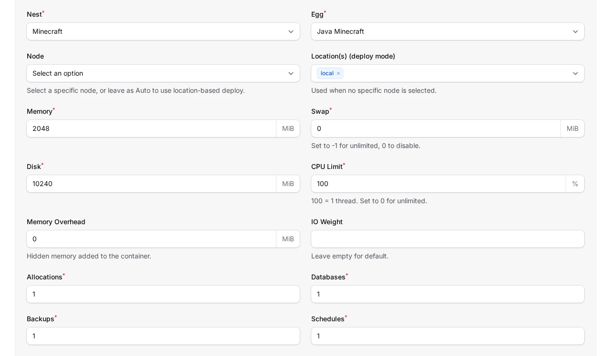
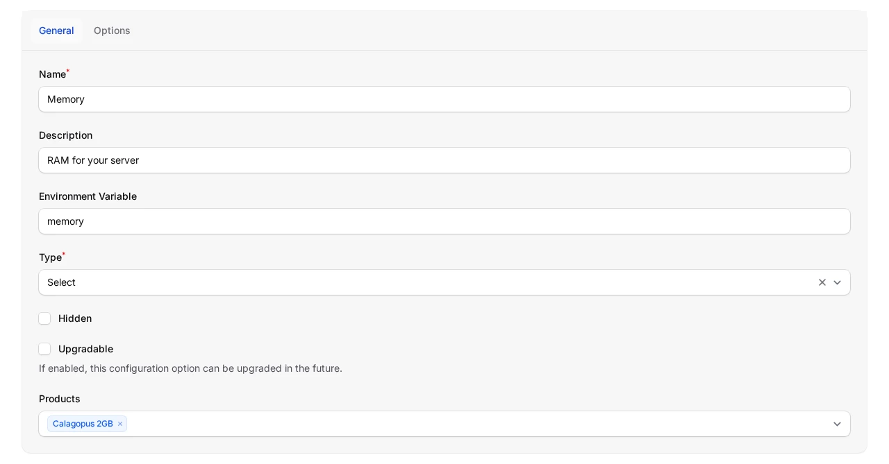
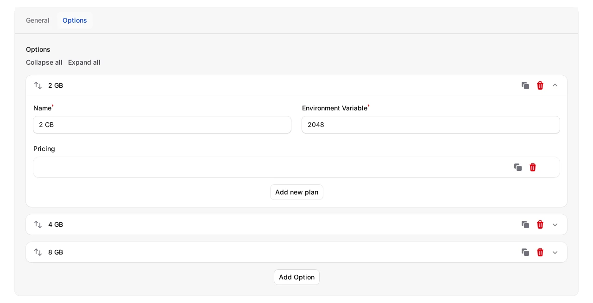
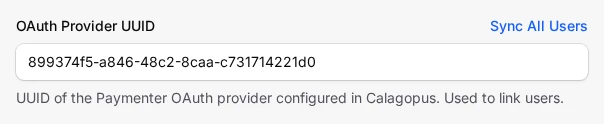
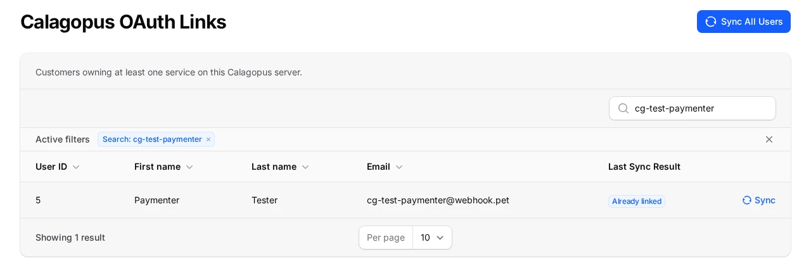

# Paymenter

The **Calagopus Paymenter module** is a server provisioning extension for [Paymenter](https://paymenter.org). It lets Paymenter automatically create, suspend, unsuspend, upgrade, and terminate Calagopus servers as part of your billing workflow, shows customers a live summary of their server on the service page, and can optionally link customer accounts to the panel via OAuth so they log in with their Paymenter credentials.

::: danger
This module authenticates with an **admin API key**, which grants full administrative access to your panel (creating users, servers, reading every resource, and more). Treat it like a root password: store it only in Paymenter's encrypted configuration, never commit it anywhere, and rotate it immediately if it is ever exposed.
:::

## What it does

Once configured against a product, the module maps Paymenter's service lifecycle onto the Calagopus admin API:

| Paymenter action | Effect on the panel |
| --- | --- |
| Create | Finds or creates a panel user for the customer, then provisions a server (on a specific node, or auto-deployed across locations). |
| Suspend / Unsuspend | Toggles the server's suspended state. |
| Upgrade / Change package | Updates the server's resource limits, feature limits, passthrough flags, pinned CPUs, and Docker image to match the new product configuration and the service's configurable options. |
| Terminate | Deletes the server, including its backups. |

Customers are matched to panel users by their Paymenter user ID, stored as the panel user's `external_id`, so each customer reuses the same panel account across all of their services. When [OAuth linking](#optional-oauth-account-linking) is set up, the module first looks for a panel user already linked to the customer's Paymenter account.

If creating the panel user fails because the email or username is taken, the module links the existing panel user with the same email, but only when the customer has verified their email in Paymenter. An unverified email doesn't prove the customer owns that panel account. Users are never matched by username. Otherwise provisioning stops with an error and you link the account by hand, as described under [Troubleshooting](#troubleshooting).

Each service page in the Paymenter client area gets a **Go to Server** button that opens the server in your panel, and a server summary below the service details. The summary shows:

- the server name, egg, and nest,
- its current state, from the panel (running, offline, installing, suspended, and so on),
- the address, with a **Copy** button,
- the location, and the uptime while it runs,
- memory, disk, and CPU as usage against the limit, where a limit of `0` shows as unlimited,
- the included databases, backups, ports, and schedules, plus any numeric limits an extension adds.

Live usage comes from the node. If the node can't be reached, the summary falls back to the configured limits.



## Requirements

- A running [Paymenter](https://paymenter.org) installation.
- A running Calagopus panel with at least one node, location, nest, and egg configured.
- An **admin API key** from your Calagopus panel.

## Installation

1. Upload the `extensions/Servers/Calagopus/` directory from the [module repository](https://github.com/calagopus/paymenter-module) into your Paymenter installation:

   ```sh
   /path/to/paymenter/extensions/Servers/Calagopus/
   ```

2. In the Paymenter admin area, go to **Servers → New server** and create a server using the **Calagopus** extension.

3. Configure the server with the following fields:

   | Field | Description |
   | --- | --- |
   | **Panel URL** | Full URL of your panel, e.g. `https://panel.example.com`. |
   | **API Key** | An admin API key for your Calagopus panel (stored encrypted). |
   | **Default User Language** | Two-letter language code for newly created users. Defaults to `en`. |
   | **OAuth Provider UUID** | Optional - used for account linking, see [below](#optional-oauth-account-linking). |

4. Click **Create**. On the saved server, use **Test Connection** next to the **Server** field to confirm Paymenter can reach the panel with the supplied key.



## Configuring a product

Create a product (or edit an existing one) and select **Calagopus** as the server extension. The product configuration is where you define what every server provisioned from this product looks like.

::: info
The **Nest**, **Egg**, **Node**, and **Location(s)** fields are populated live from your panel through the API key you configured on the server, so you can pick them from dropdowns rather than copying UUIDs by hand. Choosing a nest refreshes the available eggs.
:::



### Deployment target

You can deploy in one of two ways:

- **Specific node** - pick a **Node**, and the module provisions onto the first available allocation on that node.
- **Auto deploy** - leave the **Node** empty and select one or more **Location(s)**. Calagopus picks a node automatically, and assigns allocations according to the egg's configuration on the panel.

If no node is selected and no locations are provided, provisioning fails with "No node or location UUIDs configured for this product.", so make sure at least one is set.

### Resources and limits

| Field | Notes |
| --- | --- |
| **Memory / Swap / Disk** | In MiB. Set swap to `-1` for unlimited or `0` to disable. |
| **CPU Limit** | Percentage; `100` = one thread, `0` = unlimited. |
| **Memory Overhead** | Hidden memory added on top of the container's limit. |
| **IO Weight** | `10`–`1000`; leave blank for the default. |
| **Allocations / Databases / Backups / Schedules** | Standard feature limits. |
| **Custom Feature Limits** | Extension-added limits, as `key:value` pairs, e.g. `plugins:5,worlds:3`. Numbers are sent as numbers, `true` and `false` as booleans, anything else as text. |

### Egg and advanced options

| Field | Notes |
| --- | --- |
| **Docker Image** | Override the egg default. Blank uses the egg's default image. |
| **Startup Command** | Override the egg default startup command. |
| **Server Name Prefix** | Servers are named `<prefix><service id>`, e.g. `MC-12345`. Blank defaults to `Server-`. |
| **Skip Egg Install Script** | Skips the egg's installation script. |
| **Start on Completion** | Starts the server automatically once installation finishes. |
| **Hugepages / KVM Passthrough** | Mount `/dev/hugepages` / allow `/dev/kvm` inside the container. |
| **Pinned CPUs** | Comma-separated core IDs, e.g. `0,1,2`. Blank disables pinning. |
| **Backup Configuration UUID** | Optional backup configuration to assign to the server. |

::: tip
The product configuration has no field for egg variables. To set them, use [configurable options](#overriding-settings-with-configurable-options) whose environment variable matches the egg variable.
:::

## Overriding settings with configurable options

Paymenter's **Config Options** (admin area → **Config Options**) let a customer choose values at checkout, such as a memory tier or a game version. When the module provisions or upgrades a server, it merges every option value on the service on top of the product configuration, so the option wins whenever both are set. Custom properties on the service are merged the same way.

The match is made on the option's **Environment Variable**. The value it passes is the chosen option's own **Environment Variable**, or its name when that is left blank. Depending on the option's environment variable, it can do one of three things:

### Override a product setting

Name the environment variable after a product setting key and its value replaces the product's value for that service.

| Environment variable | Overrides | Value |
| --- | --- | --- |
| `memory`, `swap`, `disk` | Memory / Swap / Disk | MiB |
| `cpu` | CPU Limit | Percentage, `100` = one thread |
| `memory_overhead` | Memory Overhead | MiB |
| `io_weight` | IO Weight | `10`–`1000` |
| `allocations_limit`, `database_limit`, `backup_limit`, `schedule_limit` | Feature limits | Count |
| `custom_feature_limits` | Custom Feature Limits | `key:value,key:value` |
| `docker_image` | Docker Image | Image reference |
| `startup_command` | Startup Command | Command string |
| `server_name_prefix` | Server Name Prefix | Text |
| `skip_installer`, `start_on_completion`, `hugepages_passthrough`, `kvm_passthrough` | Checkboxes | `true`/`false`, `1`/`0`, `yes`/`no` |
| `pinned_cpus` | Pinned CPUs | `0,1,2` |
| `backup_configuration_uuid` | Backup Configuration UUID | UUID |
| `node_uuid`, `location_uuids`, `nest_uuid`, `egg_uuid` | Deployment target and egg | UUIDs from your panel |

For example, a config option named **Memory** with the environment variable `memory`, the type **Select**, and choices whose environment variables are `2048`, `4096`, and `8192` lets a customer pick their RAM tier at checkout. The product's own **Memory** field is the default when the option is not on the service.





### Set an egg variable

Name the environment variable after one of the egg's variables, for example `MINECRAFT_VERSION` or `SERVER_JARFILE`, and the customer's choice is written to that variable on the new server. The match is case-insensitive. Egg variables without a matching option keep the egg's default value.

### Name the server

An option with the environment variable `server_name`, `custom_server_name`, or `SERVER_NAME` sets the server's name instead of the `<prefix><service id>` pattern. The value is trimmed, limited to letters, numbers, spaces, underscores, dots, and hyphens, and cut to 48 characters. If nothing is left after cleaning, the module falls back to the prefix pattern.

### What applies on upgrade

When a service is upgraded or changes package, the module re-reads the product configuration and the service's current options, then updates the server's resource limits, feature limits, IO weight, hugepages and KVM passthrough, pinned CPUs, and Docker image. Egg variables, the startup command, the server name, the deployment target, and the install and start flags are only used when the server is first created.

::: warning
The product setting keys and the egg variables share one lookup, and the egg variable match is case-insensitive. If an egg has a variable named `MEMORY` or `DISK`, it receives the product's memory or disk value. Give your configurable options unambiguous names to avoid surprises.
:::

## Optional: OAuth account linking

OAuth linking lets your customers log into the Calagopus panel using their Paymenter account, so they never need a separate panel password. When enabled, newly provisioned servers automatically link the customer's panel user to their Paymenter identity.

1. Download the `paymenter-oauth-provider.yml` template from the [module repository](https://github.com/calagopus/paymenter-module).

2. In your Calagopus panel, go to **Admin → OAuth Providers → Import** and import the template.

3. Open the imported provider and edit every URL to point at your Paymenter installation (the template uses `https://your.paymenter.panel` placeholders). Save it, then copy the **Redirect URL**.

4. In the Paymenter admin area, go to **OAuth Clients → New OAuth client**, paste the Redirect URL into the **Redirect** field, give it a name, and save.

5. Copy the **Client ID** and **Secret** from the new Paymenter OAuth client.

6. Back in Calagopus, edit the imported OAuth provider, paste in the Client ID and Secret, and save.

7. Copy the **UUID** of the OAuth provider in Calagopus and paste it into the **OAuth Provider UUID** field on your Paymenter Calagopus server configuration. Save.

From now on, when a server is created for a customer, Paymenter links their panel account to their Paymenter identity automatically, letting them sign in to the panel with their Paymenter credentials.

### Link existing customers

Links are only created at server creation, so customers who already had a server before you set up OAuth have no link yet. You can backfill them in two ways:

- **All at once** - on the saved Calagopus server in Paymenter, click **Sync All Users** next to the **OAuth Provider UUID** field. This queues a background sweep over every customer who owns a service on that server, so it needs a running queue worker. Save any pending changes first, since the sweep uses the saved configuration.
- **One customer at a time** - go to **Calagopus OAuth Links** in the admin area, find the customer, and click **Sync** on their row.



Neither creates panel accounts; they only add missing links. A customer is linked only when their panel user has the same email and they have verified their email in Paymenter. The **Calagopus OAuth Links** page lists every customer with a service on the server, shows the progress of a running sweep, and keeps each customer's last result:

| Result | Meaning |
| --- | --- |
| Linked | The link was created. |
| Already linked | The customer was already linked. |
| No panel account | No panel user has this customer's Paymenter user ID as its `external_id`. |
| Email mismatch | The matching panel user has a different email, so it wasn't linked automatically. |
| Email unverified | The customer hasn't verified their Paymenter email. Email verification is off on a default Paymenter install, so most customers land here until they verify or you link them in the panel. |
| Failed | The panel rejected the request. The reason is shown on the page. |



::: info
The provided template is configured as **login only** - customers use it to authenticate, and the provider does not let them manage the link themselves. For more on OAuth providers in general, see [Setting up OAuth](../additional/setting-up-oauth/index.md).
:::

## Troubleshooting

| Symptom | Fix |
| --- | --- |
| "Connection failed: Calagopus API Error (HTTP 401)" on Test Connection | The API key is missing, malformed, or lacks admin access. Generate a fresh **admin** API key in your panel and re-enter it. |
| "No available allocations on the selected node" | The chosen node has no free allocations. Add allocations to the node, or switch the product to auto-deploy across locations. |
| "No node or location UUIDs configured for this product." | Pick a **Node** or at least one **Location(s)** in the product's server settings. |
| "Server already exists on the panel" | A server is already linked to this service's ID (`external_id`). Remove or re-link the existing panel server before re-provisioning. |
| "User with this email/username already exists on the panel" | A panel user already has the customer's email or username, and the module couldn't link it because the customer's email isn't verified or only the username matches. After checking that the customer owns that panel account, set its `external_id` to the Paymenter user ID given in the message, then retry. |
| The service page says "Unable to load server information from the panel." | Paymenter couldn't reach the panel with the server's API key. Check the panel is up and use **Test Connection** on the server. |
