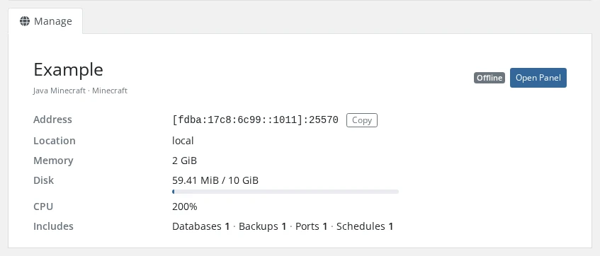
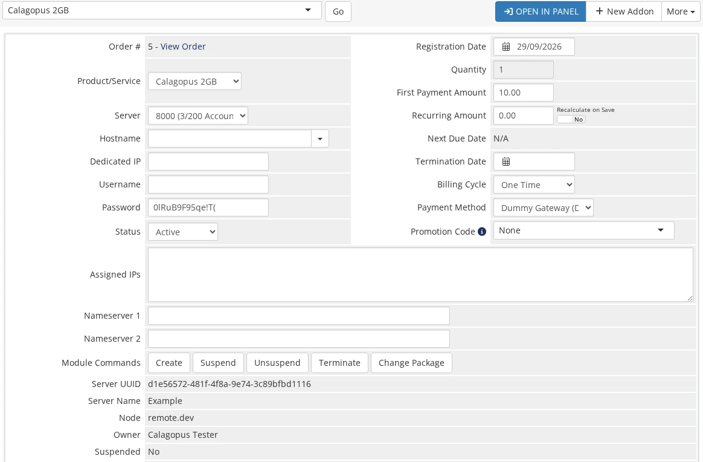
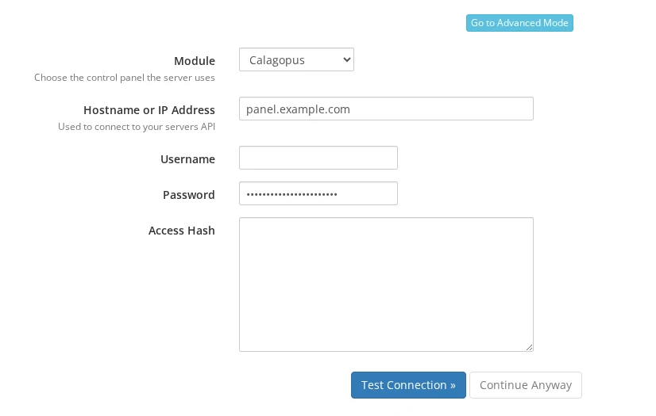
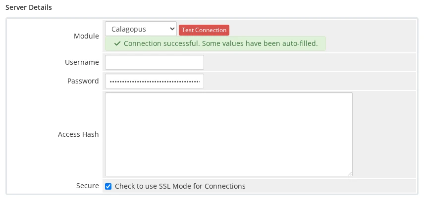
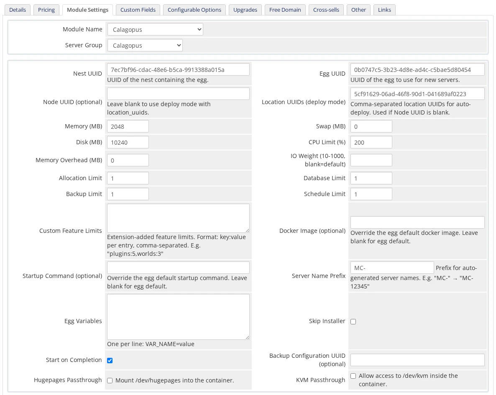
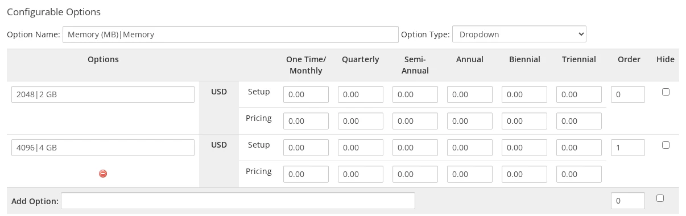

# WHMCS

The **Calagopus WHMCS module** is a server provisioning module for [WHMCS](https://www.whmcs.com). It lets WHMCS automatically create, suspend, unsuspend, upgrade, and terminate Calagopus servers as part of your billing workflow, and shows customers a live summary of their server in the WHMCS client area.

::: danger
This module authenticates with an **admin API key** (entered as the server password), which grants full administrative access to your panel - creating users and servers, reading every resource, and more. Treat it like a root password: never share it, and rotate it immediately if it is ever exposed.
:::

## What It Does

The module maps WHMCS's provisioning lifecycle onto the Calagopus admin API:

| WHMCS action | Effect on the panel |
| --- | --- |
| Create | Finds or creates a panel user for the client, then provisions a server (on a specific node, or auto-deployed across locations). Refuses to run if a server already exists for the service. |
| Suspend / Unsuspend | Toggles the server's suspended state. |
| Change Package | Updates the server's resource limits, feature limits, and egg variables to match the new product configuration and the service's configurable options. |
| Terminate | Deletes the server, including its backups. |

### How Clients and Servers Are Linked

Each client gets one panel account, reused for all of their services. The module stores the WHMCS client ID as the panel user's `external_id` and looks the user up by it before doing anything else. When no user has that ID yet, it creates one:

- The username is built from the client's first and last name plus the client ID, e.g. `johnsmith_42`.
- The panel sends the new user its welcome email so they can set a password.

If the panel rejects the new user because the email address is already taken, the module links the existing panel user with exactly that email by setting its `external_id`. A conflict on the username alone is never linked automatically. Provisioning stops with an error instead, so you can check who owns that account first.

Servers are linked the same way: the server's `external_id` is the WHMCS service ID. If you add the optional `Server UUID` custom field described under [Installation](#installation), the module also checks that UUID when the lookup by `external_id` finds nothing.

::: warning
The external IDs are plain WHMCS numbers (`42`, not a prefixed value). If the same panel is also used by another billing system that stores plain numeric IDs, a WHMCS client can be matched to that system's panel user with the same number. Give each billing system its own panel, or check the `external_id` of existing panel users before you connect a second one.
:::

### In the Client Area

The service's **Overview** page shows a summary card of the server, loaded live from the panel each time the page opens:

- The server name, egg and nest, and a state badge using the panel's own states: **Suspended**, **Transferring**, **Node Maintenance**, **Installing** or **Install Failed**, then the live **Running**, **Starting**, **Stopping** or **Offline**.
- The server address with a **Copy** button. The panel's IP alias is used when one is set.
- The server's location, and its uptime while it is running.
- Memory, disk, and CPU as used / limit with a usage bar. Memory and CPU usage appear only while the server is running; a limit of `0` shows as **Unlimited**.
- An **Includes** line with the database, backup, port (allocation), and schedule limits, followed by any numeric custom feature limits.
- An **Open Panel** button that takes the client straight to the server in Calagopus.



If the panel can't be reached, the card shows "Unable to load server information from the panel." and the error is written to the WHMCS module log.

### In the Admin Area

On the client's **Products/Services** tab, the module replaces the WHMCS login link with an **Open in Panel** button and lists the server's UUID, name, node, owner, and suspended state below the module commands.



## Requirements

- A running [WHMCS](https://www.whmcs.com) installation.
- A running Calagopus panel with at least one node, location, nest, and egg configured.
- An **admin API key** from your Calagopus panel.

## Installation

1. Upload the `modules/servers/calagopus/` directory from the [module repository](https://github.com/calagopus/whmcs-module) into your WHMCS installation:

   ```sh
   /path/to/whmcs/modules/servers/calagopus/
   ```

2. In the WHMCS admin area, go to **System Settings → Servers → Add New Server** and fill in:

   | Field | Value |
   | --- | --- |
   | **Module** | Select **Calagopus**. |
   | **Hostname or IP Address** | Your panel domain, e.g. `panel.example.com`. There is no separate port field; add the port to the hostname if your panel uses a non-standard one, e.g. `panel.example.com:8443`. |
   | **Password** | Your Calagopus **admin API key**. |

   Leave **Username** and **Access Hash** empty. The module doesn't use them.

   

3. Click **Test Connection**. On success, WHMCS opens the full server form. Give the server a **Name**, keep **Secure** ticked if your panel uses HTTPS (untick it for plain HTTP), and click **Save Changes**.

   

4. Create a **Server Group** and assign your Calagopus server to it.

::: info
To see the panel's server UUID against each service, create two **custom fields** named `Server UUID` and `Server ID` on the product (admin-only). The module fills them in when it provisions a server. They are optional. The module finds servers by their `external_id` and only falls back to `Server UUID` when that lookup finds nothing.
:::

## Configuring a Product

Create a product, set its module to **Calagopus** on the **Module Settings** tab, and pick your server group. WHMCS fields are plain text, so you enter UUIDs directly; copy them from the admin area of your panel.



::: warning
WHMCS enforces a hard limit of **24 module configuration options**. This module uses all of them, so do not add further custom config options to a Calagopus product.
:::

### Deployment Target

| Field | Description |
| --- | --- |
| **Nest UUID** | UUID of the nest containing the egg. Required. |
| **Egg UUID** | UUID of the egg to provision. Required. |
| **Node UUID** | Deploy onto a specific node, using its first free allocation. Leave blank to use deploy mode. |
| **Location UUIDs** | Comma-separated location UUIDs for auto-deploy. Used when **Node UUID** is blank. |

At least one of **Node UUID** or **Location UUIDs** must be set. WHMCS checks the module settings when you save the product and lists anything missing or invalid, so a broken product can't be saved.

### Resources and Limits

| Field | Notes |
| --- | --- |
| **Memory / Disk** | In MB. The module doesn't accept `0` here. |
| **Swap** | In MB, `0` or higher. |
| **CPU Limit** | Percentage; `100` = one thread, `0` = unlimited. |
| **Memory Overhead** | Hidden memory added on top of the container's limit. |
| **IO Weight** | `10`–`1000`; leave blank for the default. |
| **Allocation / Database / Backup / Schedule Limit** | Standard feature limits. |
| **Custom Feature Limits** | Extension-added limits, as `key:value` pairs, e.g. `plugins:5,worlds:3`. Numbers are sent as numbers and `true`/`false` as booleans; anything else is sent as text. |

### Egg and Advanced Options

| Field | Notes |
| --- | --- |
| **Docker Image** | Override the egg default. Blank uses the egg's first image. |
| **Startup Command** | Override the egg default startup command. |
| **Server Name Prefix** | Servers are named `<prefix><service id>`, e.g. `MC-12345`. Blank defaults to `Server-`. |
| **Egg Variables** | One `VAR_NAME=value` per line. |
| **Skip Installer** | Skips the egg's installation script. |
| **Start on Completion** | Starts the server automatically once installation finishes (default: on). |
| **Backup Configuration UUID** | Optional backup configuration to assign to the server. |
| **Hugepages / KVM Passthrough** | Mount `/dev/hugepages` / allow `/dev/kvm` inside the container. |

## Overriding Settings with Configurable Options

Every product setting can be overwritten per service through WHMCS **Configurable Options** or **Custom Fields**, in the same way the Pterodactyl module works. For each setting the module looks for a value in this order and uses the first non-empty one:

1. A configurable option named after the setting's friendly name, e.g. `Memory (MB)`.
2. A configurable option named after the setting's key, e.g. `memory`.
3. A custom field named after the friendly name.
4. A custom field named after the key.
5. The product's own module setting.
6. The module default.

WHMCS only passes the part of a name before the `|` to the module, for option names and option values alike. An option named `Memory (MB)|Memory` with the values `2048|2 GB` and `4096|4 GB` shows **Memory** with **2 GB** and **4 GB** to the client, and the module receives `Memory (MB)` = `4096` for the second choice.



### Overridable Settings

| Key | Friendly name | Value |
| --- | --- | --- |
| `nest_uuid`, `egg_uuid` | Nest UUID, Egg UUID | UUID |
| `node_uuid` | Node UUID (optional) | UUID |
| `location_uuids` | Location UUIDs (deploy mode) | Comma-separated UUIDs |
| `memory`, `swap`, `disk` | Memory (MB), Swap (MB), Disk (MB) | MiB |
| `cpu` | CPU Limit (%) | Percentage, `100` = one thread |
| `memory_overhead` | Memory Overhead (MB) | MiB |
| `io_weight` | IO Weight (10-1000, blank=default) | `10`–`1000` |
| `allocations_limit`, `database_limit`, `backup_limit`, `schedule_limit` | Allocation Limit, Database Limit, Backup Limit, Schedule Limit | Count |
| `custom_feature_limits` | Custom Feature Limits | `key:value,key:value` |
| `docker_image` | Docker Image (optional) | Image reference |
| `startup_command` | Startup Command (optional) | Command string |
| `server_name_prefix` | Server Name Prefix | Text |
| `variables` | Egg Variables | One `VAR_NAME=value` per line |
| `skip_installer`, `start_on_completion`, `hugepages_passthrough`, `kvm_passthrough` | Skip Installer, Start on Completion, Hugepages Passthrough, KVM Passthrough | `on`, `1`, `yes`, or `true` enables; anything else disables |
| `backup_configuration_uuid` | Backup Configuration UUID (optional) | UUID |

Overrides skip the product page's validation, so an override value goes to the panel as-is.

Two extra keys have no field on the product page but are honoured when supplied as a configurable option or custom field:

| Key | Friendly name | Purpose |
| --- | --- | --- |
| `server_name` | Server Name | Full server name, replacing the `<prefix><service id>` pattern. |
| `pinned_cpus` | - | Comma-separated core IDs, e.g. `0,1,2`. |

### Egg Variables

Each egg variable can be overwritten by a configurable option or custom field named after the variable's **display name** or its **environment variable name**. For a variable shown as `Minecraft Version` with the environment variable `MC_VERSION`, either name works. The product's **Egg Variables** field supplies the base values, and a matching option or custom field wins over it.

### Custom Feature Limits

Each key defined in the product's **Custom Feature Limits** field, for example `plugins` in `plugins:5,worlds:3`, can be overwritten individually by a configurable option or custom field with the same name. The key has to be present in the product's definition, otherwise the override is ignored.

### What Applies on Change Package

Change Package re-resolves the limits, feature limits, hugepages and KVM passthrough, and egg variables from the new product and the service's current options and custom fields. Pinned CPUs and the Docker image are applied only when they are set; leaving them blank keeps what the server already has. The server name, startup command, deployment target, and the install and start flags are only used when the server is first created.

## Troubleshooting

| Symptom | Fix |
| --- | --- |
| Test Connection fails | Confirm the **Hostname** has no scheme or trailing path (just the domain, plus `:port` if needed), **Secure** matches your panel's protocol, and the **Password** field contains a valid **admin** API key. A `cURL Error` means WHMCS couldn't reach the panel at all. |
| "No available allocations on the selected node." | The chosen node has no free allocations. Add allocations to the node, or switch the product to auto-deploy by clearing the Node UUID and supplying Location UUIDs. |
| The product won't save | The module settings failed validation: Nest UUID or Egg UUID is missing, neither a Node UUID nor Location UUIDs were given, or a number is out of range. All UUIDs must come from the same panel the server is configured against. |
| "A panel user with this username already exists and was not linked automatically." | The panel already has a user with the username generated for this client, under a different email. Check that the account belongs to the client, then set that panel user's `external_id` to the WHMCS client ID and run **Create** again. |
| "Failed to create server because it already exists for this service" | A server with this service's ID as its `external_id` is already on the panel, for example from an earlier Create. Terminate or remove that server first, or keep using it. |
| "Server not found." on Suspend, Terminate or Change Package | No panel server has this service's ID as its `external_id`, and the `Server UUID` custom field (if any) doesn't match one either. Set the server's `external_id` in the panel to the WHMCS service ID. |
| Clients get a duplicate panel account | The client registered on the panel separately with a different email than the one in WHMCS. Link the accounts by setting that panel user's `external_id` to the WHMCS client ID. |
| The client area shows "Unable to load server information from the panel." | The panel couldn't be reached or returned an error. Enable the WHMCS module log (**System Logs → Module Log**) and reload the page to see the underlying error. |
