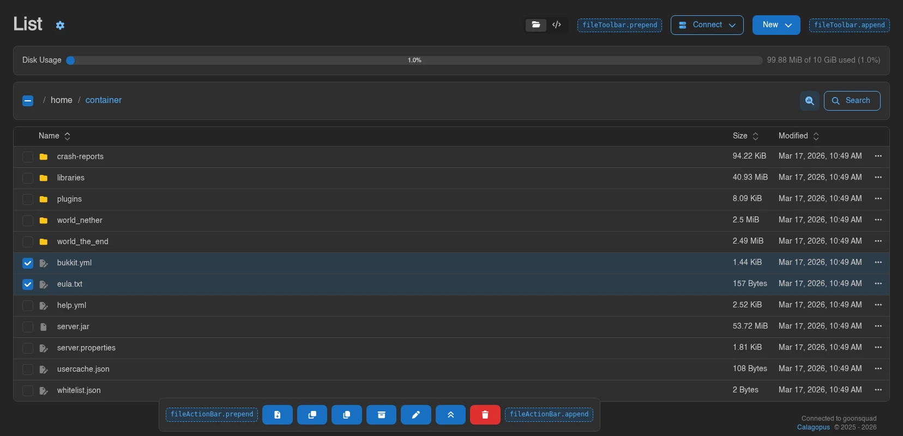
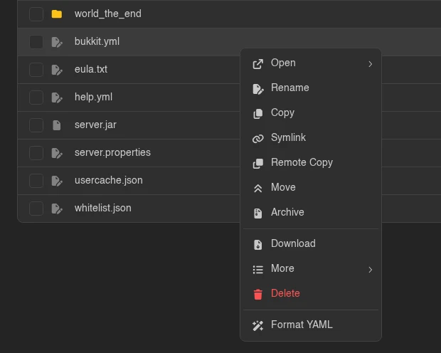
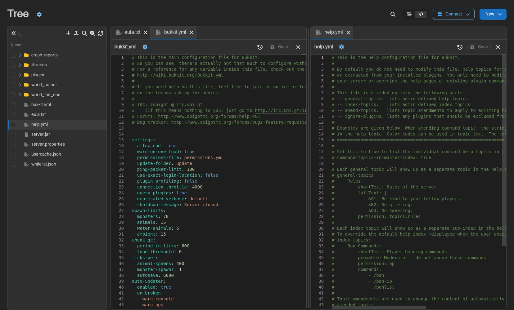

# File Manager

The file manager has twelve slot points, three handler lists and its own editor plugin system, which makes it the widest extension surface on any single Panel page. All of it hangs off one registry:

```ts
ctx.extensionRegistry.pages.server.files;
```

::: info
Not to be confused with [File Storage](./file-storage.md), which is the backend abstraction for files your *extension* owns. This page is about the UI a user browses their *server's* files with.
:::

## The Three Surfaces

The same registry drives three different screens, and a slot point rarely appears on all three:

| Surface | URL | What it is |
| ------- | --- | ---------- |
| **List view** | `/server/<id>/files` | The table of files, one directory at a time |
| **Tree workspace** | `/server/<id>/files` | The same page with the tree sidebar and editor panes, toggled by the user |
| **Editor page** | `/server/<id>/files/<action>` | One file, full screen, its own route |

List and tree are the same route. Which one a user gets is a per-user preference they flip with the two buttons in the toolbar, so **you cannot assume either**. A component slotted into the list toolbar appears in both; a component slotted into the tree toolbar appears in one of them.

The editor page is a separate route, and the tree workspace embeds the *same* editor component inside a pane. That pairing shows up throughout the registry as `surface: 'page'` versus `surface: 'inline'`.

## Where Your Components Land

Nine of the twelve slot points take components. Seven of those are plain lists: `prependComponent` and `appendComponent`, and your component is rendered with no props.

```ts
public initialize(ctx: ExtensionContext): void {
  ctx.extensionRegistry.pages.server.files.enterFileToolbar((toolbar) =>
    toolbar.appendComponent(MyToolbarButton),
  );
}
```

The toolbar and action bar slots come out either side of the stock controls, with a placeholder component sitting in each of the four:



The full list:

| Slot | Enter with | Renders | Visible when |
| ---- | ---------- | ------- | ------------ |
| `container` | `enterContainer` | Around the whole `/files` page | Always. See the warning below |
| `editorContainer` | `enterEditorContainer` | Around the editor route | Editor page only, not inside a tree pane |
| `fileToolbar` | `enterFileToolbar` | Either side of the **Connect** and **New** buttons | Both views |
| `fileTreeToolbar` | `enterFileTreeToolbar` | The icon row at the top of the tree sidebar | Tree view only |
| `fileActionBar` | `enterFileActionBar` | The floating bar that rises when rows are selected | While something is selected or queued for copy or move |
| `fileOperationsProgress` | `enterFileOperationsProgress` | Inside the operations popover | Only while an archive, extract or upload is running, and only once the user opens the popover |
| `fileSettings` | `enterFileSettings` | The gear popover beside the page title | Both views |
| `fileEditorSettings` | `enterFileEditorSettings` | The gear popover beside the file name in the editor | `edit` and `new` only |
| `fileImageViewerSettings` | `enterFileImageViewerSettings` | The same popover for the image viewer | `image` only |

The three settings slots all land inside a popover dropdown laid out as a narrow vertical stack, so put compact controls there - a switch, a select, a short number input. A card will look wrong.

::: warning
**`container` components sit outside the file manager's provider.** The `/files` page renders `FileManagerProvider` as a *child* of the container, and the container's slots render outside that child, so a component slotted into `container` cannot call `useFileManager` or `useFileManagerApi` - the hook throws. Use `container` for chrome that does not need file state, and `fileToolbar` or `fileSettings` for anything that does.

`editorContainer` is the other way round: it renders inside the provider, so it can read file state.
:::

`container` and `editorContainer` are `ContainerRegistry` instances rather than plain lists, which gives them three insertion points instead of two - `prependComponent` (above everything), `prependContentComponent` (below the header, above the content) and `appendContentComponent` (below the content).

## Context Menus

Three menus take interceptors. Unlike the component slots, an interceptor is handed the array of menu items that core built and mutates it in place:

```ts
import { faWandMagicSparkles } from '@fortawesome/free-solid-svg-icons';

ctx.extensionRegistry.pages.server.files.enterFileContextMenu((menu) =>
  menu.addItemInterceptor((items, { file, directory, surface }) => {
    if (!file.name.endsWith('.yml')) return;

    items.push(
      { type: 'divider' },
      {
        type: 'action',
        icon: faWandMagicSparkles,
        label: 'Format YAML',
        color: 'gray',
        onClick: () => formatYaml(join(directory, file.name)),
      },
    );
  }),
);
```



| Menu | Enter with | Props your interceptor receives |
| ---- | ---------- | ------------------------------- |
| `fileContextMenu` | `enterFileContextMenu` | `{ file, directory, surface: 'table' \| 'tree' }` |
| `newFileContextMenu` | `enterNewFileContextMenu` | None |
| `fileMassContextMenu` | `enterFileMassContextMenu` | None |

`newFileContextMenu` is shared: it backs the **New** button in both views *and* the right-click menu on empty space in the tree.

::: info
`enterFileMassContextMenu` was added in 1.2.3. On earlier Panels the field is there but the helper is not, so reach for it directly: `ctx.extensionRegistry.pages.server.files.fileMassContextMenu.addItemInterceptor(...)`.
:::

### Which Interceptor Kind To Use

Every context menu registry takes two kinds:

- **`addItemInterceptor(fn)`** - a plain function, `(items, props) => void`. Cannot use hooks.
- **`addComponentItemInterceptor(Component)`** - a React component rendered with `{ items, ...props }`. Mutates `items` during its own render, and can use hooks to get there.

For the mass context menu the component form is not a preference, it is the only thing that works: that menu passes **no props at all**, so a plain function has no way to learn which files are selected. A component interceptor can call `useFileManager` and read `selectedFiles` itself.

::: warning
Push your items **during render, on every render**. The item array is rebuilt from scratch each time the menu's props change, so an interceptor that adds its entries once - from a `useEffect`, or behind a "have I run yet" flag - loses them on the next rebuild.
:::

Two more things about the items themselves: submenus are exactly one level deep, so an item's `items` array cannot hold further nested items, and menu items only fire on real user clicks, which is worth knowing if you drive the Panel from a test script.

## Icons and Openability

Two handler lists decide how an entry looks and what happens when a user opens it. The pair reads as symmetric and behaves differently in ways that matter.

```ts
import { faScroll } from '@fortawesome/free-solid-svg-icons';

ctx.extensionRegistry.pages.server.files
  .addFileIconHandler((file) => (file.name.endsWith('.mcfunction') ? faScroll : undefined))
  .addFileOpenableHandler((file) =>
    file.name.endsWith('.mcfunction')
      ? { openable: true, handleOpen: ({ handleFileOpen }) => handleFileOpen(file.name, 'mcfunction', {}) }
      : { openable: false },
  );
```

**Icon handlers run first, before every built-in check.** Return `undefined` to pass and let the next handler or the stock icon logic decide. Return an icon and it is used - including for directories, which is almost never what you want, so check `file.directory` before you return anything.

**Openable handlers run in the middle.** Directories and browsable archives are resolved before your handler is called, and the sqlite, image, audio and text-editor checks happen after it. So:

- You cannot claim a directory, a `.zip`, a `.7z` or a `.ddup`.
- You can claim anything else, including files the Panel would otherwise refuse as too large.
- **There is no veto.** The loop takes the first handler that returns `openable: true` and ignores every `{ openable: false }` along the way. You cannot use a handler to make something *stop* being openable, and the `reason: 'tooLarge'` field is only ever set by core.

::: warning
Claiming an oversized file only gets you past the *frontend* check. The same limit is enforced by the backend: the file contents endpoint passes `max_file_manager_view_size` to Wings and returns `413` above it, and writes are capped the same way. A custom editor for very large files has to fetch its content from your own extension route - the Panel's content endpoint will refuse.
:::

## The Open Handler Contract

`handleOpen` is where most of the sharp edges live, because it is replayed in three different contexts and only one of them is a normal page navigation:

1. **The list view** calls it with real `navigate` and `setSearchParams`.
2. **The tree workspace** calls it to resolve a workspace tab. `handleFileOpen` opens a pane tab instead of navigating anywhere.
3. **`fileOpenUrl`** calls it against stub callbacks that record where you wanted to go, then hands the resulting URL to a new browser tab, a popup or a virtual window.

Which gives one rule:

::: warning
**Route through `handleFileOpen` and `handleDirectoryOpen`, and treat `handleOpen` as pure.** Calling `navigate()` or `setSearchParams()` yourself works in the list view and then breaks everywhere else: in the tree workspace it navigates the user out of their workspace rather than opening a tab, and under `fileOpenUrl` any side effect you perform runs while the Panel is merely *computing a URL* for a middle-click. Side effects belong in the component you open, not in the handler that opens it.
:::

`handleFileOpen(file, action, params)` takes the entry's name, the action name that selects the editor, and extra query parameters. Two details worth having:

- The first argument does not have to be the file that was clicked - pass a different name to open a sibling.
- `params` is part of a workspace tab's identity, so opening the same file twice with different `params` gives the user two tabs rather than reusing one.

The whole path is gated on `files.read-content`. If the user lacks it, nothing opens and your handler is never called.

## Custom Editors

An editor action is a component that owns the content pane for one action name:

```tsx
ctx.extensionRegistry.pages.server.files.addFileEditorAction({
  name: 'mcfunction',
  title: (file) => `Editing ${file}`,
  contentType: 'string',
  content: McFunctionEditor,
  header: {
    rightSection: McFunctionSaveButton,
  },
});
```

The `name` becomes a URL segment: registering `mcfunction` makes `/server/<id>/files/mcfunction?directory=...&file=...` a working route, which is exactly the URL `handleFileOpen(file, 'mcfunction', {})` produces. It is also the string the tree workspace matches on when it decides what to render in a pane, so one registration covers both surfaces.

Your `content` component's props are typed for you:

```tsx
import type { FileEditorStringContentProps } from 'shared/src/registries/pages/server/files.ts';

export default function McFunctionEditor({ content, setContent, readOnly, context }: FileEditorStringContentProps) {
  /* ... */
}
```

### Reserved And Overridable Names

There is no reserved-name check and no deduplication between extensions, so name collisions resolve by accident:

- **`diff` and `sqlite` are unreachable.** Both are registered as their own routes ahead of `/files/:action`, and the tree checks for `sqlite` before it checks your action. An action under either name is dead code.
- **`new`, `edit`, `image` and `audio` silently win.** A custom action is matched *before* the built-in branches on both surfaces, so registering `name: 'edit'` replaces the Panel's file editor for every text file on the instance. That is occasionally what someone wants; it should never be an accident.
- **Two extensions registering the same name**: whichever initialised first takes it.

Prefix your action names the way you prefix everything else.

### String Or Blob

`contentType` decides what your component is handed, and the Panel always fetches the file first either way - there is no opt-out, so a custom editor costs one full download even if it never reads the result.

| `contentType` | Your `content` receives | Stock **Save** button |
| ------------- | ----------------------- | --------------------- |
| `'string'` | The decoded text, plus `setContent` | Works inside a tree pane, does nothing on the editor page |
| `'blob'` | The raw `Blob`, plus `setContent` | Never works. Persistence is yours |

The Save column needs spelling out. On the **editor page** the stock Save button writes whatever your component last passed to `setContent`: the string as `text/plain`, or the blob as raw bytes, to the file the page was opened for. Panels before 1.2.3 rendered the button but silently did nothing for custom actions, and showed Create instead of Save for them. Supplying `header.rightSection` with your own save control removes the stock button, since on that surface `rightSection` *replaces* the entire stock button group.

### The Header, And How It Differs Per Surface

`header` has two optional components, and they do not behave the same way:

- **`header.settings`** replaces the gear popover next to the title, on both surfaces. Because it replaces it, a custom action also suppresses the `fileEditorSettings` and `fileImageViewerSettings` slots - those live inside the stock popovers, which no longer render.
- **`header.rightSection`** replaces the whole right-hand group on the **editor page**, but is rendered *alongside* the stock revert, history, save and close controls inside a **tree pane**. Design it so it reads correctly next to those, not only instead of them.

`title(file)` is your page title, and it wins over every built-in title rule. A tree pane falls back to the bare file name if no action matched.

### Reading The Context

Both surfaces pass a `context` prop to your `content` component:

```ts
interface FileEditorActionContext {
  surface: 'page' | 'inline';
  directory: string;
  file: string;
  path: string;
  params: Readonly<Record<string, string>>;
  workspace?: { paneId: string; paneIndex: number; paneCount: number; active: boolean };
}
```

`workspace` is present only when `surface` is `'inline'`, and describes the pane you are rendering in. Users split panes by dragging a tab, so `paneCount` is genuinely variable and `active` tells you whether the user is currently looking at your pane:



Size your editor for a pane that can be half a screen wide and is not necessarily focused. An action that only makes sense full width should check `context?.surface`.

::: info
An action name the Panel does not recognise renders a 404 screen on the editor page, and a yellow "No editor is available for this file type." notice inside a tree pane. If your action shows one of those, the registration did not run.
:::

## Reading File Manager State

The file manager's store is **scoped to a React context**, not global like `useServerStore`. `useFileManager(selector)` and `useFileManagerApi()` only work inside `FileManagerProvider`, which is why the `container` slot cannot use them and every other slot can.

```tsx
import { useFileManager } from '@/providers/contexts/fileManagerContext.ts';

const directory = useFileManager((state) => state.browsingDirectory);
```

The fields extensions usually want:

| Field | What it tells you |
| ----- | ----------------- |
| `browsingDirectory` | The directory currently open |
| `browsingWritableDirectory` | Whether writes are allowed here |
| `browsingPrimaryFilesystem` | Whether this is the server's real filesystem. Gates revisions and collaborative editing |
| `browsingFastDirectory` | Whether the backing filesystem supports archive browsing |
| `browsingBackup` | The backup being browsed, or `null` |
| `selectedFiles`, `actingFiles` | The current selection and the copy or move queue |
| `searchInfo` | The active search, or `null` |

Gate destructive menu items on `browsingWritableDirectory`, not on permissions alone. A user with `files.delete` still cannot delete anything while browsing a backup.

::: tip
Entries can be **virtual** - `file.virtual` is set for things that are not files on disk, such as entries inside a browsed archive or backup. Your icon and openable handlers are called for them exactly as for real files, so check the flag before you offer an operation that assumes a real path.
:::

## Monaco And Pierre

Editor hooks are not part of this registry. They live under `elements`, and they fire for every editor instance in the Panel, not only the file manager's:

```ts
ctx.extensionRegistry.elements
  .enterMonacoEditor((monaco) =>
    monaco.addOnMountHandler((editor, api) => {
      /* register a language, add an action, set a theme */
    }),
  )
  .enterPierreEditor((pierre) =>
    pierre.addOnMountHandler((handle, editor) => {
      /* editor.setMarkers(...), editor.setSelections(...), handle.setValue(...) */
    }),
  );
```

The catch is local to this page. The file manager is the only place in the Panel that offers a second editor engine: users pick Monaco or **Pierre** in the editor settings, and only the handlers for the engine they picked run. Every other editor in the Panel - the YAML editors, the email template editor, the database query console, the node log viewer, the egg installation script editor - is unconditionally Monaco. A feature that only hooks Monaco therefore goes missing for Pierre users on this one screen without any error, so hook both engines.

The Pierre handler receives the Panel's `PierreEditorHandle` (`getValue`, `setValue`, `applyEdits`, `setCarets`, `focus`) and the raw `@pierre/diffs` `Editor` instance behind it, which is where `setMarkers`, `setSelections`, `undo` and `getViewState` live. Both registries also take `addDiffOnMountHandler` for the diff views, meaning the revision comparison and the save-conflict modal. The Pierre diff view is read-only and hands its handler only the handle.

::: info
`enterPierreEditor` was added in 1.2.3. On earlier Panels Pierre instances run no extension handlers at all, and there is nothing to fall back to.
:::

## Permissions

The file manager surfaces read `files.read-content`, `files.create`, `files.update`, `files.archive`, `files.delete`, and `files.query-raw` for the SQLite query page. Gate your own UI with `ServerCan` as described in [Permissions](./permissions.md).

One file-manager-specific difference: context menu items take a `canAccess` boolean rather than being wrapped, and an item with `canAccess: false` is removed from the menu entirely. If every item ends up removed the row's whole menu affordance disappears, so a permission-gated item should set `canAccess`, not render an empty menu.

## What Has No Extension Hook

These parts of the file manager expose nothing at all, which is worth knowing before you go looking for a registry that is not there:

- Drag and drop, including the tab drags that split editor panes
- Uploads, the upload manager and the incomplete-uploads banner
- Search, its filters and the inline content previews under results
- File revisions, the history drawer and the diff view
- Collaborative editing
- The editor **tab** context menu, which builds its items directly rather than through a registry
- Every modal - rename, permissions, extract, pull, mass rename and the rest

The only escape hatch is a route interceptor that replaces the whole page, described in [Mounting UI](./mounting-ui.md#interceptors). Replacing the file manager means you own keeping it working as the Panel evolves, so weigh that against the feature you wanted.

## Version Notes

The component slots, the context menus and `addFileIconHandler` have been there since the first 1.0.0 pre-releases. Everything else arrived later:

| Added | In |
| ----- | -- |
| `fileMassContextMenu` | 1.0.0 |
| `addFileOpenableHandler`, `addFileEditorAction` | 1.0.2 |
| `reason: 'tooLarge'` | 1.1.3 |
| `fileTreeToolbar`, `FileEditorActionContext`, the `surface` prop on file context menus, `readOnly` on editor content props | 1.2.0 |
| `enterFileMassContextMenu`, `elements.enterPierreEditor` | 1.2.3 |

An extension using the 1.2.0 additions will not build against an older Panel.
