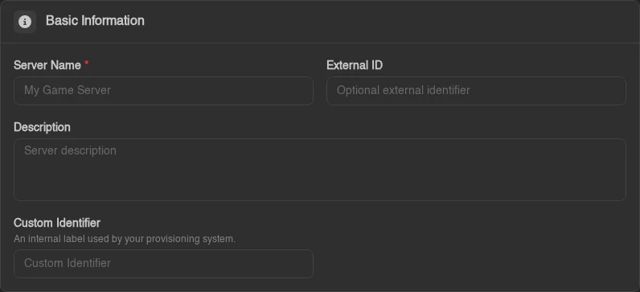

# Forms

Panel forms are used everywhere: creating servers, editing users, configuring nodes, defining backup targets, tweaking application settings. The forms extension system lets your extension participate in any of those forms, adding new fields, providing their validation rules and default values, or tweaking properties of existing fields, without touching the built-in form components.

The mechanism is simple. Every extensible form has a string ID. You call `enterForms` in your `initialize` method, call `extend` with the form ID and a slot describing your changes, and the Panel merges your slot into the form the next time it renders.

## Registering

Inside your extension's `initialize` method:

```ts
import { ExtensionContext } from 'shared';
import { z } from 'zod';
import { type FieldDef, insertFieldsAfter } from '@/elements/form-engine/index.ts';

public initialize(ctx: ExtensionContext): void {
  ctx.extensionRegistry.enterForms((forms) =>
    forms.extend('admin.servers.create', {
      zodShape: {
        customIdentifier: z.string().max(64),
      },
      initialValues: {
        customIdentifier: '',
      },
      transform: (fields) =>
        insertFieldsAfter(fields, 'description', {
          type: 'text',
          name: 'customIdentifier',
          label: 'Custom Identifier',
          description: 'An internal label used by your provisioning system.',
        } satisfies FieldDef),
    }),
  );
}
```



`enterForms` gives you the `FormRegistry`. Calling `.extend(formId, slot)` registers a **slot**, a bundle of Zod schema additions, their initial values, and a field-list transform. Multiple extensions can each register a slot for the same form and they all compose cleanly; slots are applied in registration order, with each `transform` receiving the field list produced by the previous one.

Form IDs are a typed union (`FormId`), so a typo is a compile error. The registered IDs cover the admin create/update forms (`admin.servers.create`, `admin.servers.update`, `admin.nodes.createOrUpdate`, `admin.users.createOrUpdate`, ...), the admin settings forms (`admin.settings.application`, `admin.settings.captcha.turnstile`, ...) and more - see `RegisteredFormIds` in `@/elements/form-engine/types.ts` for the authoritative list.

## The Slot

Each `extend` call takes a `FormExtensionSlot` object. The slot is **Zod-first**: `zodShape` is the required source of truth for the fields your extension adds, and `initialValues` is typed (and required) from it - TypeScript infers the exact value types, nested objects included, so a missing or mistyped default is a compile error:

```ts
interface FormExtensionSlot<S extends ZodFieldShape> {
  zodShape: S; // Zod schema for the fields your extension adds
  initialValues: InferFieldShape<S>; // default values, typed from zodShape
  transform?: FieldTransform<...>; // (fields: FieldDef[]) => FieldDef[]
}
```

A slot that only tweaks existing fields (no new ones) passes empty objects for both: `{ zodShape: {}, initialValues: {}, transform: ... }`.

### `transform`

A function that receives the form's current field definitions and returns a new list. This is how you add fields, move them, tweak existing ones, or remove them - anything you can express as an array transformation. Four helpers in `@/elements/form-engine/index.ts` cover the common cases:

```ts
import { insertFieldsAfter, insertFieldsBefore, removeField, updateField } from '@/elements/form-engine/index.ts';
```

| Helper | Description |
| ------ | ----------- |
| `insertFieldsBefore(fields, name, ...insert)` | Insert one or more fields immediately before the named field |
| `insertFieldsAfter(fields, name, ...insert)` | Insert one or more fields immediately after the named field |
| `updateField(fields, name, (field) => field)` | Replace the named field with the result of the callback |
| `removeField(fields, name)` | Drop the named field from the list |

The insert helpers return the field list **unchanged** when the anchor field isn't present. That's deliberate: some form IDs render their fields in multiple sections (server create/update, for example), and your transform runs against each section - the no-op behavior means your field only lands in the section that actually contains your anchor. To unconditionally add a field at the start or end, spread the array yourself: `(fields) => [...fields, myField]` appends, `(fields) => [myField, ...fields]` prepends.

Overriding an existing field is `updateField` with a spread:

```ts
transform: (fields) =>
  updateField(fields, 'name', (field) => ({
    ...field,
    label: 'Server Name (internal)',
    description: 'Must match your naming convention: env-region-number.',
  })),
```

Don't change the `name` of an existing field (it's the key the form values are bound by), and be conservative about removing built-in fields - other extensions' transforms may be anchoring on them.

### `zodShape`

A record mapping field names to Zod types. The Panel **deep-merges** this into the form's Zod schema so that your new fields participate in validation. Because the merge is deep, you can extend nested objects without replacing the core validation for their existing keys. The merge is deep between your slot and the core schema only: the shapes of several slots on the same form are combined by a plain spread first, so two extensions that both declare `featureLimits: z.object({...})` overwrite each other's nested keys instead of combining them.

```ts
zodShape: {
  customIdentifier: z.string().min(1).max(64),
  featureLimits: z.object({
    subdomains: z.number().int().min(0), // merged into the core featureLimits object
  }),
},
```

`zodShape` also drives **payload serialization**: the core API endpoints pass the registered shapes to `serializeForApi` (via `formExtensionSchemas(formId)`), so only fields declared here make it into the submitted request body. A field that exists only in your `transform` renders and can be typed into, but its value never leaves the browser. Declare every field you add.

Only provide entries for **new fields your extension adds**. To prevent conflicts, don't overwrite built-in field names.

### `initialValues`

The initial (empty-state) values for the fields in your `zodShape` - the type is inferred from the shape, so every declared field needs a default of the right type. These get deep-merged into the form's initial state, so the form doesn't start with `undefined` for your new fields (and nested defaults extend the core defaults instead of replacing them):

```ts
initialValues: {
  customIdentifier: '',
  enableFeatureX: false,
},
```

## Field Types

The fields inside a form (and the ones your `transform` produces) are `FieldDef` objects, a discriminated union keyed on `type`. Every type except `divider`, `section` and `custom` shares a set of base properties:

**Base properties (all field types except `divider`, `section` and `custom`):**

| Property | Type | Description |
| -------- | ---- | ----------- |
| `name` | `string` | Field name, must match the form value key (Mantine paths, so dots address nested values) |
| `label` | `LazyString` | Label shown above the input |
| `description` | `LazyString?` | Helper text shown below the label |
| `tooltip` | `ReactNode?` | Tooltip content shown on an info icon next to the label |
| `required` | `boolean?` | Shows an asterisk on the label (not on `switch` and `checkbox`). It enforces nothing on its own, so pair it with a Zod rule such as `.min(1)` |
| `advanced` | `boolean?` | Hidden unless the user has enabled Advanced Mode |
| `colSpan` | `'full' \| 1` | `'full'` stretches across both columns; omit for the default half-width |
| `when` | `(values) => boolean` | Receives the current form values; field is hidden when this returns `false` |

`LazyString` is `string | (() => string)`. The function form is resolved at render time, which is what lets you pass translation getters from module scope (your `initialize` runs long before any form renders): `label: () => t('myext.fields.customIdentifier')`.

### Text fields

```ts
{ type: 'text', name: '...', label: '...', props?: Partial<TextInputProps> }
{ type: 'password', name: '...', label: '...', props?: Partial<PasswordInputProps> }
{ type: 'textarea', name: '...', label: '...', rows?: number, props?: Partial<TextareaProps> }
```

### Numeric

```ts
{ type: 'number', name: '...', label: '...', props?: Partial<NumberInputProps> }
```

### Boolean

```ts
{ type: 'switch', name: '...', label: '...', props?: Partial<SwitchProps> }
{ type: 'checkbox', name: '...', label: '...', props?: Partial<CheckboxProps> }
```

### Selection

```ts
{ type: 'select', name: '...', label: '...', options: { value: string; label: LazyString }[], props?: Partial<SelectProps> }
{ type: 'multiselect', name: '...', label: '...', options: { value: string; label: LazyString }[], props?: Partial<MultiSelectProps> }
{ type: 'multiselectgroup', name: '...', label: '...', data: { group: LazyString; items: { value: string; label: LazyString }[] }[], props?: Partial<MultiSelectProps> }
{ type: 'autocomplete', name: '...', label: '...', options?: string[], props?: Partial<AutocompleteProps> }
```

### Date / time

```ts
{ type: 'date', name: '...', label: '...', props?: Partial<DateTimePickerProps> }
```

### Tags

```ts
{
  type: 'tags',
  name: '...',
  label: '...',
  placeholder?: LazyString,
  allowReordering?: boolean,
  allowDuplicates?: boolean,
}
```

Stores a `string[]` value. Users can type entries and press Enter to add them to the list.

```ts
{ type: 'numberTags', name: '...', label: '...', placeholder?: LazyString, allowReordering?: boolean, min?: number, max?: number }
```

The same input for a `number[]` value, with optional bounds on each entry.

### Size

```ts
{ type: 'size', name: '...', label: '...', mode: 'b' | 'mb', min: number }
```

A numeric input with byte/megabyte units. Store the value as a number in your Zod schema.

### Localized text

```ts
{
  type: 'localizedtext',
  name: '...',
  label: '...',
  translationsName: string,  // the field name holding the translations map
  languages: string[],
}
{
  type: 'localizedtextarea',
  name: '...',
  label: '...',
  translationsName: string,
  languages: string[],
  rows?: number,
}
```

Renders a text input paired with per-language override inputs. The main value lives under `name`; the translations object lives under `translationsName`. You need both keys in your `zodShape` and `initialValues`.

### Divider

```ts
{
  type: 'divider',
  name: '...',
  label?: LazyString,
  switchName?: string,       // optional: renders a switch on the divider, bound to this form value
  switchLabel?: LazyString,
  switchProps?: Partial<SwitchProps>,
  advanced?: boolean,
  when?: (values) => boolean,
}
```

A section divider with an optional label and an optional inline switch (useful for "enable this whole section" toggles). It has no value of its own unless you use `switchName`.

### Section

```ts
{
  type: 'section',
  name: '...',
  icon: ReactNode,
  title: LazyString,
  nullableDefault?: Record<string, unknown> | (() => Record<string, unknown>),
  advanced?: boolean,
  colSpan?: ColSpan,
  when?: (values) => boolean,
  render: (form: UseFormReturnType<T>) => ReactNode,
}
```

A titled, collapsible block that renders whatever `render` returns, the way the server create form groups its limits. `nullableDefault` is the object the section's value is reset to when the user turns the section off, for values that are an object or `null`.

### Custom

```ts
{
  type: 'custom',
  name: '...',
  label?: LazyString,
  advanced?: boolean,
  colSpan?: ColSpan,
  when?: (values) => boolean,
  render: (form: UseFormReturnType<T>) => ReactNode,
}
```

For anything the built-in types don't cover. The `render` prop receives the full Mantine form object so you can call `form.getInputProps`, `form.setFieldValue`, read `form.values`, and so on. Use this as an escape hatch, not a default, the built-in types cover most cases and compose more predictably.

## A Complete Example

An extension that adds a "Provisioning Tag" and "Enable Monitoring" field to the server creation form, each validated by Zod:

```ts
import { Extension, ExtensionContext } from 'shared';
import { z } from 'zod';
import { type FieldDef, insertFieldsAfter } from '@/elements/form-engine/index.ts';

class MyExtension extends Extension {
  public initialize(ctx: ExtensionContext): void {
    ctx.extensionRegistry.enterForms((forms) =>
      forms.extend('admin.servers.create', {
        zodShape: {
          provisioningTag: z.string().max(128),
          monitoringEnabled: z.boolean(),
        },
        initialValues: {
          provisioningTag: '',
          monitoringEnabled: false,
        },
        transform: (fields) => [
          ...insertFieldsAfter(fields, 'description', {
            type: 'text',
            name: 'provisioningTag',
            label: 'Provisioning Tag',
            description: 'Passed to the provisioning system on first start.',
            colSpan: 'full',
          } satisfies FieldDef),
          {
            type: 'switch',
            name: 'monitoringEnabled',
            label: 'Enable Monitoring',
            advanced: true,
          } satisfies FieldDef,
        ],
      }),
    );
  }
}

export default new MyExtension();
```

Because both fields are declared in `zodShape`, their values ride along in the submitted request body alongside the built-in fields (`provisioning_tag` and `monitoring_enabled` after snake_casing). Your backend route receives them and can act on them however it needs to - see [Extending Models](./extending-models.md) for how to persist per-server data on the backend.

## Advanced Mode

Fields marked `advanced: true` are hidden by default. The Panel exposes an **Advanced Mode** toggle (the synced user setting `form_engine::advanced_mode`, so it follows the operator across devices) that shows all advanced fields globally. This is the right tool for fields that most operators will never need, configuration that's correct by default and only relevant in non-standard setups. When in doubt, don't mark a field advanced; it's better to show an unfamiliar field than to hide one someone needs.

## Conditional Fields

The `when` function lets you show or hide a field based on the current form values:

```ts
transform: (fields) => [
  ...fields,
  {
    type: 'text',
    name: 'customDriverPath',
    label: 'Driver Path',
    when: (values) => values.driver === 'custom',
  } satisfies FieldDef,
],
```

`when` is called on every render with the latest form values. The field is rendered when it returns `true` and omitted when it returns `false`. This is pure display logic, the field's value stays in the form state even when `when` returns `false`, so it can be safely submitted without losing user input if the condition toggles.
