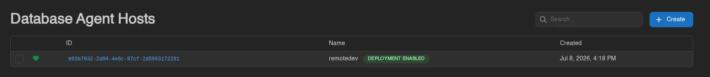
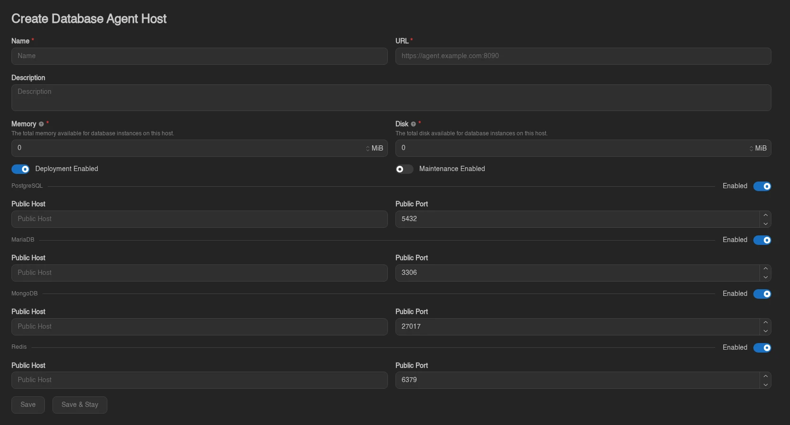
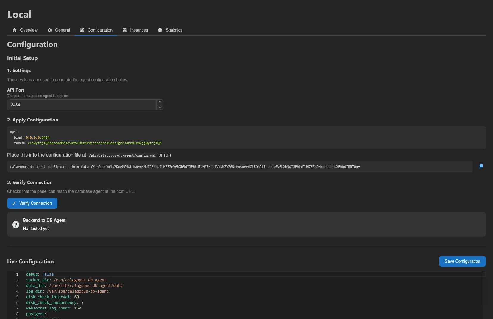
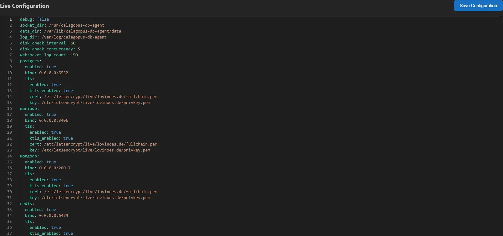
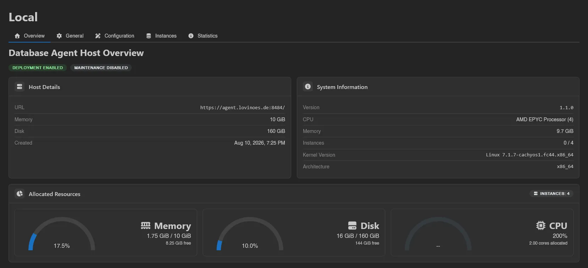
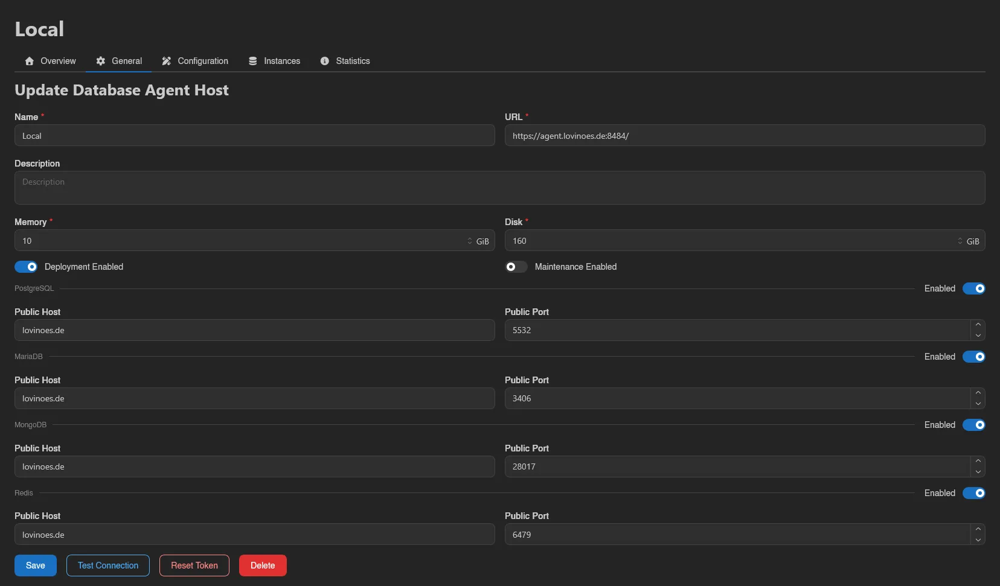
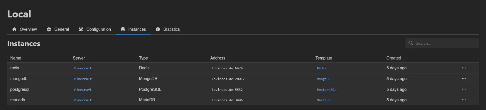
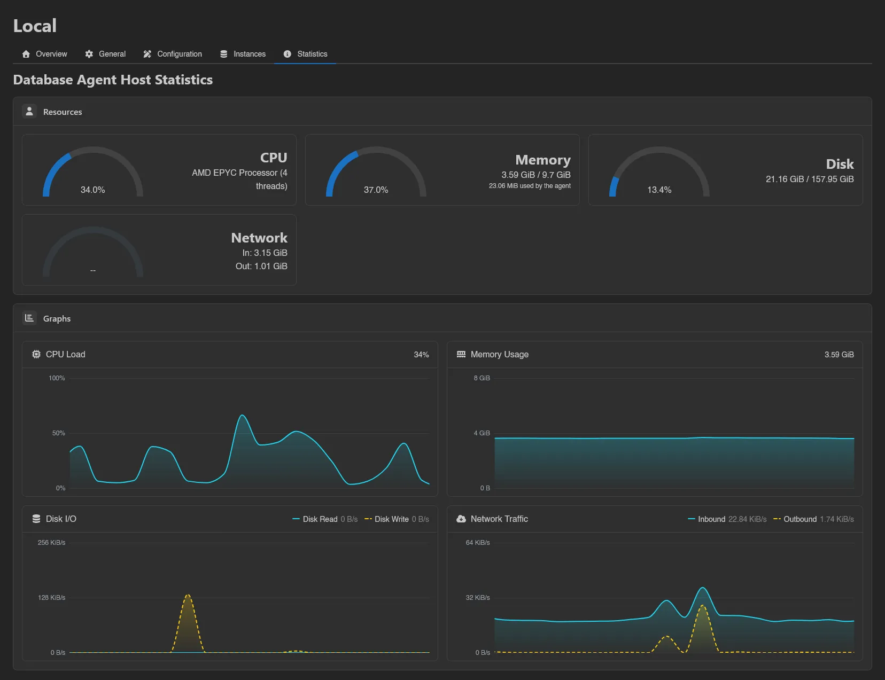

# Database Agent Hosts

A database agent host is a machine running the [Calagopus DB Agent](../../../db-agent/index.md), which provisions managed databases: dedicated PostgreSQL, MariaDB, MongoDB, or Redis instances users create from their server's [Databases page](../server/databases/managed.md#creating-a-managed-database).

::: info
Install the agent on the machine first; the [DB Agent docs](../../../db-agent/index.md) cover installation and the [configuration reference](../../../db-agent/configuration.md). The panel side below hands you the exact config file to drop in.
:::

The list at `/admin/database-agent-hosts` shows a health indicator, ID, Name, and Created date for each host. The heart is green when the panel can reach the agent, yellow and pulsing when an agent update is available, and broken red when the host is unreachable; hovering it gives the agent version. Next to the name, a badge shows whether the host can still take new instances: **Deployment Enabled** (green), **Nearly Full** (yellow), **No Capacity** (orange), **Under Maintenance** (red), **No Types Enabled** (red), or **Deployment Disabled** (red). Hovering it shows allocated memory and disk against the host's limits, or "no host limit" where a limit is `0`.

Rows have selection checkboxes; drag across rows or Ctrl/Cmd-click to select several (Ctrl/Cmd+A for all, Escape to clear). With hosts selected, an action bar appears with **Update Config**, which applies a YAML configuration snippet to every selected host at once.

::: info
The capacity states compare the memory and disk claimed by the host's instances against its configured limits, whichever of the two is worse: **Nearly Full** from 90%, **No Capacity** at 100% or over. A limit of `0` is unlimited and never counts toward either. **Deployment Disabled**, **Under Maintenance** and **No Types Enabled** each rule the host out on their own, so they are checked first, in that order. The allocation figures are cached for 30 seconds.
:::

## Creating a Database Agent Host

Click **Create** in the top right.

| Field | Description |
| ----- | ----------- |
| **Name** | Display name for the host. |
| **URL** | Where the panel reaches the agent, e.g. `https://agent.example.com:8090`. If you omit the port, a warning explains the panel will connect on the URL's default port while the agent listens on `8090` by default; an **Add :8090** button appends it for you. |
| **Description** | Optional free text. |
| **Memory** | "The total memory available for database instances on this host." New instances are only placed while the combined limits of the host's instances fit within it. Defaults to `0`, which means no limit. |
| **Disk** | "The total disk available for database instances on this host." The same placement rule applies. Defaults to `0`, which means no limit. |
| **Deployment Enabled** | Whether new instances may be placed on this host. On by default. |
| **Maintenance Enabled** | Puts the host into maintenance mode, see below. Off by default. |

Below that is a section per database type (**PostgreSQL**, **MariaDB**, **MongoDB**, **Redis**), each with an **Enabled** switch and optional **Public Host** and **Public Port** overrides for the address users connect to (defaults `5432`, `3306`, `27017`, `6379`).

## Connecting the Agent

Open the new host's **Configuration** tab and click **Reveal Configuration** (it's hidden by default because it contains the host token).

Under **Initial Setup**:

#### 1. Settings

Set the **API Port** the agent should listen on. If it doesn't match the port in the host URL, a warning tells you the panel won't be able to connect unless a reverse proxy bridges the two.

#### 2. Apply Configuration

Copy the generated YAML into `/etc/calagopus-db-agent/config.yml` on the host, or use the one-line command shown next to it.

#### 3. Verify Connection

Click **Verify Connection** to check the panel can reach the agent; the result appears in the **Backend to DB Agent** box.

Below the setup steps, **Live Configuration** shows the running agent's full config in a YAML editor; edit it and hit **Save Configuration** to push changes without touching the machine. This is the same config the bulk **Update Config** action patches across many hosts.

## Host View

### Overview

Badges show the host's deployment and maintenance state. The **Host Details** card lists URL, Memory, Disk, Description, and Created; **System Information** shows the agent's Version, CPU, Memory, Instances (online / total), Kernel Version, and Architecture.

If a newer agent release exists, an **Update Available** badge appears next to the version; see [Updating](../../../db-agent/updating.md). **Allocated Resources** graphs how much of the host's memory and disk budget instances currently claim, plus allocated CPU.

### General

The edit form, plus **Test Connection**, **Reset Token** (invalidates the agent's current token; you'll need to update the config file on the host afterwards), and **Delete**.

### Instances

Every managed database on this host, searchable: Name, Server (linked), Type, Address, Template (linked), and Created. Right-click an instance to **Edit** or **Delete** it. Editing lets you pin a specific **Docker Image** (leave empty to follow the template, including future template updates), set **Environment Overrides**, and override the template's Memory, Swap, Disk, CPU, and IO Weight per instance.

### Backups

Every [database backup](../server/backups.md) taken from an instance on this host, searchable: Name, **Source** (the instance the dump came from), Server, Node, Checksum, Size, Retention, and Created. A dump taken by a [system backup policy](./system-backup-policies.md) carries a **SYSTEM** badge linking to the policy. **Retention** is filled in for backups that belong to a [backup group](../server/backups.md#backup-groups) or were taken by a [system backup policy](./system-backup-policies.md): a badge for the rule keeping the backup longest and the time the panel expects to delete it. There is no file count, because a dump is a single file.

Right-click a row to **Download**, **Reassign** or **Delete** it. Restore, export to files and the detach and reattach actions are file-backup concepts and are not offered for dumps.

**Reassign** moves a dump to a different database instance. The dialog has two fields: pick a **Server**, then one of that server's **Database Instances**. Only instances of the same database type are listed, and the instance the dump already belongs to is left out.

The target server can be a different one, in which case the dump moves onto that server's backup list and quota; a dump that's not on shared storage can only move to a server on the same node. Moving a dump to another server also takes it out of any [backup group](../server/backups.md#backup-groups) it was in, because groups belong to a single server.

When the host has failed dumps, a **Delete Failed Backups** button appears above the table, with the usual **Force** switch.

The Node column is the node whose storage holds the dump, not the host that produced it. Deletion goes through that node, so a dump cannot be removed while its storage node is unreachable unless you force it.

::: info
A dump whose instance has since been deleted loses its link to this host and no longer appears here. It remains on the server's and the node's backup tabs.
:::

### Statistics

Live host metrics streamed from the agent: CPU, memory, disk, and network cards plus **CPU Load**, **Memory Usage**, **Disk I/O**, and **Network Traffic** graphs. The memory card also notes the agent's own footprint.

## How Instances Are Placed

Like database hosts, agent hosts must be attached to a node or location from that node's or location's **Database Agent Hosts** tab. When a user creates a managed database, the panel picks among hosts that are attached to the server's node or its location, have **Deployment Enabled** on, are not in maintenance, have the requested database type enabled, and still have enough free memory and disk; the least utilized eligible host is preferred. A limit of `0` always passes the capacity check and counts as zero utilization in that ranking, so a host with neither limit set comes first.

## Maintenance Mode

While **Maintenance Enabled** is on, the host takes no new instances, and users cannot send power actions to the instances already on it, update them, or delete them. Template updates skip instances on hosts in maintenance too.

::: info
The buttons on these pages follow the `database-agent-hosts.*` admin permission keys (`create`, `read`, `update`, `delete`, `test`, `read-token`, `reset-token`). See the [Permissions Reference](../dashboard/permissions.md).
:::
