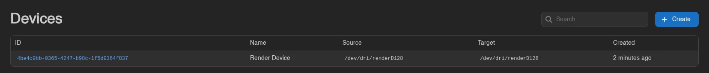
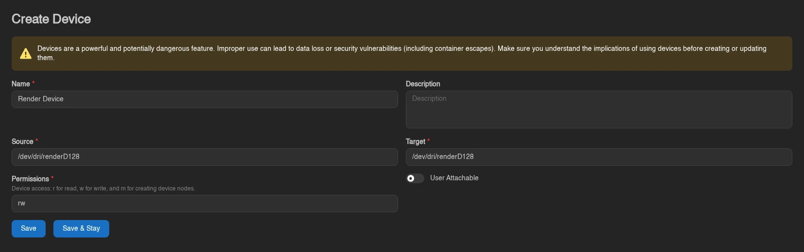
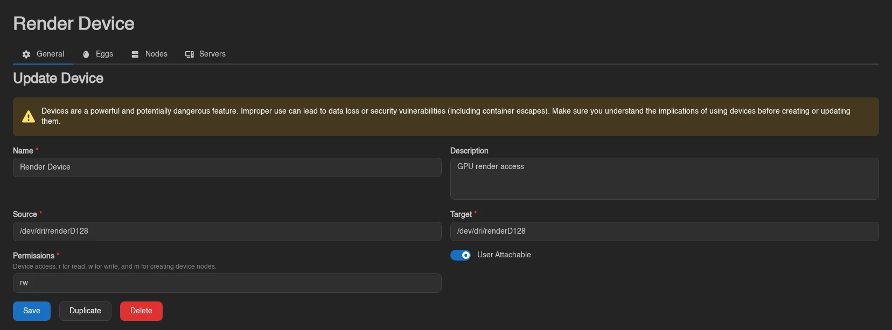
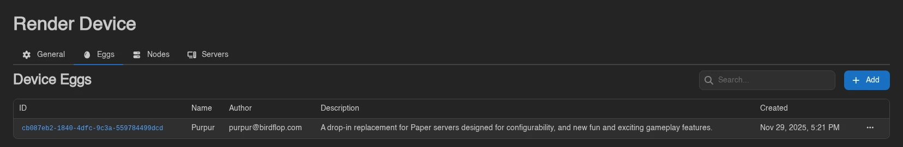
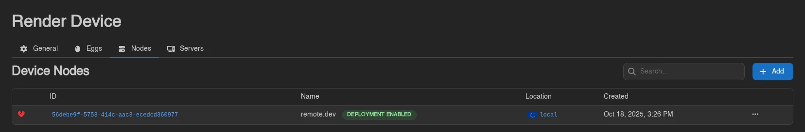

# Devices

**Storage → Devices** defines host devices that server containers may use, such as a GPU render device at `/dev/dri/renderD128`. Unlike [mounts](./mounts.md), which share directories, devices pass through a Unix character or block device with specific access permissions.



## Creating a Device

Click **Create**, fill in the form, then **Save**.

| Field | Meaning |
| --- | --- |
| **Name** | Display name shown to admins and users. |
| **Description** | Optional explanation of what the device is for. |
| **Source** | Absolute device path on the Wings host, for example `/dev/dri/renderD128`. |
| **Target** | Absolute path where the device appears inside the server container. |
| **Permissions** | A nonempty combination of `r` (read), `w` (write), and `m` (create device nodes). Defaults to `rwm`; use only the access the application needs. |
| **User Attachable** | Lets users attach and detach this device themselves. Off by default. |



::: warning
A device can expose host hardware or storage directly to a container. Grant access only to devices you intend that server to control; passing through a host disk can expose or damage its contents.
:::

## Allow the Device in Wings

On every node that should offer the device, add its source to [`allowed_devices`](../../../wings/configuration.md#allowed-devices) in the local Wings `config.yml`:

```yaml
allowed_devices:
  - /dev/dri/renderD128
```

Restart Wings after changing its local configuration. The default is an empty list. The Panel cannot change this allowlist through **Live Configuration**, even when other remote configuration updates are enabled.

An allowlist entry can be a device path or a parent directory. Prefer the individual device path; allowing `/dev` grants a much wider choice. Wings resolves paths and checks that the source is an allowed character or block device. Invalid or missing mappings are skipped with a warning in the Wings logs.

For containerized Wings, the device must also be accessible inside the Wings container and to the container runtime. Keep the same source path on both sides; for Docker Compose, add this under the `wings` service:

```yaml
devices:
  - /dev/dri/renderD128:/dev/dri/renderD128
```

Recreate Wings with `docker compose up -d` after changing Compose. A mapping does not install drivers, change device ownership, or bypass the host's permissions.

## Assign Eggs, Nodes, and Servers

Opening a device shows **General**, **Eggs**, **Nodes**, and **Servers** tabs. **General** edits the definition and offers **Duplicate** and **Delete**.



1. In **Eggs**, add the eggs allowed to use the device.
2. In **Nodes**, add the nodes where that device exists at the configured source path.
3. Open a server's admin **Devices** tab and attach the device, or enable **User Attachable** so users can do so from **Mounts → Devices**.





Both the server's node and egg must be assigned before it is eligible. These assignments make the device available; they do not attach it to every server automatically. The device's **Servers** tab lists its current attachments.

Restart a running server after attaching, detaching, or changing its device mappings so the container picks up the change. If the Panel shows it as attached but the device is missing inside the container, check the Wings allowlist, host device path, and Wings logs.

Admin definitions use `devices.create`, `devices.read`, `devices.update`, and `devices.delete`. Assignments use `eggs.devices`, `nodes.devices`, and `servers.devices`. User access has separate [server permissions](../dashboard/permissions.md#devices).

## Node Allowlist Feedback

Node assignment views show **Checking...** while reading the node configuration and **Not Allowed** when the device source does not match Wings' `allowed_devices` entries. Update that node's local allowlist before expecting the attachment to work. Assignment dialogs also warn about rejected sources.

This check compares configured paths. It does not resolve symlinks on the node or prove that the source exists or is a usable device; an absent warning is not a host filesystem check.
