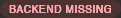
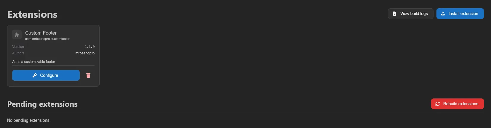
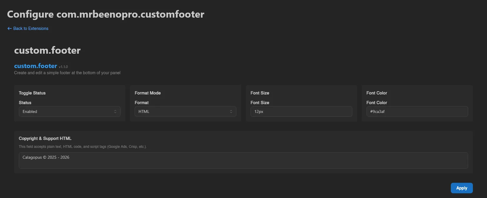
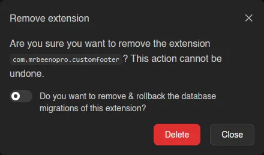
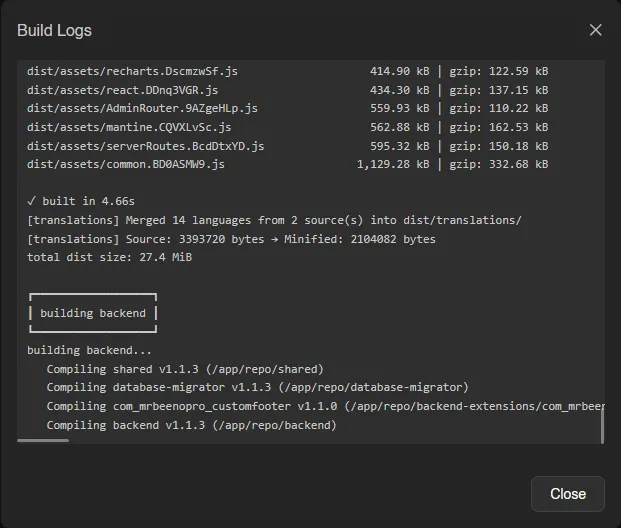

# Extensions

Extensions (**System** > **Extensions**) add features to the panel itself. This page shows what's installed and drives the build pipeline that compiles extensions into the panel.

::: info
The full installation walkthrough, including switching to the heavy image that extension building requires, lives at [Installing Extensions](../../extensions/installing-extensions.md). This page only describes the admin UI.
:::

## Installed Extensions

Each installed extension gets a card with its name, package name, **Version**, **Authors**, and description. Badges flag incomplete states:

   

**Configure** on a card opens the extension's own settings page at `/admin/extensions/<packageName>`. It's disabled, with a tooltip saying why, when the extension has no backend, ships no configuration page, or is currently disabled.

The switch next to it turns an extension **off without uninstalling it**: its entrypoints are skipped at boot, so its routes and background tasks stop existing, while its files, database tables and permission grants all stay put. Toggling shows a **Pending restart** badge until the panel restarts, and a **Disabled** badge afterwards. Flipping it back on restores the extension as it was. See [Disabling Extensions](../../extensions/disabling-extensions.md) for exactly what a disabled extension stops doing.

The trash icon removes an extension entirely, with a switch to also remove and roll back its database migrations. The code stops being included on the next rebuild, but the migration rollback happens immediately.

::: info
The extension pictured across this page is [Custom Footer](https://www.sourcexchange.net/products/custom-footer-for-calagopus) by mrbeenopro, available on SourceXchange and [GitHub](https://github.com/mrbeeenopro/custom-footer-for-calagopus).
:::

## Installing and Building

- **Install extension** uploads an extension `.zip`; you can also drag and drop files onto the page. If the extension ships a license, you have to **Accept** it before it's added.
- Newly added extensions land under **Pending extensions** until you hit **Rebuild extensions**, which compiles everything and restarts the panel. Progress phases are shown live, and a running build can be stopped with **Cancel build**.
- **View build logs** opens the log of the current or last build. If a build fails, an alert shows the reason and the **Rebuild** button becomes **Retry build**.

::: warning
Extensions can only be built when the panel runs the heavy Docker image and its extension supervisor is reachable; the page warns you when either is missing. See [Installing Extensions](../../extensions/installing-extensions.md).
:::

Viewing this page needs the `extensions.read` admin permission; installing, toggling, configuring and removing extensions all need `extensions.manage`. See the [Permissions Reference](../dashboard/permissions.md).
