# Nests

Nests are categories for eggs, and eggs are the templates that define how a server type is installed, started, stopped, and configured. Everything egg-related lives here: a nest holds its eggs, and each egg holds its install script, startup and stop configuration, variables, and Docker images.

The list shows each nest's ID, name, author, description, and created timestamp. Use the search box to filter, click a nest's ID to open it, or hit **Create** in the top right for a new one.

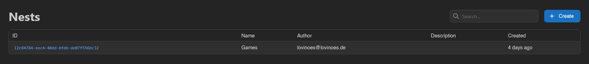

## Creating and Editing a Nest

A nest is just three fields: **Name**, **Author**, and an optional **Description**. **Save** creates it, **Save & Stay** creates it without leaving the form.

Opening an existing nest shows two tabs: **General**, the same form plus a **Delete** button, and **Eggs**. Deleting a nest asks whether you also want to delete all eggs inside it, via the **Do you want to delete all eggs in this nest?** switch in the confirmation.

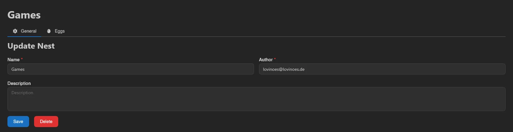

## Eggs

The **Eggs** tab lists the nest's eggs with the same columns as the nest list (ID, Name, Author, Description, Created) plus a selection checkbox per row.

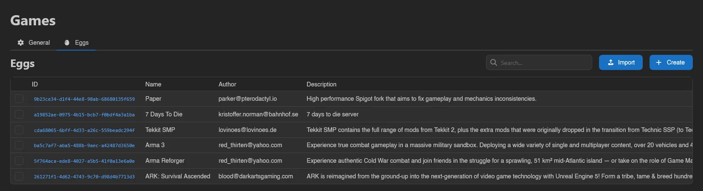

Eggs support bulk operations: drag across rows to select, Ctrl/Cmd-click or use the checkboxes, Ctrl/Cmd+A to select everything, Escape to clear. With eggs selected, an action bar appears with **Update from Repository**, **Move** (to another nest), and **Delete**.

### Creating an Egg

**Create** opens the egg form described under [General](#general) below. New eggs start with a stub install script (a `debian:latest` container running `/bin/bash`) that you fill in afterwards.

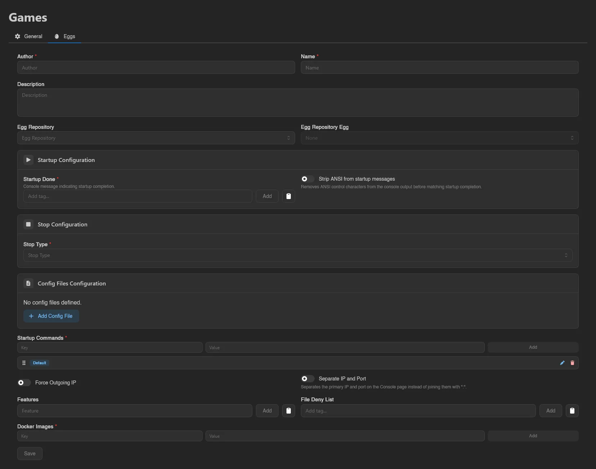

### Importing Eggs

**Import** is a dropdown with two sources: **from File** and **from URL**.

**from File** accepts an egg file in JSON or YAML format (`.json`, `.yml`, `.yaml`), including eggs exported from Pterodactyl. You can also drag files from your file manager anywhere onto the page and drop them to import several at once.

**from URL** fetches the eggs instead. Paste up to 25 `http`/`https` URLs and the panel downloads them (5 at a time), auto-detecting JSON or YAML. Each egg may be at most 1 MiB. If some URLs fail, the import still succeeds for the rest and lists the failures with a reason next to each URL. Eggs imported this way are not linked to a repository, so they won't be updated automatically - **Update** on an existing egg also offers **from URL** for refreshing one by hand.

To pull eggs from a Git repository and keep them updated, use [Egg Repositories](./egg-repositories.md).

## Editing an Egg

Opening an egg shows five tabs: **General**, **Installation Script**, **Variables**, **Mounts**, and **Servers**.

### General

The top of the form covers identity and repository linkage:

| Field | What it does |
|---|---|
| **Author** / **Name** / **Description** | Basic metadata. |
| **Egg Repository** / **Egg Repository Egg** | Links this egg to an egg from a synced [egg repository](./egg-repositories.md), enabling **Update from Repository**. |

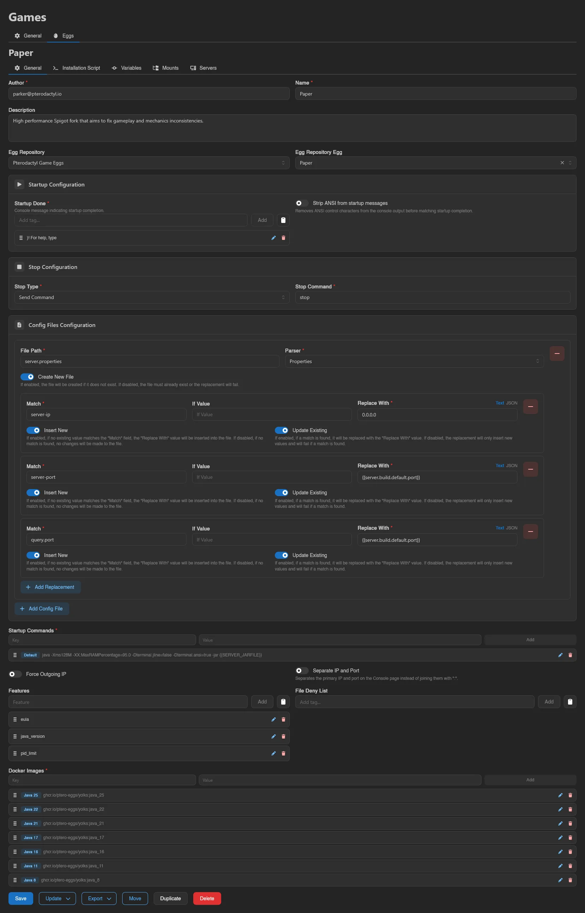

Below that, three configuration cards:

- **Startup Configuration**: **Startup Done**, one or more console messages indicating startup completion (the panel marks the server as running when one appears), and **Strip ANSI from startup messages**, which removes ANSI control characters before matching.
- **Stop Configuration**: **Stop Type** is **Send Command** (with a **Stop Command** field), **Send Signal** (with a **Stop Signal** picker: `SIGABRT`, `SIGINT`, `SIGTERM`, `SIGQUIT`, `SIGKILL`), or **Docker Stop**.
- **Config Files Configuration**: files the panel rewrites on boot. Each entry has a **File Path**, a **Parser** (File, YAML, Properties, INI, JSON, XML, TOML), a **Create New File** switch, and a list of replacements (**Match**, optional **If Value**, **Replace With** as either **Text** or **JSON**, plus **Insert New** and **Update Existing** switches controlling whether unmatched values get inserted and matched ones replaced).

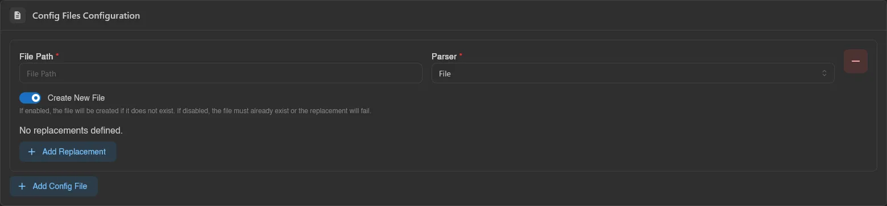

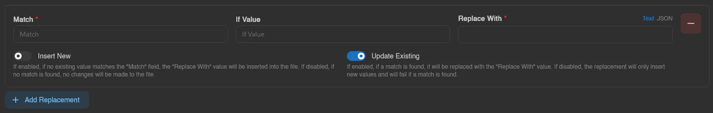

The rest of the form:

| Field | What it does |
|---|---|
| **Startup Commands** | Named startup command presets as key/value pairs. Users pick between them on the server's [Startup page](../server/startup.md). |
| **Force Outgoing IP** | Forces the server's outgoing traffic through its allocation IP. |
| **Separate IP and Port** | Shows the primary IP and port separately on the Console page instead of joining them with `:`. |
| **Features** | Feature tags for this egg. |
| **File Deny List** | File patterns users cannot touch in the file manager. |
| **Docker Images** | Named Docker images as key/value pairs (label to image). Users switch between them on the Startup page. |

The tag-style inputs (Startup Done, Features, File Deny List) share a clipboard menu with **Copy All** and **Paste (Replace)** for carrying lists between eggs.


At the bottom, next to **Save**:

- **Update**: dropdown with **from File** (upload a `.json`/`.yml`/`.yaml` egg to overwrite this one) and **from Repository** (re-pull from the linked egg repository egg; disabled if none is linked).
- **Export**: dropdown with **Export as JSON**, **Export as YAML**, and **Export as Pterodactyl** (JSON in Pterodactyl's egg format, for taking eggs back the other way).
- **Move** (to another nest), **Duplicate** (copy under a new name, optionally into a different nest), and **Delete**.

### Installation Script

The script that runs when a server using this egg is installed or reinstalled. **Installation Container** is the Docker image the script runs in, **Container Entrypoint** the shell that executes it, and below both sits a code editor for the script itself.

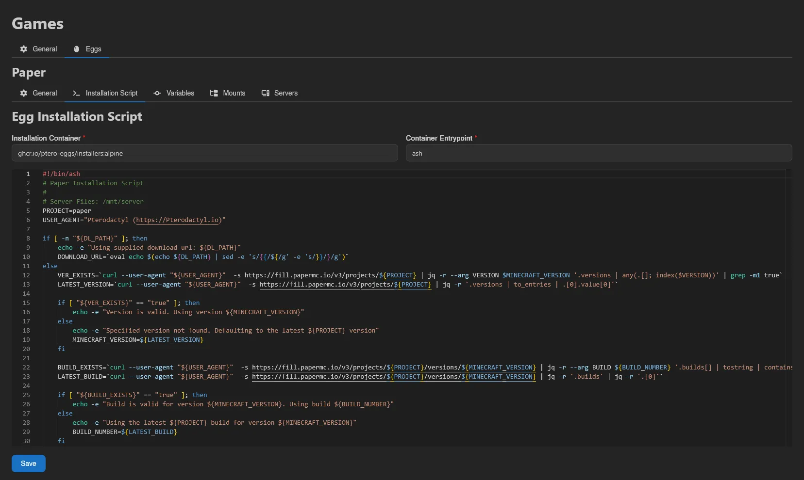

#### Reporting Progress

Wings gives the install container an `INSTALL_PROGRESS_FILE` environment variable pointing at a file inside the container. Write a line to that file and the server's installing banner turns into a progress bar with a label, instead of an indefinite "installing" message. Wings re-reads the file every 500 ms and uses the **last non-empty line**, so appending as you go is fine.

Each line is a progress value, optionally followed by a space and a label:

```sh
echo "42" > "$INSTALL_PROGRESS_FILE"                    # 42%
echo "42 Downloading" > "$INSTALL_PROGRESS_FILE"        # 42%, labeled
echo "512/2048 Downloading" > "$INSTALL_PROGRESS_FILE"  # explicit total
```

With no `/`, the total is assumed to be 100, so the number is a percentage. Two things to watch out for. A trailing `%` makes the line **invalid**, and it is dropped without an error. When the total is anything other than 100, the panel renders the pair as a byte count, so `512/2048` shows as bytes: right for a download, misleading for anything else. Only the last 4096 bytes of the file are read, and labels are capped at 255 characters.

There is a matching `INSTALL_STATUS_FILE` for the final status of the install.

### Variables

Each variable is a card in a grid; drag a card by the grip handle in its top-right corner to reorder them, which sets the order users see on the Startup page. **Add** creates a blank card.

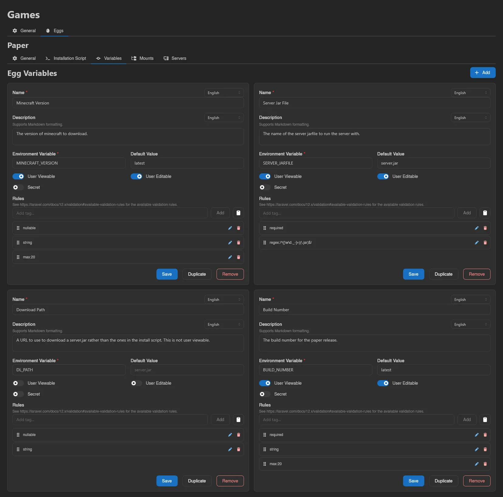

| Field | What it does |
|---|---|
| **Name** / **Description** | Shown to users. Both are translatable per language, and the description supports Markdown. |
| **Environment Variable** | The `ENV_VAR` passed to the container. Typed input is uppercased automatically, with spaces and hyphens converted to underscores. |
| **Default Value** | Value used when the user hasn't set one. |
| **User Viewable** / **User Editable** | Whether users see and can change the variable on the Startup page. |
| **Secret** | Hides the value like a password. |
| **Rules** | Validation rules applied to user input, using [Laravel validation rule](https://laravel.com/docs/12.x/validation#available-validation-rules) syntax. |

Each card has its own **Save**, **Duplicate**, and **Remove** buttons.

### Mounts

Mounts attached here become available to every server using this egg, on top of any per-server mounts. The searchable table lists ID, Name, Source, Target, and Added; **Add** opens a modal to pick one of the panel's configured [mounts](./mounts.md), and each row's context menu offers **Remove**. See the server-side [Mounts page](../server/mounts.md) for how users interact with them.

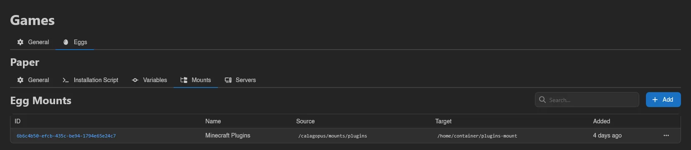

### Servers

A read-only, searchable list of all servers currently using this egg, with the same columns as the [Servers](./servers.md) list, handy before deleting or heavily editing one.

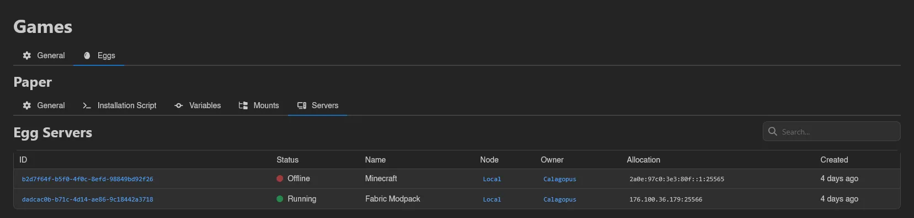

::: info
Nest and egg actions are gated by the `nests.*` and `eggs.*` admin permissions (the Mounts tab additionally needs `eggs.mounts`). See the [Permissions Reference](../dashboard/permissions.md).
:::
