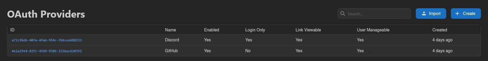
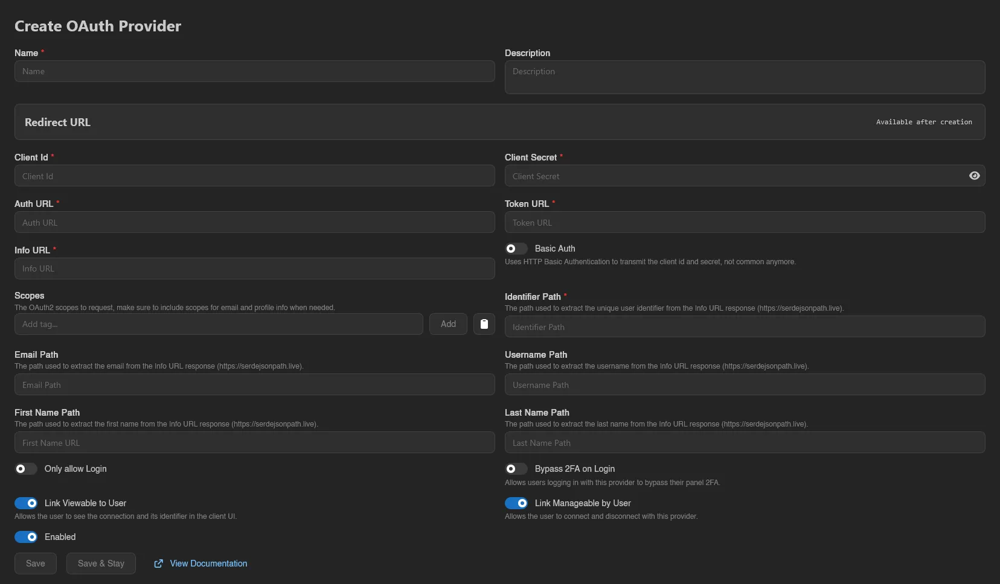
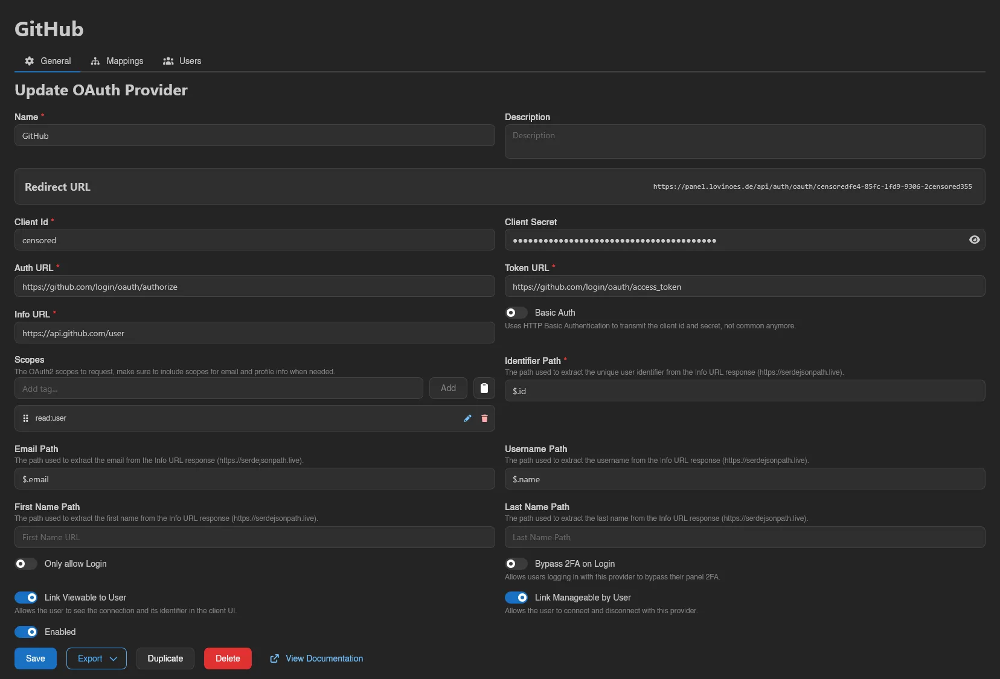
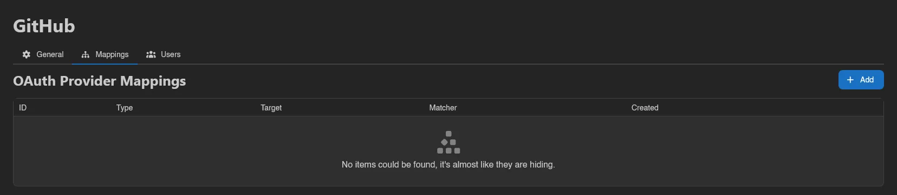
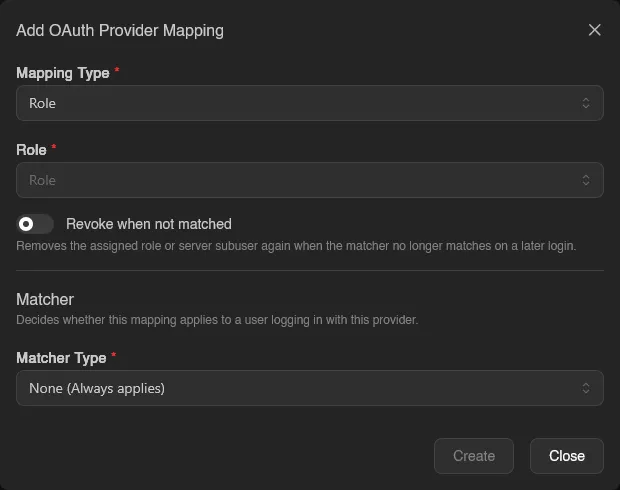
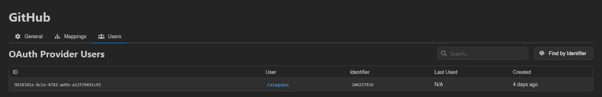

# OAuth Providers

**OAuth Providers** under **Users & Access** let users log in to the panel (and link their account) through an external OAuth2 service like Discord, GitHub, or Google. This page covers the admin UI; for step-by-step walkthroughs of registering the app on each provider's side, see [Setting up OAuth](../../../additional/setting-up-oauth/index.md).

The list shows ID, Name, Enabled, Login Only, Link Viewable, User Manageable (all Yes/No), and Created. The four flags come straight from the provider form:

| Flag | Meaning |
| --- | --- |
| **Enabled** | Whether the provider can be used at all. |
| **Login Only** (**Only allow Login**) | Users with an existing link can sign in, but signing in never registers a new panel account from the provider's profile. |
| **Link Viewable** (**Link Viewable to User**) | "Allows the user to see the connection and its identifier in the client UI." |
| **User Manageable** (**Link Manageable by User**) | "Allows the user to connect and disconnect with this provider." |

The last two control what users see on their own [OAuth Links](../dashboard/oauth-links.md) page.

## Creating a Provider

**Create** (requires `oauth-providers.create`) opens the form. Name and an optional description come first, followed by a **Redirect URL** card: it reads "Available after creation" until the provider exists, then shows `<panel URL>/api/auth/oauth/<uuid>`, the callback URL you register with the external provider.

| Field | Notes |
| --- | --- |
| **Client Id** / **Client Secret** | Required. The credentials from the external provider's app registration. |
| **Auth URL** / **Token URL** / **Info URL** | Required. The provider's authorization, token, and user-info endpoints. |
| **Basic Auth** | "Uses HTTP Basic Authentication to transmit the client id and secret, not common anymore." |
| **Scopes** | "The OAuth2 scopes to request, make sure to include scopes for email and profile info when needed." |
| **Identifier Path** | Required. Extracts the unique user identifier from the Info URL response. |
| **Email Path** / **Username Path** / **First Name Path** / **Last Name Path** | Optional paths for profile fields, used to fill in accounts registered through this provider. |
| **Avatar URL Template** / **Overwrite Existing Avatars** | Optional. Import the user's profile picture from the provider, see [Avatars](#avatars). |
| **Only allow Login** / **Bypass 2FA on Login** / **Link Viewable to User** / **Link Manageable by User** / **Enabled** | The behavior switches; the first and last three are [explained above](#oauth-providers). |

The path fields use JSONPath syntax (see [serdejsonpath.live](https://serdejsonpath.live)) evaluated against the Info URL response.

::: warning
**Bypass 2FA on Login** "Allows users logging in with this provider to bypass their panel 2FA." Only enable it when the provider enforces equivalent security itself.
:::

Finish with **Save** (or **Save & Stay** when creating). An existing provider also offers **Export** (as JSON or YAML), **Duplicate**, **Delete**, and a **View Documentation** shortcut to the setup guides.

While **Enable Password Login** is off in [Settings](./settings.md#application), the panel refuses to delete or disable the last enabled provider, since nobody without a security key would be able to sign in afterwards. Turn password login back on first if that is what you want.

## Avatars

**Avatar URL Template** pulls the user's profile picture from the provider. Leave it empty and the panel never touches avatars. Fill it in and every login or link through the provider imports the picture it points at. The download runs in the background, so a slow or unreachable image host never holds up the login.

The template is a URL with `{...}` placeholders, each holding a JSONPath into the Info URL response. What happens to a resolved value depends on where its placeholder sits:

- A template that is *only* a placeholder, such as `{$.picture}`, is used verbatim. This is what most OIDC providers need, because the profile response already carries the full image URL.
- Anywhere else the placeholder stands for one path or query component and its value is percent-encoded, so a provider cannot smuggle a different URL into the rest of the template. Discord, which hands back an id and an avatar hash instead of a URL, needs `https://cdn.discordapp.com/avatars/{$.id}/{$.avatar}.png`.

That second rule catches people out when they try to tack something onto a whole-URL placeholder. `{$.picture}?size=512` is no longer a lone placeholder, so the entire picture URL gets percent-encoded into the path of a URL that goes nowhere. Either use the placeholder alone, or spell the whole URL out around the pieces the provider gives you.

A placeholder that resolves to nothing (missing, `null`, or an empty string) means "this user has no avatar" and quietly skips the import. A template that resolves to something other than an `http` or `https` URL is an error instead: the login still goes through, but the panel logs a warning and the user keeps whatever avatar they had.

The download accepts the same formats as an upload, PNG, JPEG, WebP, or GIF, and ends up as the same 512x512 WebP, but the limits around it are its own: at most 8 MB and 2048 pixels on either side, with no minimum size.

**Overwrite Existing Avatars** decides who gets one. Off, the import only runs for users who have no avatar at all, leaving anything they uploaded themselves alone. On, it runs every time and replaces theirs, though a picture whose URL has not changed since the last import is recognised and not downloaded again. [Frozen](./users.md) accounts are skipped either way.

## Import

Next to **Create**, **Import** (requires `oauth-providers.create`) accepts a provider definition as a `.json`, `.yml`, or `.yaml` file, either through the file picker or by dragging the file anywhere onto the list. This is the counterpart of **Export**: it recreates the whole provider configuration, endpoints, paths, scopes, and flags included.

::: info
Exports never contain the client credentials, so an imported provider comes in with placeholder values. Open it and set the real **Client Id** and **Client Secret** before pointing users at it.
:::

## Mappings

The **Mappings** tab automates access: whenever a user logs in through this provider, every mapping whose matcher applies takes effect. Adding one requires `oauth-providers.update`; the table shows ID, Type, Target, Matcher, and Created.

**Add** opens the mapping form:

- **Mapping Type** decides what is granted:
  - **Role** assigns a panel [role](./roles.md); pick the **Role**.
  - **Server Subuser** adds the user as a [subuser](../server/subusers.md); pick the **Server**, the subuser **Permissions**, and optionally **Ignored Files**.
- **Revoke when not matched**: "Removes the assigned role or server subuser again when the matcher no longer matches on a later login", handy for mirroring, say, a Discord role into a panel role.

::: info
You cannot create a mapping that grants more than you hold yourself. A mapping whose role or subuser permissions exceed your own is rejected with `permissions: more permissions than self`. The same guard applies when editing a role that already grants permissions you lack, and when linking an OAuth account to a user whose role outranks yours.
:::

### Matchers

The **Matcher** decides whether the mapping applies to a login. Pick a **Matcher Type**:

| Matcher Type | Applies when | Fields |
| --- | --- | --- |
| **None (Always applies)** | Every login through this provider | none |
| **AND (All must match)** | Every nested matcher applies | nested matchers |
| **OR (Any must match)** | At least one nested matcher applies | nested matchers |
| **NOT (Must not match)** | Its nested matcher does not apply | one nested matcher |
| **Granted Scopes** | The login granted the listed OAuth scopes | **Scopes** |
| **Field Exists** | The profile response contains the field | **Field Path** |
| **Field Equals** | The field equals the value | **Field Path**, value |
| **Field Contains** | The field contains the value | **Field Path**, value |
| **Field Starts With** | The field starts with the value | **Field Path**, value |
| **Field Ends With** | The field ends with the value | **Field Path**, value |

**AND**, **OR**, and **NOT** nest further matchers, so conditions can be combined freely. Field paths use the same JSONPath syntax as the provider's profile paths, evaluated against the Info URL response.

## Users

The **Users** tab (requires `oauth-providers.read`) lists every account linked to this provider: ID, User, Identifier, Last Used, and Created. **Find by Identifier** looks up which panel user owns a given provider-side identifier, useful when all you have is, for example, a Discord user ID.

