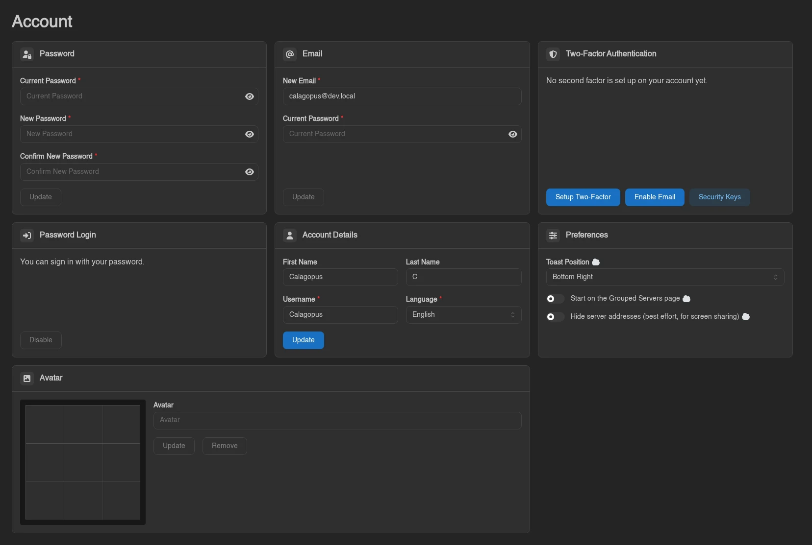
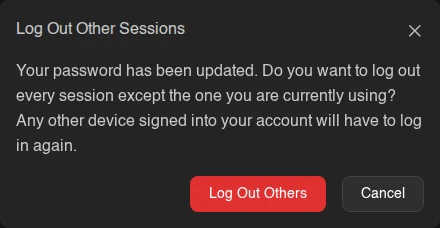
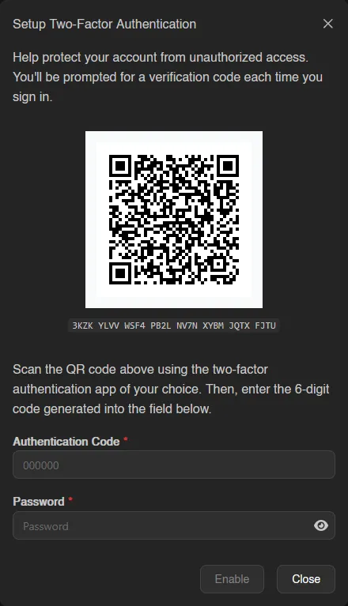
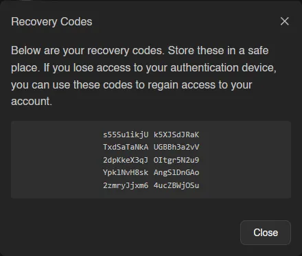

# Account

The Account page covers everything about your own user profile: password, email, two-factor authentication, display details, and avatar.

## Email Verification

If the administrator has turned on **Require Email Verification** and you haven't confirmed your address yet, a red **Email Verification Required** alert sits at the top of this page with a **Resend Verification Email** button, and the panel keeps redirecting you here from anywhere else.

Until you verify, the panel is almost entirely closed off. You can reach this page and the [Security Keys](./security-keys.md) page, change your email, request a new link, and log out. **SFTP and SSH are refused too**, so that route to your files is shut as well.

The link is mailed to you and stays valid for 24 hours; requesting a new one is limited to once a minute. Opening it takes you to `/auth/verify-email` and marks the address verified. Completing a [password reset](../auth/password-reset.md) also verifies your address, which is the way out if the verification mail never arrives but the reset mail does.

## Password

Enter your current password, then your new password twice, and hit **Update**. You always have to confirm your current password first, even if you're already logged in. If your account was created through an OAuth provider and has no password set, the **Current Password** field is hidden and this is how you set one for the first time.

Changing your password does not sign anyone out on its own, so a **Log Out Other Sessions** prompt follows a successful change.

**Log Out Others** ends every [session](./sessions.md) except the one you're using and reports how many were removed; **Cancel** leaves them alone. Take it if you changed your password because you suspect someone else has it, or if you were signed in somewhere you no longer control. It is the same action as **Log Out Others** on the Sessions page, so you can also do it later.

## Email

Same idea: enter your new email and your current password, then **Update**.

When email verification is required, the change doesn't apply straight away. The panel mails a confirmation link to the *new* address and tells you "Confirmation link sent to {email}. Your address changes once you open it." Until you open that link, your old address stays in place. Confirming it also invalidates any outstanding password reset.

## Two-Factor Authentication

Standard TOTP-based 2FA, the same kind used by most apps. Scan the QR code (or enter the code shown below it) in your authenticator app, then enter the 6-digit code it generates along with your current password to enable it.

Right after enabling, a **Recovery Codes** dialog appears: "Below are your recovery codes. Store these in a safe place. If you lose access to your authentication device, you can use these codes to regain access to your account." You get ten codes; click the code block to copy them all. Each code works exactly once at the [login checkpoint](../auth/login.md#two-factor-checkpoint), so store them somewhere safe before closing the dialog. The panel keeps the same set as long as you have any code left, so enabling a second email-based factor later shows you the same codes again rather than new ones.

Once you have a second factor set up, the card lists each enrolled method as a green badge - **Authenticator App**, **Security Key**, or **Email** - plus a line showing when your authenticator app was last used. With nothing set up it reads "No second factor is set up on your account yet." instead.

Up to three buttons sit at the bottom of the card: **Setup Two-Factor** or **Disable Two-Factor** for the authenticator app, **Enable Email** or **Disable Email** when the administrator has turned on email two-factor, and **Security Keys**, which takes you to the [Security Keys](./security-keys.md) page. Disabling asks for a valid authentication code and your password again.

If your role or the panel requires 2FA, the card also tells you whether your account currently meets that requirement. A frozen account shows an alert explaining that account details cannot be changed.

## Password Login

This card only appears if your account has a password. It reads either "You can sign in with your password." or "Password login is turned off. Only your security keys can sign you in.", with a button to flip it. Both directions ask for your password to confirm.

You cannot turn password login off until you have at least one [security key](./security-keys.md) - the button stays disabled with the tooltip "Add a security key before turning off password login." until then, and the panel refuses it server-side as well.

Turning it off is broader than it sounds: your password stops working **everywhere**, including SFTP password authentication. SSH keys keep working, and so do your security keys. Attempting a password login afterwards fails with "password login is disabled for this account". While it's off you also can't delete your last remaining security key, which would otherwise lock you out entirely.

## Account Details

Your first name, last name, username, and panel language. First and last name are optional; username is required, and the language selector only appears when the administrator allows changing it.

## Preferences

A separate card holding **Toast Position** (where notifications pop up on screen) and a toggle for whether the panel should open to the **Grouped Servers** view instead of **All Servers**, off by default. See [Servers](./servers.md) for the difference.

## Avatar

Click the empty **Avatar** field to upload an image. If it doesn't crop the way you want, drag the position handles on the preview grid to adjust it before saving.

Once you have an avatar set, upload a new file and hit **Update** to replace it, or **Remove** to delete it.

Uploads must be PNG, JPEG, WebP or GIF, and between 64 and 4096 pixels on both sides; the file type is checked by content, not by its extension. Whatever you upload is re-encoded to a 512x512 WebP, so there is no benefit to sending anything larger.

