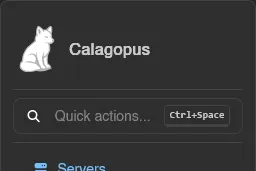
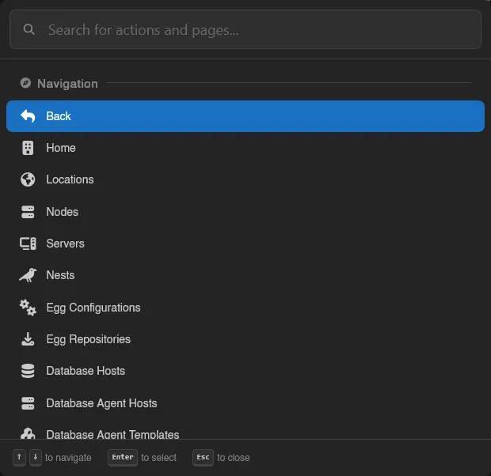

# Dashboard

The Dashboard is what every user lands on after logging in. It covers your own account (password, email, two-factor, avatar), your servers, and account-level self-service like API keys, SSH keys, and security keys. It's separate from the **Admin** area, which is only visible to users with admin permissions and covers instance-wide management like nodes, locations, and other users.

| Page | Description |
| --- | --- |
| [Servers](./servers.md) | Your server list, server groups, and bulk power actions |
| [Account](./account.md) | Password, email, two-factor authentication, and avatar |
| [Security Keys](./security-keys.md) | Passkeys and hardware security keys for login |
| [API Keys](./api-keys.md) | Personal access tokens for the API, with granular permissions |
| [SSH Keys](./ssh-keys.md) | Public keys used for SFTP and SSH access to Wings |
| [Command Snippets](./command-snippets.md) | Shortcuts for commands you use often in the server console |
| [OAuth Links](./oauth-links.md) | Linking third-party accounts for faster login |
| [Sessions](./sessions.md) | Devices currently logged into your account |
| [Keyboard Shortcuts](./keyboard-shortcuts.md) | Rebindable shortcuts for navigating the panel |
| [Activity](./activity.md) | A log of everything that's happened on your account |

## Navigating the Dashboard

The sidebar lists every page above, plus **Servers** and **Admin** (if you have admin permissions) at the top, under the **Quick actions** trigger (see below). At the bottom sits a server switcher: click into it to search and jump straight to one of your servers. The profile box below it leads to your [Account page](./account.md).

Right-clicking any sidebar link offers two more ways to open it: **Open in Virtual Window** renders the page in a floating window inside the panel, so you can keep it next to whatever you're doing, and **Open in Popup** opens it in a separate browser window.

## Quick Actions

**Quick actions...** at the top of the sidebar, or `Ctrl+Space` anywhere (rebindable under [Keyboard Shortcuts](./keyboard-shortcuts.md), and it works even while typing in an input), opens a command palette: type to filter actions and pages by any part of their name, use the arrow keys to navigate, **Enter** to select, **Esc** to close.

What it offers follows where you are:

- On the dashboard: your servers, to jump straight into one, plus every dashboard page.
- Inside a server: the server's pages plus **Power** actions matching its state and your permissions (**Start** while offline, **Stop** and **Restart** while running, **Kill** while stopping).
- In the admin area: **Back**, **Home**, and every admin page.

Whatever page you are on, its own tabs are listed too, under **Page Navigation** - the tabs of a node, an egg or your backups, without reaching for them.

A **Logout** action is available everywhere, under **Account**; it asks for confirmation before ending your session.

### Prefixes

Typing one of four characters first switches the palette into a different mode. The palette shows these as hints along its footer, so you don't have to remember them.

| Prefix | Mode |
| --- | --- |
| `=` | Evaluate a math expression, with the result shown as you type. **Enter** copies it. |
| `#` | Search servers by name. In the admin area this searches every server on the panel, not just yours. |
| `@` | Search users. Admin area only, and only with user permissions. |
| `/` | Filter to pages only, showing each one's path. |

The three dots next to your name open a small menu to jump to your **Account** page, switch to the **Admin** area (admins only), pick a **Theme**, reset your device overrides (see [Settings Sync](#settings-sync); the entry only appears when you have some), or log out. **Auto** follows your browser's theme, **Dark** and **Light** force one; the panel starts on **Dark** until you pick.

## Settings Sync

Most preferences follow your account rather than your browser: change the console font size or your toast position on one machine and it is already set on the next one you log into. This covers the [Preferences](./account.md#preferences) card, console and file-manager settings, the form-engine **Advanced mode** toggle, and your [keyboard shortcut](./keyboard-shortcuts.md) rebinds.

Every synced setting has a small icon next to its label that opens a scope menu:

| Option | What it does |
| --- | --- |
| **Sync With Account** | The default. The value lives on your account and applies everywhere. |
| **Only This Device** | Breaks the link and keeps a separate value on this device. The label then reads **This Device**. |
| **Use the Account Value** | Drops the device override and goes back to the account's value. |
| **Save This Value to My Account** | Pushes the current device value up as the new account value. |

A few settings are inherently per-device and never sync: the editor engine, line-overflow wrapping, the VS Code URI scheme, and the audio player's volume.

When you have any overrides, the profile menu at the bottom of the sidebar grows a **Reset Device Overrides** entry with a count, which clears them all at once and returns this device to your account's values.
