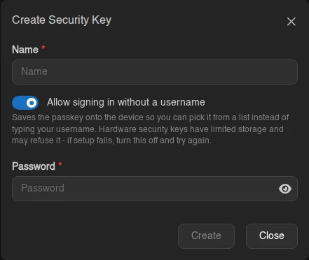
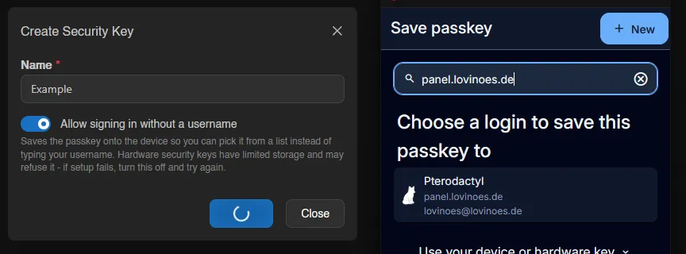
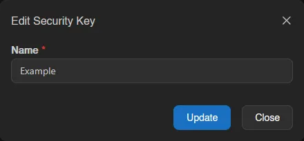
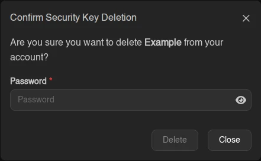

# Security Keys

Security keys use [WebAuthn](https://webauthn.io/) to let you log in with a passkey, your device's biometrics, or a physical hardware key instead of typing your password; see the [login flow](../auth/login.md#step-2-passkey-or-password) for how they're used. Your instance needs a valid SSL certificate for this to work; see [Generating SSL Certificates](../../../additional/ssl-certificates.md) if it doesn't have one yet.

Existing keys are listed with their name, credential ID, last used, and created timestamps, under a counter reading "N of M maximum security keys created.". **Create** is disabled with an explanatory tooltip when WebAuthn is off, the limit is reached, or the page isn't served over HTTPS, and a warning alert appears when the administrator has disabled security keys entirely.

## Creating a Security Key

Click **Create** in the top right and give the key a name. The **Allow signing in without a username** switch (on by default) saves the passkey onto the device so you can pick it from a list at login instead of typing your username; hardware security keys have limited storage and may refuse this, so turn it off and retry if setup fails. You also have to confirm your account password, unless your account signs in through an OAuth provider only and has no password set.

After confirming, the browser takes over and asks where to save the credential: a password manager extension like Bitwarden, a platform prompt (Windows Hello, iCloud Keychain, Android), or a physical key. Closing that prompt cancels the creation.

## Editing and Removing

Right-click a key (or open the menu at the end of its row) to rename or remove it. **Edit** only changes the display name shown in the table, not the credential itself.

**Delete** removes the key from your account and asks for your account password to confirm, the same as creating one does. The credential stays on your device or password manager, so clean it up there as well if you do not intend to use it again. If password login is turned off for your account, you cannot remove your last remaining key; turn password login back on first.

::: info
Whether security keys and usernameless login are available at all, and how many keys an account may have, is controlled by the instance administrator under [Settings > Webauthn](../admin/settings.md#webauthn) and [Settings > User](../admin/settings.md#user).
:::
