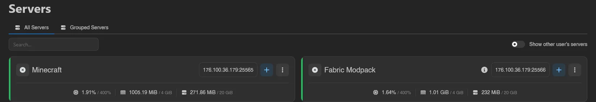
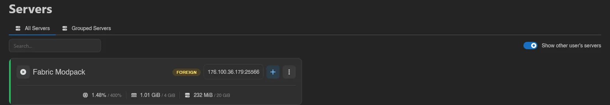
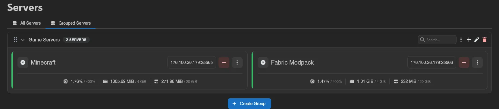
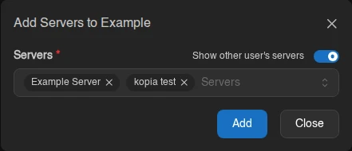
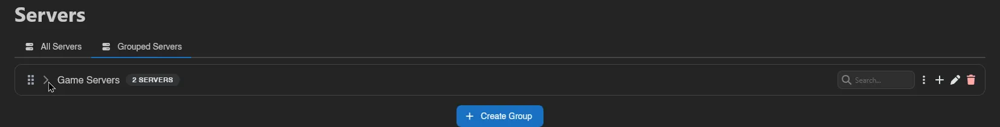
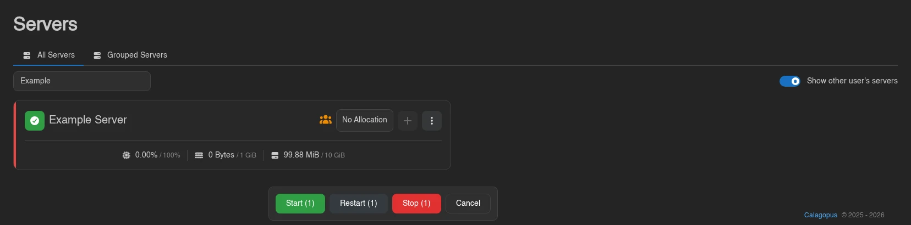

# Servers

The Servers page is the landing page for most users and lists every server you have access to. It has two views: **All Servers**, a flat list, and **Grouped Servers**, where you organize servers into your own groups.

Each server card shows its power state, name, address, and live CPU, memory, and disk usage, and surfaces **Suspended**, **Transferring**, and **Node Maintenance** states. Servers owned by someone else carry a **Foreign** badge ("This server is owned by another user, you have access to it as a subuser or administrator"). If your account has the `servers.read` admin permission, a **Show other user's servers** toggle appears in the top right; it's off by default.

## Grouped Servers

Groups are personal and only affect how servers are organized for you, they don't change who has access to a server.

### Creating a Group

Switch to the **Grouped Servers** tab and click **Create Group** at the bottom. Give the group a name.

### The Group Header

Each group's header holds a search box that filters the servers inside it, alongside selection and group controls:

| Control | Does |
| --- | --- |
| **Group Actions** (the three dots) | **Start**, **Restart**, or **Stop** every server in the group at once |
| **Add Servers to Group** (plus) | Search for and select several servers to add together; existing members are excluded |
| **Edit** (pencil) | Rename the group via the **Edit Server Group** modal |
| **Delete** (trash) | Remove the group after a **Confirm Server Group Deletion** prompt |

Deleting a group never deletes the servers inside it, it just ungroups them.

The add-server picker lets administrators include other users' servers with its visibility switch. Selected servers are appended to the group in selection order.

### Inside a Group

Groups are collapsible; click the chevron to expand or collapse one, and drag servers to reorder them within the group. Groups themselves reorder by their grip handle, and each header carries a server-count badge. While a server is stopping, its card's context menu offers **Kill** (with a Force Stop confirmation).

Dragging also works *between* groups: drop a server onto another group to move it there, and a "Server moved to {group}." toast confirms it. Two things block a drop, and the target group tells you which as you hover it: **Already in this group**, or **Group is full**, since a group cannot hold more than 100 servers. A collapsed group won't accept a drop either; expand it first.

Use the select-all control in **All Servers** for the current page, or the control in a group header for that group's displayed servers. It does not add servers on other pages or in other groups, but earlier selections there remain selected and still count toward bulk actions.

Hold **S** and click servers (or click the check icon on a card) to select them; a plain click opens the server instead. An action bar appears with **Start**, **Restart**, and **Stop** for the whole selection, each showing how many servers it applies to, plus **Cancel**. Removing a server from a group is separate: the red minus icon on its card (the server itself is never deleted).

