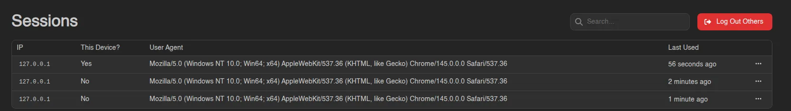

# Sessions

Sessions lists every device currently logged into your account: its IP address, whether it's the device you're using right now (the **This Device?** column), its user agent, and when it was last active.

## Revoking a Session

Right-click a session (or open the menu at the end of its row) and select **Remove** to log it out; on your current session the action is disabled. This is useful if you spot a session you don't recognize or want to sign out an old device.

To clear everything at once, **Log Out Others** in the top right ends every session except the one you're using. It asks for confirmation first, and reports how many were removed. This is what you want after losing a device or changing your password.

