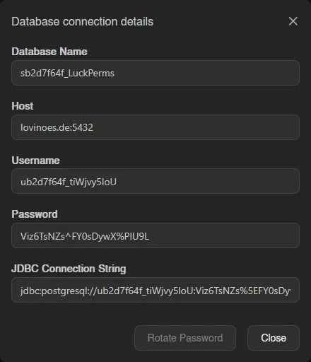

# Classic Databases

Classic databases are single databases provisioned on a shared [database host](../../../../additional/database-hosts/index.md), the familiar setup from other panels. They count toward the server's shared database limit; see [Databases](./index.md) for how the limit and the tab bar work when your server also has managed databases.

The **Databases** tab lists each database's name, type (MySQL, PostgreSQL, or MongoDB), address, username, size, and whether it's locked. Click the address to copy it.

## Creating a Database

Click **Create**. Pick a **Database Name** and a **Database Host**; hosts are grouped by database type, and a host marked **Under Maintenance** can't be selected. The button is disabled with a tooltip once the shared limit is hit, or with "No hosts found" when there's nothing to provision on.

::: info
Database hosts are set up by administrators and attached to locations, see [Database Hosts](../../../../additional/database-hosts/index.md). Users only ever pick from the hosts made available to their server.
:::

## Connection Details

Right-click a database and choose **Details** to open the **Database connection details** modal: database name, host, username, password, and a ready-made **JDBC Connection String** in the form `jdbc:mysql://<username>:<password>@192.0.2.1:3306/<database>`.

The password is only visible with the `databases.read-password` permission. From the same modal, **Rotate Password** generates a new password immediately, invalidating the old one.

## Editing, Recreating, and Deleting

The rest of the right-click menu:

| Action | What it does |
| --- | --- |
| **Explore Data** | Opens the [Data Explorer](./index.md#data-explorer). |
| **Edit** | Toggle **Locked**. A locked database can't be recreated or deleted, and its password can't be rotated. |
| **Recreate** | Wipes all data and creates a fresh, empty database with the same connection details. Type the database name to confirm. |
| **Delete** | Permanently deletes the database and all data. Type the database name to confirm. |

With `databases.delete`, you can also select several databases (checkboxes, drag, or `Ctrl+A`) and **Delete** them together after one confirmation. Locked databases are skipped. Each action reports how many items it changed, skipped or failed in a toast.
