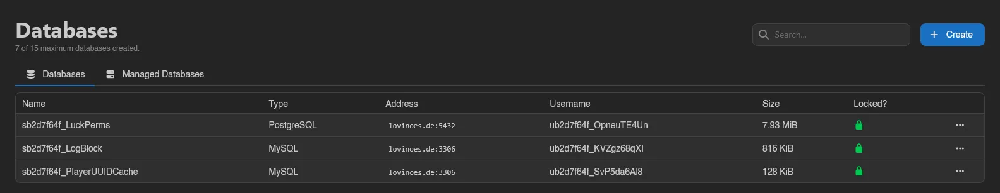

# Databases

Calagopus has two kinds of server databases. **Classic Databases** are single databases provisioned on a shared database host, the familiar setup from other panels. **Managed Databases** are full database instances run for you by [DB Agent](../../../../db-agent/index.md), with their own container, power controls, and live stats.

Both kinds count toward the same limit, shown at the top of the page as "6 of 15 maximum databases created."; the limit is part of the server's [feature limits](../../admin/servers.md#feature-limits). The page splits into a **Databases** tab for classic databases and a **Managed Databases** tab at `/databases/instances`, each with its own search box and **Create** button.

A tab only appears when it's relevant to your server: classic when you have databases or a database host to create on, managed when you have instances or templates to create from. With only one relevant, the tab bar hides and you get a single plain list.

## Pick a Kind

::::tabs
=== Classic Databases

Single databases provisioned on a shared [database host](../../../../additional/database-hosts/index.md), the familiar setup from other panels.

See [Classic Databases](./classic.md).

=== Managed Databases

Full database instances run for you by [DB Agent](../../../../db-agent/index.md), with their own container, power controls, and live stats.

See [Managed Databases](./managed.md).
::::

## Data Explorer

**Explore Data** on a classic database or on a database inside a managed instance opens a database browser built into the panel, no external tool needed. MongoDB databases cannot be explored, nor can Redis instances.

A searchable **Tables** sidebar (collapsible via **Hide Tables**) lists the database's tables with estimated row counts; views carry a **View** badge. Three tabs work on the selected table:

- **Rows**: browse with pagination and stackable column filters (equals, contains, starts with, greater or less than, and more); column headers show each column's type and sort the listing. Edit cells inline and hit **Save**, insert with **New Row** (columns can keep their **Database default**), or select rows and delete them after confirmation.
- **Structure**: the column list shows Name, Type, Nullable, Key, Default, and Attributes. Create tables (columns with **Type**, **Nullable**, **Primary Key**, and **Auto Increment**), add, rename, and delete columns, and rename or delete whole tables; deleting a table or column permanently destroys its data, and adding a non-nullable column to a table that already has rows fails.
- **Query**: a SQL console with syntax highlighting, a **Row Limit** (default 100), and **Run**. **Read-only** is on by default ("Rejects statements that change data or structure."); turn it off to run writes.

Browsing needs the `databases.query` permission (`database-instances.query` inside instances); editing rows, editing structure, deleting structure, and the Query tab each map to their own key, see the [Permissions Reference](../../dashboard/permissions.md). Treat `query-raw` like handing out the database credentials themselves, and note that a [database host in maintenance mode](../../admin/database-hosts.md#maintenance-mode) blocks the explorer entirely. SQLite files in the file manager get the same treatment via the [files page](../files.md#sqlite-databases).
