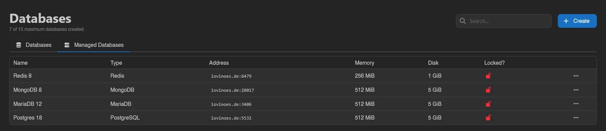
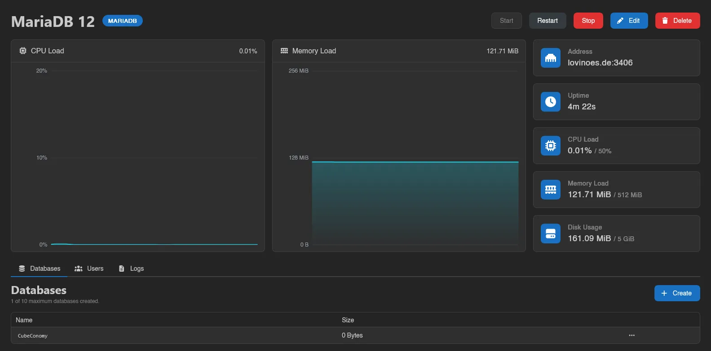

# Managed Databases

Managed databases are dedicated Redis, MongoDB, PostgreSQL, or MariaDB instances run for you by [DB Agent](../../../../db-agent/index.md), with their own container, power controls, and live stats. They count toward the server's shared database limit; see [Databases](./index.md) for how the limit and the tab bar work when your server also has classic databases.

The **Managed Databases** tab lists each instance's name, type, address, memory, disk, and lock state; an instance with a pending template update also shows an **Update Available** badge. Right-click a row for power actions (**Start**, **Restart**, **Stop**, **Kill**) and **Delete**, or click it to open the instance page.

## Creating a Managed Database

Click **Create** on the **Managed Databases** tab. Choose a **Database Name** and a **Template**; templates are grouped by database type, and each one defines the instance's resource limits (memory, swap, disk, CPU, and IO weight). If the template offers more than one **Docker Image**, you pick one too.

::: info
Templates and the resource limits they carry are configured by administrators under [Database Agent Templates](../../admin/database-agent-templates.md); the per-instance database and user caps live in [Settings > Server](../../admin/settings.md#server). See the [DB Agent docs](../../../../db-agent/index.md) for how instances are provisioned.
:::

## Bulk Actions

Select rows with their checkboxes, by dragging across them, or with `Ctrl+A` (`Esc` clears); only rows on the current page are selected. The action bar has **Start**, **Restart**, **Stop** and **Kill** for every selected instance (`database-instances.power`; **Kill** asks first, since it can corrupt data), and **Delete** (`database-instances.delete`), which permanently removes the instances and their data after a confirmation. Locked instances are skipped by **Delete**. Each action reports how many items it changed, skipped or failed in a toast.

## The Instance Page

Each instance has its own page at `/server/<id>/databases/instances/<id>` with the instance name, its type badge, and badges for **Locked**, **Update Available**, and **Restoring backup** where relevant.

Along the top:

- **Start**, **Restart**, and **Stop** power buttons. While the instance is stopping, **Stop** turns into **Kill**; killing warns you first, since forcibly killing a database can corrupt data.
- **Export** and **Import** (Redis only, and only while running): download a dump of the whole instance, or upload one, optionally with **Wipe all existing data before importing**.
- **Apply Update**, shown when the instance's template has a newer configuration. Applying it restarts the database on the updated template.
- **Edit** to rename the instance or toggle **Locked**. A locked instance can't be deleted, template updates can't be applied, and its user passwords can't be rotated.
- **Delete** to remove the instance and all its data. Type the name to confirm.

Below that are live **CPU Load** and **Memory Load** graphs (with an "Instance is offline" overlay when it's off) and stat tiles for Address, Uptime, CPU Load, Memory Load, and Disk Usage. Tiles show usage against the template's limits; a limit of zero displays as Unlimited. If a background operation like a remote import is running, a progress ring appears next to the power buttons where you can watch or cancel it, or **Cancel all operations** at once.

While a [database backup](../backups.md#database-backups) is being restored into the instance, a banner at the top reads "A backup is currently being restored into this managed database. Please wait..." with a progress bar and time estimate, and **Start**, **Restart**, and **Stop** are disabled until it finishes. A toast tells you whether the restore completed or failed.

A restore also **write locks** the instance, and anything connected to it notices. New connections are refused with "database is write locked", and **connections that are already open are dropped**, so a game server using the database will see its connection die mid-query and need to reconnect once the restore is done.

Restores are the only thing that locks an instance; exports and remote imports you start yourself do not, so your own export will not freeze the database under a running server. The [query explorer](./index.md#data-explorer) also refuses to run while the lock is held.

## Databases Tab

Not shown for Redis, which has no named databases. Lists the databases inside the instance with their size, up to its own per-instance cap.

**Create** asks for a name (letters and numbers only) and requires the instance to be running. It also has a **Create a user for this database** switch, on by default, which "creates a user named after the database, grants it access and shows its credentials once the database is created": leave it on and you get a working database and login in one step. A warning icon next to a database means it has no user attached yet, so nothing can connect to it.

Right-click a database for:

| Action | What it does |
| --- | --- |
| **Explore Data** | Opens the [Data Explorer](./index.md#data-explorer). |
| **Export** | Downloads a dump of this database. |
| **Import** | Uploads a **Dump File**, optionally wiping existing data first. MongoDB imports also need the **Source Database** name the dump was taken from. |
| **Import from Remote** | Dumps another database server over a **Connection String** and imports the result. An optional **Source Database** field "Overrides the database named in the connection string", and a wipe toggle clears the target first. The connection string is only used to take the dump, it is never stored. Runs in the background as a cancellable operation. |
| **Recreate** | Wipes all data and recreates an empty database with the same name and user access. Type the name to confirm. |
| **Delete** | Permanently deletes the database and its data. |

## Users Tab

Per-instance database users, shown with the `database-instances.users` permission and capped by **Max Users per Database Instance** under [Settings > Server](../../admin/settings.md#server) ("0 of 10 maximum users created."). Each row lists the databases that user can reach as badges under a **Databases** column, blue for read and write access, grey for read-only.

**Create** takes a **Username** of 2 to 23 characters, letters and digits only, and for everything except Redis a **Database Access** list. What you type is a suffix rather than the final name: the agent prefixes it to keep users from different servers apart, so `appuser` is created as something like `ub3bf2a14_appuser`, and that prefixed form is what the table, the credentials and your connection string all use.

You never choose a password either; the agent generates one and **Details** shows it.

### Database Access

Access is granted per database rather than per instance. The list names every database in the instance with a **No Access** / **Read Only** / **Read & Write** control beside it, and one user can hold a different level in each. You get the same list whether you are creating a user or editing one through **Permissions**, and the **Databases** badges on the row summarize the result.

**No Access** is the absence of a grant rather than a stored setting. Creating a database only takes a name, so a new one starts out unreachable until you grant somebody access to it. **Recreate** keeps the grants, so wiping a database does not change who can reach it.

Redis instances have no databases, so their users are instance-wide and **Permissions** never appears for them. An instance whose databases you have not created yet says "This instance has no databases yet." and hides the action too.

Editing access also needs `database-instances.databases`, since the panel has to read the instance's databases to draw the list. Without it, both the **Create** button and the **Permissions** action disappear.

The instance also has to be running. While it is stopped, **Create**, **Permissions** and **Delete** are greyed out, and **Create** says why: "The instance must be running to create users." Redis is the exception again, since its users have no grants to apply, so they can be created and removed with the instance off.

::: warning `database-instances.users` includes the passwords
Classic databases keep their password behind a separate `databases.read-password` permission. Managed instances have no such split, so anyone who can open this tab can read every user's password from **Details**. Grant it as you would hand out the credentials themselves. See the [Permissions Reference](../../dashboard/permissions.md).
:::

Right-click a user for:

| Action | What it does |
| --- | --- |
| **Details** | Opens the **Database Credentials** modal: address, username, password, and a **JDBC Connection String**, plus the same **Rotate Password** button classic databases have. When the user can reach more than one database, a selector switches which one the connection string is built for. |
| **Permissions** | Opens **Database Permissions** - "Controls which databases **{username}** can access, and what it may do in them." - the same No Access / Read Only / Read & Write list used when creating the user. |
| **Delete** | Removes the user. |

## Backups Tab

Shown with the `backups.read` permission. Lists the database backups taken from this instance, under a counter like "2 of 15 maximum backups created on this server, shared with server backups." - the same limit the server's [Backups](../backups.md) page counts against. Backups that belong to a [backup group](../backups.md#backup-groups) show the group's name under theirs.

**Create** asks for a **Name** and, when the server has groups, a **Backup Group**, then dumps the running instance. It is disabled while the instance is offline ("The managed database must be running to take a backup.") and while a restore is in progress.

Flip **All MariaDB backups on this server** (the engine name follows the instance) to widen the list to every database backup of the same engine on this server. A **Source** column then names the managed database each dump was taken from, marking one whose database no longer exists as "Example (deleted)". Restoring one of those into this instance is how you move data between managed databases, or recover a dump whose database has been deleted.

Right-click a backup for **Edit**, **Download**, **Restore**, and **Delete**; they work as described under [Backup Actions](../backups.md#backup-actions).

## Logs Tab

A live log stream from the instance's container, the managed-database equivalent of the server console (read-only, no command input). While the agent is pulling a new Docker image, pull and extract progress bars appear beneath the log.
