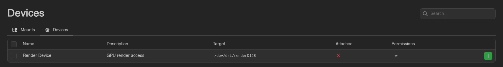
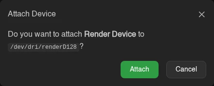
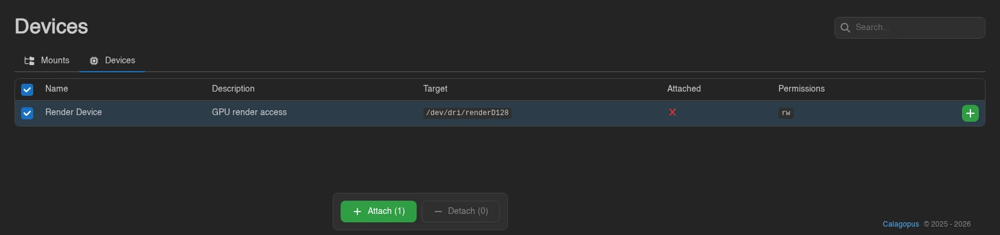

# Devices

Open **Mounts → Devices** to see the host devices your administrator has made available to your server. These can include a GPU render device or other hardware that the application inside the container needs.

The table shows **Name**, **Description**, **Target**, **Permissions**, and whether the device is **Attached**. The target is its path inside your container. Permissions use `r` for read, `w` for write, and `m` for creating device nodes.

Use the **+** or **-** on a row to attach or detach it, then confirm.

For several devices, select rows with the checkboxes, by dragging, or with `Ctrl+A`; **Attach** and **Detach** in the action bar skip devices already in the requested state. `Escape` clears the selection.

Restart the server to apply changed device mappings. An attachment shown in the Panel still needs a valid source device and an allowlist entry on the Wings host. Contact your administrator if the device does not appear after a restart.

Administrators define the paths and access permissions under [Devices](../admin/devices.md). Devices must be assigned to both your node and egg, and marked **User Attachable**, for you to manage them here.

Viewing needs `devices.read`; attaching and detaching need `devices.attach` and `devices.detach`. These are separate from the permissions for directory mounts. See the [Permissions Reference](../dashboard/permissions.md#devices).
