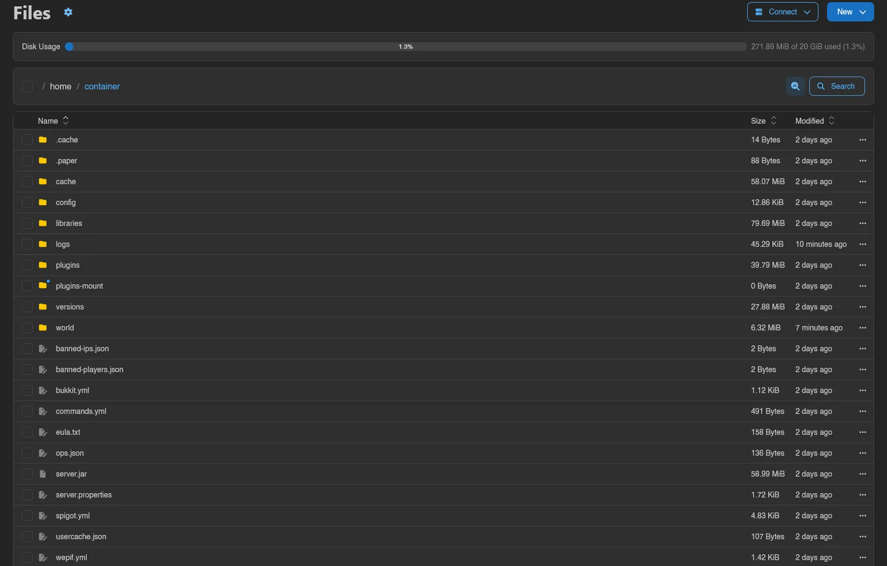
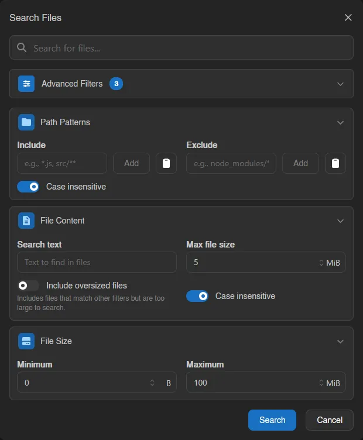
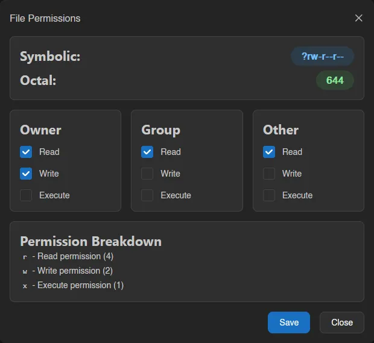
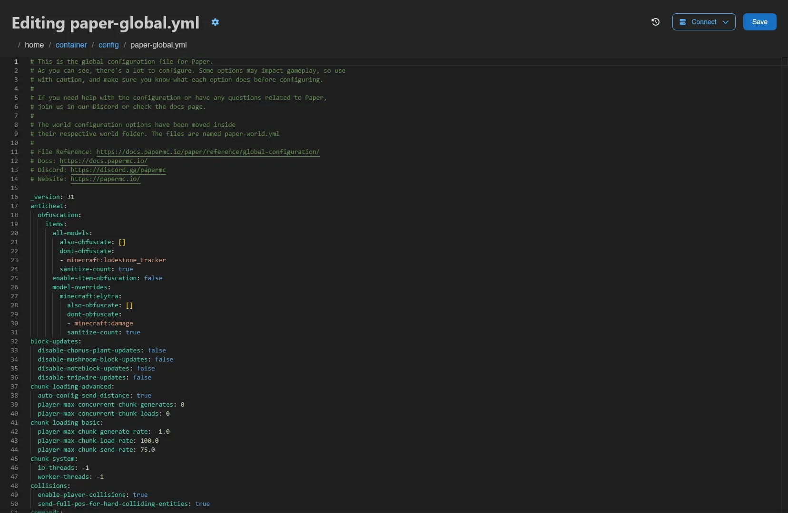
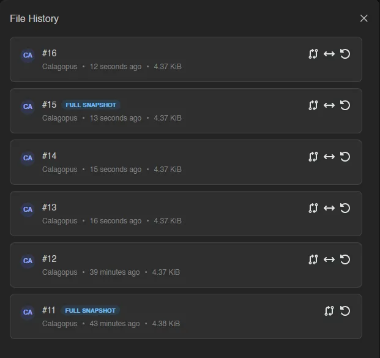
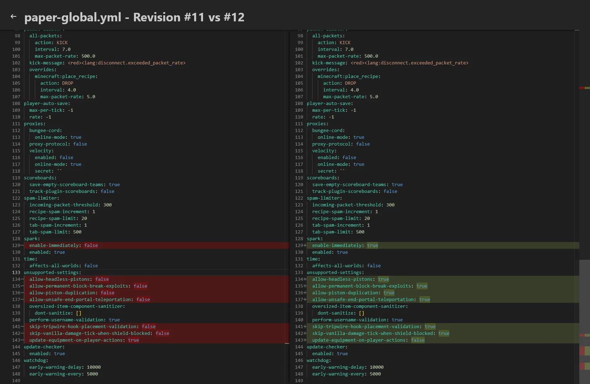

# Files

The Files tab is a full file manager for your server: browse and sort, upload and download, edit with a code editor, pack and unpack archives, and roll files back to earlier revisions. Everything is gated by the `files.*` permissions, see the [Permissions Reference](../dashboard/permissions.md).

The file manager has two views, and the page title tells you which one you are in. **List** is the table above, and **Tree** swaps it for a sidebar file tree next to an editor pane, for working across several files at once. The pair of buttons in the top right switches between them, as do the **Switch to List View** and **Switch to Tree View** [quick actions](../dashboard/index.md#quick-actions). Your choice is remembered per browser.

## The List View

Files are listed with **Name**, **Size**, and **Modified** columns; click a column header to sort, click again to flip the direction. Single-click selects a row, double-click opens it, and typing a few letters jumps to the first matching entry. Inside a subdirectory, the top row takes you back up one level.

The breadcrumb bar above the table always starts at `home / container` and every segment is clickable. It also holds the select-all checkbox, a directory-size analyzer, and the **Search** button.

The gear next to the page title opens the file manager settings:

| Setting | Effect |
|---|---|
| **Click once to open file or folder** | Single-click opens entries instead of selecting them. |
| **Show physical size instead of logical size** | The Size column shows actual disk usage rather than file length. |
| **VS Code URI Scheme** | Which editor the **via VS Code** connect option launches (`vscode` by default, e.g. `vscodium` or `cursor` for forks). |

### Connect

The **Connect** menu offers two ways to work on your files outside the browser:

- **via SFTP** opens the **SFTP Details** modal with the connection info: **Protocol**, **Host**, **Port**, **Username** (your panel username plus the server's short ID, like `user.1a2b3c4d`), and a **Password** field that just reads "Your Control Panel Password". If your password cannot open that connection, a warning replaces the field and you need an [SSH Key](../dashboard/ssh-keys.md). That applies when the account has no password, when you have turned [Password Login](../dashboard/account.md#password-login) off, and when an admin has turned it off for the whole panel. Every field except the password copies on click, and **Launch** opens an `sftp://` link for clients registered to handle it. Holding Shift while clicking **via SFTP** skips the modal and launches directly. Requires the `files.sftp` permission.
- **via VS Code** mounts the server as a workspace folder in your editor. See the [VS Code integration](../../../integrations/vscode.md) for setup and everything it can do.

### New

The **New** menu (shown when you can write to the current directory and hold `files.create`) creates content in the directory you are browsing:

| Option | What it does |
|---|---|
| **File from Editor** | Opens an empty code editor; **Create** asks for a file name. |
| **Directory** | Creates a new directory. |
| **Symlink** | Creates a symbolic link. You give it a **Symlink Name** and a **Symlink Target**, "relative to the directory the symlink is created in", and the modal previews both resolved paths before you commit. |
| **File from Pull** | Downloads a file from a URL directly onto the server, see [Pulling from a URL](#pulling-from-a-url). |
| **File from Upload** | Uploads files from your device. |
| **Directory from Upload** | Uploads an entire folder, keeping its structure. |

### Disk Usage

Below the toolbar, a **Disk Usage** bar shows how much of the server's disk limit is in use, for example `271.86 MiB of 20 GiB used (1.3%)`. It turns yellow at 80% and red at 95%, and is hidden on servers with unlimited disk.

### Search

**Search** (or `Ctrl+K`) opens the **Search Files** modal, which remembers your last query when reopened. The plain text box matches file names anywhere below the current directory. **Advanced Filters** adds three optional sections:

| Filter | Fields |
|---|---|
| **Path Patterns** | **Include** and **Exclude** glob patterns (`*.js`, `node_modules/**`), plus a **Case insensitive** toggle. |
| **File Content** | Deep search: **Search text** looked for inside files, a **Max file size** per file, **Include oversized files** (list files that match the other filters but are too large to scan), and **Case insensitive**. |
| **File Size** | **Minimum** and **Maximum** file size. |

Results replace the listing, with a banner summarizing the query and active filters; close the banner to return to normal browsing. The content-search size cap is limited by a panel-wide maximum under [Settings > Server](../admin/settings.md#server), and the **File Content** section only appears on filesystems where the daemon supports fast content scanning.

#### Result Previews

Every search result carries an inline preview you can expand and collapse per file, in both the list and the tree view.

With a **File Content** search running, the preview shows the matching lines themselves, with a line of context either side and the match highlighted, headed by the line range ("Lines 41-43"). Without a content filter, it shows the first few lines of the file instead, so you still get a sense of what you matched. Archives never get a preview.

Previews are capped: at most six lines are shown per file, and **More matches not shown** appears when a file matched more times than fit.

Some results show a short status instead of content:

| Status | Meaning |
| --- | --- |
| **Content permission required** | You have `files.read` but not `files.read-content`, so the panel may list matching files but not show what is inside them. |
| **Match found, preview unavailable** | The file matched, but the node returned no context for it, usually because it is larger than the node's preview limit. |
| **Preview unavailable** | The file's contents could not be read back. |
| **Empty file** | The file matched the name or size filters and has no content. |

A search that actually returns previews is recorded in the [activity log](./activity.md) as a `server:file.read-content` entry naming the directory searched, the files that matched, and a truncated copy of the query. A search by a user who only holds `files.read` never reaches file contents and so records nothing.

::: info
How much the node will read for previews is capped by [`api.file_search_context`](../../../wings/configuration.md#api-file-search-context-max-matches) in the Wings configuration, separately from the **Max file size** on the search itself. A file over the node's budget still counts as a match; it just comes back without preview content.
:::

### Analyzing Disk Usage

The chart icon next to **Search** ("Analyze directory sizes") opens **Largest Directories**, a treemap of which directories eat your disk. Click a directory in the map to jump into it.

### Browsing Backups

Backups can be browsed read-only through the same file manager; the breadcrumb root switches to `backups / <backup name>` and an **Exit Backup** button brings you back to the live filesystem. Actions that modify files are hidden while browsing a backup.

## Selecting Files and Mass Actions

Use the row checkboxes, `Ctrl`-click to toggle, `Shift`-click for a range, drag a selection box across rows, or the breadcrumb checkbox / `Ctrl+A` for everything. As soon as anything is selected, an action bar appears with quick buttons for download (as a `.zip`), remote copy, copy, archive, rename, move, and delete.

Right-clicking a selected row opens the mass action menu:

| Item | What it does |
|---|---|
| **Download** | Bundles the selection into an archive; pick the format from **Download as** (`.tar`, `.tar.gz`, `.tar.xz`, `.tar.lz`, `.tar.bz2`, `.tar.lz4`, `.tar.zst`, `.zip`). |
| **Remote Copy** | Copies the selection to another server, see [Remote Copy](#remote-copy). |
| **Copy** | Marks the selection for copying. |
| **Archive** | Packs the selection into an archive on the server. |
| **Rename** | Opens the batch [Rename Files](#renaming) modal. |
| **Move** | Marks the selection for moving. |
| **Delete** | Deletes the selection after confirmation. |

**Copy** and **Move** work like cut and paste: the marked files stay highlighted while you navigate to the target directory, then the action bar offers **Copy ... here** or **Move ... here** (or `Ctrl+V`), with a cancel button to back out.

If names collide while copying, a **Resolve Copy Conflicts** modal lists each clash with the source and destination details and lets you **Skip**, **Overwrite**, or **Rename** each file individually, or **Skip all** / **Overwrite all** at once.

Drag rows onto a directory row or a breadcrumb segment to move them; dragging any selected row drags the whole selection.

## Per-File Actions

Right-click a row (or use its menu button) for the single-file context menu:

| Item | What it does |
|---|---|
| **Open in new Window** | Opens the file in a floating window inside the panel, so you can keep browsing next to it. |
| **Rename** | Renames the file. |
| **Copy** | Copies it; in read-only directories you pick a destination instead. |
| **Remote Copy** | Copies it to another server. |
| **Move** | Marks it for moving, same paste-style flow as mass move. |
| **Symlink** | Creates a symlink pointing at this entry, with the target pre-filled. |
| **Archive** / **Extract** | Packs the entry into an archive; for archive files the item becomes **Extract** instead. |
| **Download** | Downloads the file directly; for directories, pick an archive format from the **Download as** submenu. |
| **More** > **Details** | Shows **Path**, **Mode**, **Logical Size**, **Physical Size**, **MIME Type**, **Last Modified At**, and **Created At**. |
| **More** > **Fingerprint** | Computes a checksum: MD5, CRC32, SHA-1, SHA-224, SHA-256, SHA-384, SHA-512, or CurseForge. |
| **More** > **Permissions** | Unix permissions editor, see below. |
| **Delete** | Deletes the file after confirmation. Deletion is permanent. |

### Permissions (chmod)

**File Permissions** shows the current mode as both **Symbolic** (`-rw-r--r--`) and **Octal** (`644`), with Read/Write/Execute checkboxes for **Owner**, **Group**, and **Other** and a breakdown of what each bit means.

For directories, a switch applies the change recursively to everything inside. Changes can be undone straight from the confirmation toast.

### Renaming

A single **Rename** is a simple name prompt (also `F2`), undoable from the toast.

Renaming a selection opens **Rename Files**, a batch tool:

| Field | What it does |
| --- | --- |
| **Find** / **Replace with** | Text or, with **Case sensitive** on, a regular expression with `$1` group references. **Replace all occurrences** controls whether every match or just the first is replaced. |
| **Apply to** | Which part of the name the find/replace runs against: **Name**, **Extension**, or **Full name**. |
| Prefix / Suffix | Text added before or after the result. |
| Case conversion | Forces the result to a case. |
| Automatic numbering | A `{n}` token in the name, with **Start at**, **Step**, and **Minimum digits** controls. |

A live preview shows every resulting name and flags conflicts before anything is renamed.

### Remote Copy

**Remote Copy Files** sends files to a different server you have access to: pick the target **Server**, browse to a destination directory, and optionally give a single file a new name. You need `files.create` on the destination server.

### Archives

**Archive** opens **Create Archive** with an optional **Archive Name** (a timestamped name is generated if you leave it empty) and a **Format**: `.tar`, `.tar.gz`, `.tar.xz`, `.tar.lz`, `.tar.bz2`, `.tar.lz4`, `.tar.zst`, `.zip`, or `.7z`.

**Extract** unpacks an archive into any directory you pick in the browser. `.zip`, `.7z`, and `.ddup` archives can also be browsed in place, double-click one to navigate into it like a directory (where the filesystem supports it).

Both run in the background; progress appears next to the toolbar, where operations (compressing, extracting, pulling, copying) can be cancelled individually or all at once via **Cancel all operations**.

## Uploading

Drag files from your device anywhere onto the page and a **Drop files here to upload** overlay appears; drop to start. Alternatively use **New** > **File from Upload** or **Directory from Upload**. Upload progress lives in a popover next to the toolbar, where uploads can be paused, resumed, and cancelled.

Uploads keep going when you leave the page, and a progress toast follows you around the panel until they finish, one per destination, reading "Uploading 3 files to `server`...". Its **Show files** button takes you back to the directory being uploaded into, and its close button cancels every upload still heading there.

::: info
The maximum size per uploaded file is set by the Wings option [`api.upload_limit`](../../../wings/configuration.md#api-upload-limit) (default 100 MiB). For anything bigger, use SFTP.
:::

### Shared Upload State

An upload in flight is staged as a `.upload-part` file next to its destination, and only gets its real name once every byte has arrived. A half-finished file therefore never sits in the listing looking complete.

Uploads are not private to the tab that started them. Wings tracks each one and pushes its progress to everyone watching the server, so the same row updates for your other sessions and for anyone else with access to the file. The listing shows the name the file will end up with, never the `.upload-part` suffix, and replaces the size column with progress while the upload runs:

| Row state | What you see |
| --- | --- |
| Uploading | Green row with an **Uploading 42%** badge, and `137.2 MiB / 320 MiB` in place of the size. |
| Incomplete | Yellow row with an **Incomplete** badge. The upload has stopped without finishing. |
| Someone else's | The same badges, plus `by <user>` next to them. Your own uploads are not attributed. |

Seeing an upload needs the `files.read` permission, and a subuser whose [ignored files](./subusers.md#ignored-files) hide the destination does not see the upload either - the deny rule is matched against the name the file will end up with, so a partial cannot be used to peek at a path that is otherwise hidden.

### Incomplete Uploads

An upload that goes 30 seconds without progress is treated as incomplete. Its badge turns yellow, and a dismissible **Incomplete Uploads** banner appears above the listing:

> Some uploads to this server never finished and their partial files are still on disk.

**Review Uploads** on the banner, or the **Review Incomplete Uploads** entry in the [quick actions](../dashboard/index.md#quick-actions) palette (`Ctrl+Space`), opens a modal listing every partial file and how far it got. Dismissing the banner hides it for that server until you open the panel in a new tab; the quick action stays available as long as something is unfinished.

How to clear one depends on where it came from:

| Partial file | How to deal with it |
| --- | --- |
| Yours, still in this session | Right-click the row for **Pause**, **Resume**, and **Cancel**, or use the upload popover next to the toolbar. Cancelling deletes the partial file from the node for you. |
| Yours, after a page reload | The browser no longer holds the file's contents, so the row offers **Re-select file to resume**. Pick the same file again and it carries on from where it stopped. |
| Someone else's, or left by a wings restart | Delete the partial file from the listing. Restart leftovers are listed without an owner or a total size and cannot be resumed at all. |

::: info
Only uploads larger than 95 MiB are sent in chunks, and only those can be paused and resumed. Anything smaller goes up in a single request, so **Cancel** is the only action offered on the row.

The 30-second threshold only decides when the panel calls an upload incomplete. Wings keeps tracking an abandoned partial for 24 hours before it drops the record, and the `.upload-part` file itself stays on disk until something deletes it. Nothing reclaims that space on its own, so a server that repeatedly loses connections mid-upload is worth checking.
:::

::: warning
Staging appends `.upload-part` to the name, so a file whose name is longer than 243 bytes cannot be uploaded through the file manager at all - wings rejects it with `file name too long`. Use SFTP for those, or shorten the name.
:::

### Pulling from a URL

**New** > **File from Pull** makes the server download a file itself, no round trip through your browser. Enter the **File URL** and hit **Query** to fetch the file's name and size in advance, adjust the **File Name** if needed, then **Pull**. The download runs on the node and shows up in the background operations progress.

## The Editor

Openable files launch a code editor at `/files/edit` with syntax highlighting and search. **Save** or `Ctrl+S` writes the file back; leaving with unsaved changes prompts you first. The gear next to the title holds the editor settings:

| Setting | Effect |
|---|---|
| **Editor Engine** | **Monaco** or **Pierre**. Monaco is the full desktop editor; Pierre is lighter and built for touch. Touch devices default to Pierre, everything else to Monaco. |
| **Show File Minimap** | Toggles the code overview strip on the right. Monaco only. |
| **Wrap Line Overflow** | Wraps long lines instead of scrolling horizontally. |
| **Editor Font Size** | Font size, 6 to 72. |
| **VS Code URI Scheme** | Same setting as in the list view; the editor's **Connect** menu can hand the open file straight to your editor. |

While you type, the editor keeps a local draft in your browser (for up to three days). If you come back to a file with an abandoned draft, a **Restore Draft** modal offers to **Restore** or **Discard** it, and warns if the file changed on the server in the meantime. A revert button next to the title discards your unsaved changes and reloads the file from disk.

Files above the panel-wide view-size limit ([Settings > Server](../admin/settings.md#server)) show a warning instead of opening; images open in a zoomable viewer (its own gear has a **Smoothen Image (Anti-Aliasing)** toggle, turn it off to inspect pixel art), and audio files open in a player with a waveform, 15-second skips, and playback speed control.

## SQLite Databases

SQLite files (`.db`, `.db3`, `.sqlite`, `.sqlite3`) don't open in the editor: they open the same [data explorer](./databases/index.md#data-explorer) the panel uses for managed databases, at `/files/sqlite` - browsing rows, inspecting and editing the schema, and a raw query console. This requires the `files.query-raw` permission, which grants full read and write access to the file's contents; changing rows or structure additionally needs `files.update`.

## File History

The clock icon ("File History") in the editor header opens a drawer listing the file's revisions, newest first. Each entry shows the revision number, who made the change, when, its size, and a **Full Snapshot** badge where the daemon stored the entire file rather than a diff. Per revision you can:

- **View diff against current file**, which opens `/files/diff` titled `<file> - Revision #N vs Current`. The current side is editable; **Save** writes it back, and **Restore this revision into the editor** replaces the file with the old revision.
- **Compare to previous revision**, a read-only `Revision #N vs #M` diff.
- **Restore this revision into the editor**, which loads the old content into the editor as an unsaved change so you can review before saving.

::: info
Revisions are recorded by Wings for edits made through the file manager and SFTP. Admins control this via the [`system.file_history`](../../../wings/configuration.md#system-file-history-enabled) options, including retention and the per-file size cap; files above the cap are not tracked.
:::

## Live Collaboration

When several people open the same file, the editor switches to a shared real-time session: everyone's avatar appears in the header, and edits merge live. **Save** persists the shared document for everyone. Each participant also gets a colored cursor and selection labeled with their name, in both Monaco and Pierre. The [VS Code extension](../../../integrations/vscode.md) supports the same real-time collaboration, synchronized through the panel.

If the file changes on disk outside the session (for example via SFTP), a warning banner appears with **View Diff** to compare, **Load Disk Version** to replace the session contents with the file on disk, or **Keep Editor Version** to overwrite the disk with what the session has.

## Keyboard Shortcuts

The file manager is fully keyboard-driven: `Ctrl+A` select all, `Ctrl+X`/`Ctrl+C`/`Ctrl+V` cut/copy/paste, `Delete`, `F2` rename, `Ctrl+K` search, `Ctrl+Z` undo, arrow keys to move the selection, and `Alt+ArrowUp` to go up a directory. See [Keyboard Shortcuts](../dashboard/keyboard-shortcuts.md) for the full list and how to rebind them.

## Undo

Four operations can be taken back: moving files by dragging them, a single rename, a batch rename, and a permissions change. Each one shows an **Undo** button on its confirmation toast, and `Ctrl+Z` undoes the most recent one without having to reach for the toast.

The window is short: an entry expires when its toast does, after about seven and a half seconds, and only the last ten are kept. **Deleting and copying are not undoable**, so deletion is permanent.
