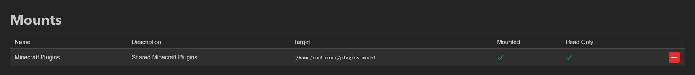

# Mounts

Mounts make a directory from the host machine available inside your server's container at a fixed target path, useful for things like shared plugin folders or common asset directories.

The table lists every mount available to your server: **Name**, **Description**, **Target** (the path inside the container, e.g. `/home/container/plugins-mount`), **Mounted**, and **Read Only**.

Use the green **+** at the end of a row to attach a mount, or the red **-** to detach one. Both ask for confirmation first ("Do you want to attach **name** to `target`?") and confirm with a toast once done.

Select rows with their checkboxes, by dragging across them, or with `Ctrl+A` (`Esc` clears); only rows on the current page are selected. **Attach** and **Detach** in the action bar then work on the whole selection, each skipping mounts already in that state; **Detach** asks for confirmation first. Each action reports how many items it changed, skipped or failed in a toast.

::: info
Users only toggle mounts on and off. Which mounts exist, where they point, and whether they are read-only is defined by administrators under [Mounts](../admin/mounts.md), and every mounted path must also be whitelisted in the node's [`allowed_mounts`](../../../wings/configuration.md#allowed_mounts) Wings setting.
:::

Attaching and detaching are gated by the `mounts.attach` and `mounts.detach` permissions, viewing by `mounts.read`. See the [Permissions Reference](../dashboard/permissions.md).
