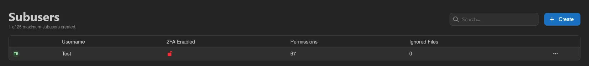
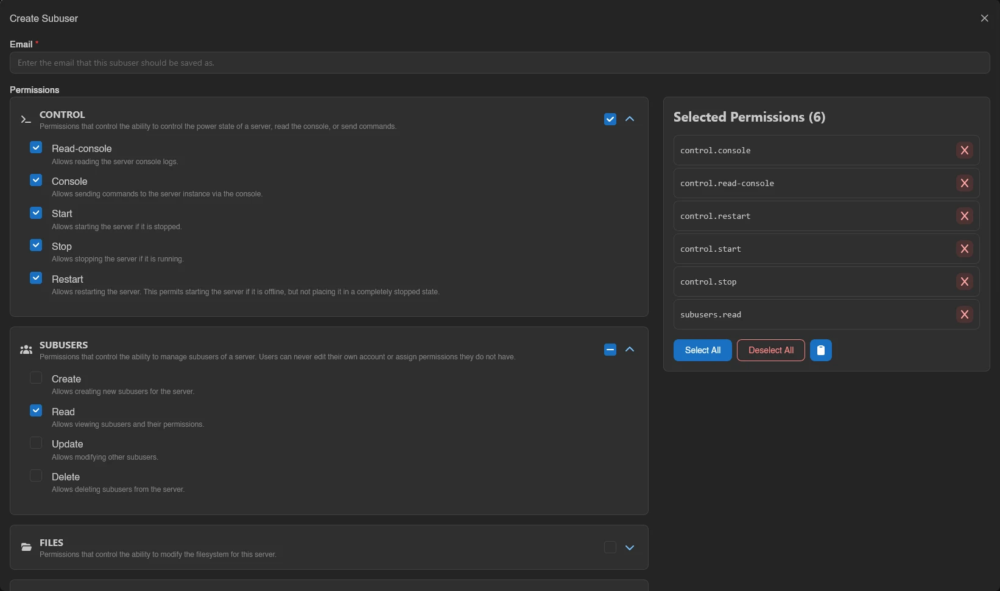
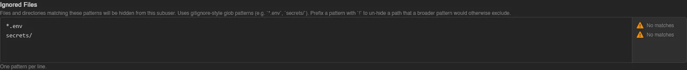

# Subusers

Subusers are other users with access to your server, each with their own set of permissions. Hand a friend the console without also handing them your files, or give a co-owner everything.



The list is searchable and shows each subuser's **Username**, whether they have **2FA Enabled** (a green closed lock, or a red open one if not), and how many **Permissions** and **Ignored Files** patterns they have. A counter at the top tracks the limit, for example "0 of 25 maximum subusers created."; at the limit, **Create** is disabled with the tooltip "This server is limited to 25 subusers."

::: info
The maximum number of subusers per server is a panel-wide setting configured by the instance administrator under [Settings > Server](../admin/settings.md#server).
:::

## Inviting a Subuser

Click **Create** and enter the person's **Email**. If an account with that email already exists it gets added directly; if not, an account is created for them automatically. Either way, they receive an email with a link to the server. When the panel has a [captcha](../admin/settings.md#captcha) configured, it renders in this modal too and must be solved before **Create** works.



A few rules the panel enforces:

- The server owner can't be added as a subuser.
- Each email can only be a subuser once per server.
- You can never grant a permission you don't hold yourself, and subusers can't edit their own access.

### Picking Permissions

Permissions come grouped in categories. Expand one with the chevron to check individual permissions, or use the category checkbox to toggle the whole group at once. Everything selected appears on the right under **Selected Permissions**, next to **Select All**, **Deselect All**, and a clipboard menu with **Copy Permissions** and **Paste Permissions** for carrying a set over to another subuser.

See the [Permissions Reference](../dashboard/permissions.md#server-permissions) for what every server permission does. If you're a subuser yourself, the picker only offers the permissions you actually hold.

## Ignored Files

**Ignored Files** hides parts of the filesystem from that specific subuser. Patterns are gitignore-style globs, one per line, for example `*.env` or `secrets/`, and a `!` prefix un-hides a path that a broader pattern would otherwise exclude.



The patterns follow `.gitignore` rules, which the panel and Wings both apply the same way:

| Pattern | Hides |
| --- | --- |
| `secrets` | Anything named `secrets` at any depth, and everything inside it if it's a directory. Not `secrets.txt`. |
| `/config.yml` | Only `config.yml` at the server root. A leading `/`, or a `/` anywhere but the end, anchors a pattern to the root. |
| `logs/` | Directories named `logs`, with their contents, but not a file of that name. |
| `*.env` | Everything ending in `.env`, at any depth. |
| `!pattern` | Nothing: it un-hides whatever matches, even below a directory an earlier line hid. |

Lines starting with `#` are comments. Later lines win over earlier ones, so an exception has to come after the pattern it carves into. That makes an allowlist possible:

```
*
!game/csgo/cfg
```

hides everything except `game/csgo/cfg` and its contents. The directories on the way there (`game`, `game/csgo`) stay listed so the subuser can reach the exception, but the directories themselves are still denied, so they cannot be renamed, deleted or archived as a whole. A list that fails to compile, for example with an unclosed `[`, denies the whole server rather than nothing.

As you type, the gutter next to each line shows how many files currently match ("12 matched" or "No matches"); `!` lines are marked "Exception". Past 20 patterns, counting is no longer automatic and a **Count Matches** button appears instead.

A partially uploaded file is matched against the name it will end up with, not the `.upload-part` name it carries while in flight, so a pattern cannot be side-stepped by grabbing the partial file over SFTP mid-upload.

Toggle **Preview ignored files** for a small file browser where everything the patterns hide is struck through and tagged **Ignored**, and directories that are only reachable because of an exception below them are tagged **Partially ignored**. Both the counts and the preview need the `files.read` permission.

## Editing and Removing

Right-click a subuser (or open the row menu) for **Edit** and **Remove**. **Edit** opens the same permissions and ignored files editor; the email can't be changed. **Remove** asks for confirmation and only revokes access to this server, it doesn't touch their account.

With `subusers.delete`, select several subusers (checkboxes, drag, or `Ctrl+A`) and **Remove** them together after one confirmation.

Viewing the page requires `subusers.read`; creating, editing, and removing require `subusers.create`, `subusers.update`, and `subusers.delete` respectively.
