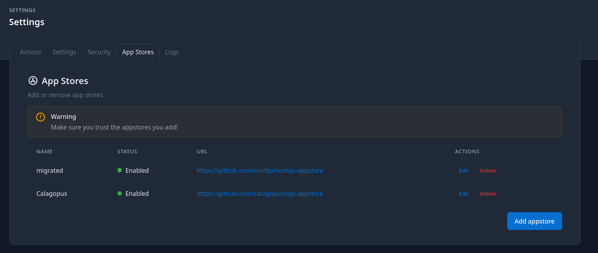

# Runtipi Panel Installation

Calagopus is available for [Runtipi](https://runtipi.io/) through the [Calagopus Tipi App Store](https://github.com/calagopus/tipi-appstore). Each app bundles its own PostgreSQL and Valkey containers, and Runtipi generates the encryption key for you, so there is nothing to configure before installing.

::: info Running game servers on a home server
Wings will run fine on Runtipi, but game servers are CPU- and RAM-intensive workloads that compete with your other Runtipi apps. This is well-suited for homelab use. For production hosting, consider running Wings on a dedicated machine connected to a standalone Panel instead.
:::

## 1. Add the App Store

In the Runtipi dashboard, open **Settings** and switch to the **App Stores** tab. Click **Add appstore**, give it a name such as `Calagopus`, paste the store URL, and save:

```
https://github.com/calagopus/tipi-appstore
```

Runtipi clones the store in the background. Once it has finished, the Calagopus apps show up in the **App Store**.



## 2. Install the app

Search the **App Store** for `Calagopus`. The store offers three apps, pick the one that matches your needs and click **Install**:

| App | Use when |
| --- | --- |
| **Calagopus (AIO)** | Standard install, Panel + Wings, no extensions. The best choice for most people. |
| **Calagopus (Heavy AIO)** | You plan to install [extensions](../../extensions/index.md), includes the build tooling needed to compile them |
| **Calagopus** | Panel only, you connect one or more separate [Wings](../../../wings/installation/index.md) nodes to run game servers |

::: warning Install only one variant
All three apps publish the panel on port `8000`, and both AIO variants publish SFTP on port `2022`, so only one of them can run on the same Runtipi host at a time.
:::

Runtipi pulls the images and starts the app. The first start runs the database migrations, which can take a minute.

## 3. Access the Panel

Click **Open** on the Calagopus app page, or open your browser and navigate to:

```
http://<runtipi-ip>:8000
```

You will see the OOBE (Out Of Box Experience) setup screen where you create your first admin account and complete initial configuration.


The ports used are:

| Port | Purpose |
| --- | --- |
| `8000` | Panel web UI and API |
| `2022` | SFTP access to game server files via Wings (AIO variants only) |

Your game servers will also need their own port allocations, configure those on the Wings node after setup.

## Updating

The Tipi App Store is updated shortly after each new Calagopus release. Runtipi periodically pulls its app stores and shows an **Update** button on the Calagopus app page when a new version is available. Click it to pull the new image and restart the app; your data is preserved.
