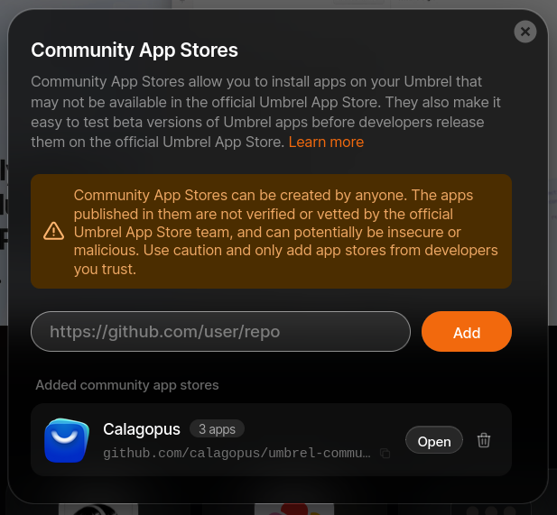

# umbrelOS Panel Installation

Calagopus is available for [umbrelOS](https://umbrel.com/umbrelos) through the [Calagopus Community App Store](https://github.com/calagopus/umbrel-community-store). Each app bundles its own PostgreSQL and Valkey containers, and umbrelOS generates the encryption key for you, so there is nothing to configure before installing.

::: info Running game servers on a home server
Wings will run fine on umbrelOS, but game servers are CPU- and RAM-intensive workloads that compete with your other Umbrel apps. This is well-suited for homelab use. For production hosting, consider running Wings on a dedicated machine connected to a standalone Panel instead.
:::

## 1. Add the Community App Store

In the umbrelOS dashboard, open the **App Store**, click the **⋯** menu in the top-right corner, and choose **Community App Stores**. Paste the store URL and click **Add**:

```
https://github.com/calagopus/umbrel-community-store
```

Click **Open** next to the newly added **Calagopus** store.



## 2. Install the app

The store offers three apps, pick the one that matches your needs and click **Install**:

| App | Use when |
| --- | --- |
| **Calagopus AIO** | Standard install, Panel + Wings, no extensions. The best choice for most people. |
| **Calagopus Heavy AIO** | You plan to install [extensions](../../extensions/index.md), includes the build tooling needed to compile them |
| **Calagopus** | Panel only, you connect one or more separate [Wings](../../../wings/installation/index.md) nodes to run game servers |

::: warning Install only one variant
All three apps publish the panel on port `8000` and SFTP on port `2022`, so only one of them can run on the same Umbrel at a time.
:::

umbrelOS pulls the images and starts the app. The first start runs the database migrations, which can take a minute.

## 3. Access the Panel

Click the Calagopus icon on your umbrelOS home screen, or open your browser and navigate to:

```
http://umbrel.local:8000
```

You will see the OOBE (Out Of Box Experience) setup screen where you create your first admin account and complete initial configuration.


The ports used are:

| Port | Purpose |
| --- | --- |
| `8000` | Panel web UI and API |
| `2022` | SFTP access to game server files via Wings (AIO variants only) |

Your game servers will also need their own port allocations, configure those on the Wings node after setup.

## Updating

The Community App Store is updated shortly after each new Calagopus release. umbrelOS shows available updates in the **App Store**, click **Update** on the Calagopus app to pull the new image and restart it; your data is preserved.
