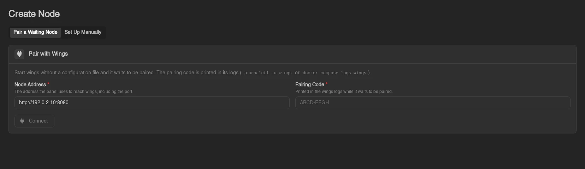
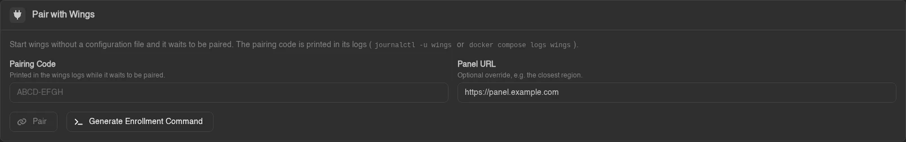

# Configuring a New Node

A node connects Wings on a remote or local host to the Panel. A fresh Wings installation can start without a configuration file and wait for you to pair it. You can also create the node first and use an enrollment command or the generated YAML.

If you use the Panel's All-in-One image, its integrated node is already configured. Use that existing node; these steps are for adding a separate Wings installation.

You can do this during the **OOBE** (first-time setup) or anytime later from the **Admin panel**. The steps are the same either way, just noted below where they differ.

## Create a location

Locations group nodes together and control backup configuration inheritance. You only need one location per logical group of nodes (e.g. per region or provider). Skip this step if you already have one you want to use.

- **OOBE**: shown automatically before you create your first node.
- **Existing panel**: go to **Admin → Locations → Create**.

| Field | Description |
|---|---|
| Name | A label to distinguish this location (e.g. `Germany`). |
| Backup Configuration Name | The backup storage configuration used by nodes in this location. |
| Backup Disk | Where backups are stored. `Local` stores them on the Wings host; keep a copy elsewhere in case that host is lost. *(OOBE only)* |
| Description | Optional notes about this location. *(Admin panel only)* |


## Pair a Waiting Node

Install Wings using the [Docker](../installation/docker.md), [Binary](../installation/binary.md), or [Package Manager](../installation/pkgmanager.md) guide, then start it without creating a `config.yml`. Wings listens for setup over HTTP on port `8080` by default and prints a pairing code in its logs.

| Installation | Where to read the code |
| --- | --- |
| Docker Compose | `docker compose logs wings` from the Compose directory |
| systemd service | `journalctl -u wings -n 50 --no-pager` |
| Foreground process | The terminal running `wings` or `calagopus-wings` |

1. Open **Admin → Nodes → Create** and select **Pair a Waiting Node**.
2. Enter the **Node Address**, including the port, and the **Pairing Code** from the logs. Use an address the Panel can reach, such as `http://192.0.2.10:8080`; replace that example IP with your node's address.
3. Click **Connect**. The Panel checks Wings and shows its version, resources, and container-runtime status.
4. Review the node form, choose its location, and finish creating and pairing it. Memory and disk start at 90% of the detected totals; adjust them for your host.



Keep the code private. After five failed pairing requests, Wings prints a replacement code. Successful pairing writes the configuration and continues into normal operation automatically. If the node entry already exists, use **Pair with Wings** on its **Configuration** tab; this is also available during first-time setup.

For Docker port mappings, use the published host port in **Node Address**. Pairing keeps Wings' local API and SFTP listener ports, so `7777:8080` means the address ends in `:7777` while Wings still listens on `8080` inside its container.

::: info Existing installations
Setup mode only starts when no configuration file is found. An invalid existing file still needs fixing. Wings also refuses automatic setup if its server data directory already contains data: restore the configuration or explicitly configure the installation. `--no-setup` disables automatic setup for unattended runs that should fail when configuration is missing.
:::

## Create the node manually

- **OOBE**: continues automatically after the location step.
- **Existing panel**: go to **Admin → Nodes → Create** and select **Set Up Manually**.

| Field | Description |
|---|---|
| Name | A short, identifiable name for the node. |
| Location | The location to assign this node to. *(Admin panel only which is set automatically in the OOBE)* |
| URL | The address the panel itself uses to reach Wings, including its port (default `8080`). |
| Public URL | The address browsers use to reach Wings directly, for websocket connections and downloads. Leave empty to reuse **URL**. |
| SFTP Host | Custom SFTP hostname shown in the dashboard. Leave empty to reuse the hostname from URL. |
| SFTP Port | Port for the SFTP/SSH server. Leave default unless you know you need to change it. |
| Memory | RAM budget for planning and automatic placement; reserve memory for the OS and other services. Manual server creation can exceed it. |
| Disk | Disk budget for planning and automatic placement; leave space for images, logs, and backups. This is not a filesystem quota. |
| Backup Configuration | The backup configuration servers on this node will use. *(Admin panel only)* |
| Description | Optional description. *(Admin panel only)* |

**URL vs. Public URL:** **URL** is what the panel itself uses to reach Wings, so it can be a reachable internal address such as a LAN IP. With a Panel running in Docker, `localhost` refers to that container, not the host or a separate Wings container. Use an address reachable from the Panel's network. The AIO image is an exception: its bundled Wings shares the Panel's container and is configured automatically.

**Public URL** is what the browser uses, so it must be reachable from wherever your users are, e.g. a domain with SSL like `https://node.calagopus.com:8080`. Leave Public URL empty to reuse URL.

If your panel has SSL but Wings doesn't, **Wings Proxy Mode** lets the panel proxy browser traffic to Wings. With the supplied Docker Compose stack, set `APP_ENABLE_WINGS_PROXY=true` in the `web` service's `environment` list, then run `docker compose up -d --no-deps web` from the Compose directory. For a native installation, set it in the Panel's `.env` and restart the Panel service. Click the globe icon next to Public URL to auto-fill the proxy URL. This adds load to the Panel and does not proxy SFTP. See [Exposing Wings in a Homelab](../advanced/exposing-wings-in-a-homelab.md) for the network requirements and trade-offs.


> The OOBE also asks for an **IP** and **Port Ranges** here, so your first allocation is ready immediately. The admin pairing form also offers optional **IP** and **Port Ranges** fields. With manual admin creation, add allocations afterward. See [Setting up Allocations](./setting-up-allocations.md).

Click **Create** (or **Create & Continue** in the OOBE).

## Install Wings

If Wings is not installed yet, follow [Wings Installation](../installation/index.md). Return here to enroll an existing node entry or apply its configuration manually.

## Use an Enrollment Command

For an existing node entry, open **Admin → Nodes → (your node) → Configuration** or the **Node Configuration** step during first-time setup. Under **Pair with Wings**, click **Generate Enrollment Command** and run the command on the node:

```bash
calagopus-wings configure --panel-url https://panel.example.com --enroll CODE_FROM_PANEL
```

Use the command generated by your Panel, with its real URL and code. If you installed the standalone binary as `wings`, use that name instead. Each code expires after 30 minutes and can be redeemed once. Redemption rotates the node token, so do not use it to configure a second copy of an already-running node. Pairing and command generation require `nodes.reset-token` and are unavailable for the integrated All-in-One node.



Set **Panel URL** in the pairing card when Wings must use a different reachable Panel address. Leave it empty for the normal address. The command writes the node credentials, Panel origins, and the API/SFTP ports returned by the Panel. Start or restart Wings afterward. If an unconfigured Wings process is already waiting for pairing, stop that process before running the command, then start it again.

Docker installations can pass the URL and code as [first-start enrollment variables](../installation/docker.md#automatic-enrollment). Normal node operation still needs the Panel and Wings to reach each other after enrollment.

## Apply the node configuration

Manual YAML and the existing join command are still available. Once the node exists in the Panel, open its configuration:

- **OOBE**: shown on the Node Configuration step.
- **Admin panel**: go to **Admin → Nodes → (your node) → Configuration** tab.

For **Docker**, copy the generated YAML into `config/config.yml` as described in the [Docker installation guide](../installation/docker.md#configure-wings).

For a **binary installation**, run the generated join command on the node's host:

```bash
wings configure --join-data xxxxxx
```

For a **package installation**, use `calagopus-wings configure --join-data xxxxxx` instead, unless you created the optional `wings` alias. Replace `xxxxxx` with the join data supplied by your Panel.


After applying the configuration, return to your [Docker](../installation/docker.md#start-wings), [Binary](../installation/binary.md#configure-wings), or [Package Manager](../installation/pkgmanager.md#configure-wings) guide to start Wings and check the connection.

## Next step: secure the browser connection

SSL is disabled by default on a fresh Wings install. For browsers to reach Wings from an HTTPS Panel, serve Wings over HTTPS using [its own certificate](../configuration.md#ssl-configuration) or a [reverse proxy](../../additional/reverse-proxies/wings.md). If you use Wings Proxy Mode through an HTTPS Panel, Wings does not need a separate public certificate; follow the [proxy-mode guide](../advanced/exposing-wings-in-a-homelab.md) instead.
